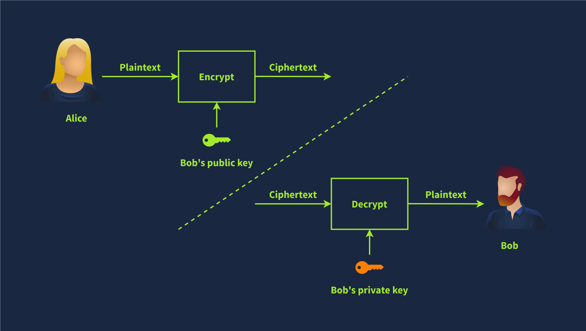

# Rivest-Shamir-Adleman (RSA)

RSA is a public-key encryption algorithm that enables secure data transmission over insecure channels. An insecure channel is susceptible to eavesdropping from unwanted parties.

&nbsp;

## The Math that makes RSA secure

RSA is based on the mathematical difficult problem of factoring a large number. Multiplying two large prime numbers is a straightforward operation; however, finding the factors of a huge number takes much more computing power.

It is simple to multiply two prime numbers together even on paper, say 113 × 127 = 14351. Even for larger prime numbers, it would still be a feasible job, even by hand. Consider the following numeric example:

- Prime number 1: 982451653031
- Prime number 2: 169743212279
- Their product: 982451653031 × 169743212279 = 166764499494295486767649

On the other hand, it’s pretty tricky to determine what two prime numbers multiply together to make 14351 and even more challenging to find the factors of 166764499494295486767649.

In real-world examples, the prime numbers would be much bigger than the ones in this example. A computer can easily factorise 166764499494295486767649; however, it cannot factorise a number with more than 600 digits. And you would agree that the multiplication of the two huge prime numbers, each around 300 digits, would be easier than the factorization of their product.

&nbsp;

## Numerical Example

Let’s revisit encryption, decryption, and key usage in asymmetric encryption. The public key is known to all correspondents and is used for encryption, while the private key is protected and used for decryption, as shown in the figure below.

In the Cryptography Basicss module, we explained the modulo operation and said it plays a significant role in cryptography. In the following simplified numerical example, we see the RSA algorithm in action:

1.  Bob chooses two prime numbers: *p* = 157 and *q* = 199. He calculates *n* = *p* × *q* = 31243.
2.  With *ϕ*(*n*) = *n* − *p* − *q* + 1 = 31243 − 157 − 199 + 1 = 30888, Bob selects *e* = 163 such that *e* is relatively prime to *ϕ*(*n*); moreover, he selects *d* = 379, where *e* × *d* = 1 mod *ϕ*(*n*), i.e., *e* × *d* = 163 × 379 = 61777 and 61777 mod 30888 = 1. The public key is (*n*,*e*), i.e., (31243,163) and the private key is $(n,d), i.e., (31243,379).
3.  Let’s say that the value they want to encrypt is *x* = 13, then Alice would calculate and send *y* = *x**e* mod *n* = 13163 mod 31243 = 16341.
4.  Bob will decrypt the received value by calculating *x* = *y**d* mod *n* = 16341379 mod 31243 = 13. This way, Bob recovers the value that Alice sent.

The proof that the above algorithm works can be found in [modular arithmetic](https://www.britannica.com/science/modular-arithmetic) and is beyond the scope of this module. It is worth repeating that in this example, we picked a three-digit prime number, while in an actual application, *p* and *q* would be at least a 300-digit prime number each.

&nbsp;

## RSA in CTFs

The math behind RSA comes up relatively often in CTFs, requiring you to calculate variables or break some encryption based on them. Many good articles online explain RSA, and they will give you almost all of the information you need to complete the challenges. One good example of an RSA CTF challenge is the [Breaking RSA](https://tryhackme.com/r/room/breakrsa) room.

There are some excellent tools for defeating RSA challenges in CTFs, like [RsaCtfTool](https://github.com/Ganapati/RsaCtfTool) and [rsatool](https://github.com/ius/rsatool).

You need to know the main variables for RSA in CTFs: p, q, m, n, e, d, and c. As per our numerical example:

- p and q are large prime numbers
- n is the product of p and q
- The public key is n and e
- The private key is n and d
- m is used to represent the original message, i.e., plaintext
- c represents the encrypted text, i.e., ciphertext

Crypto CTF challenges often present you with a set of these values, and you need to break the encryption and decrypt a message to retrieve the flag.