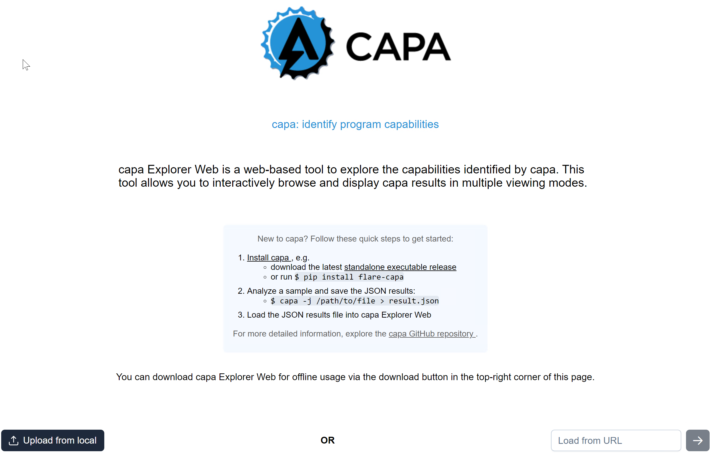
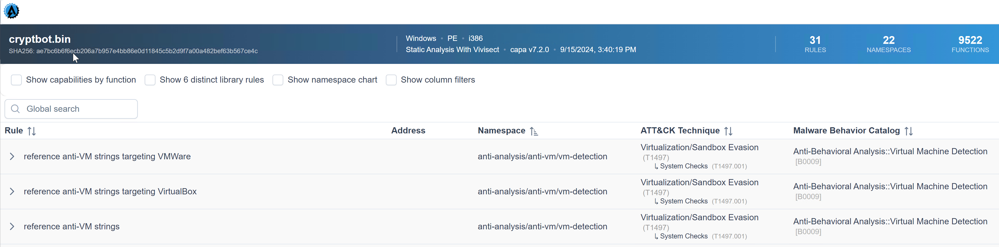
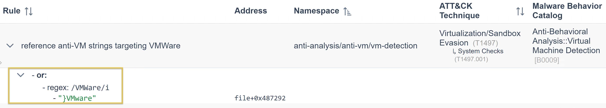
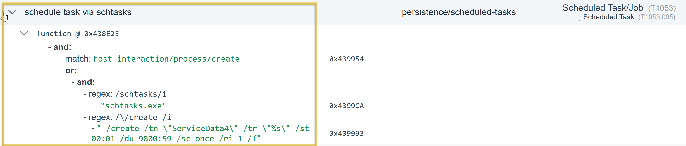
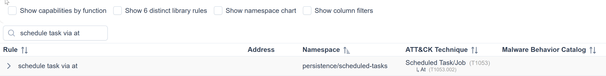

# More Information, more fun!

Aren't you curious about what precisely within the rule was matched? Well, I am!

In this module, we will seek to determine the reason for triggering the rules and the conditions involved. We will use the parameter `-vv` or **very verbose** to achieve this.

| Option | Description | Sample Syntax |
| --- | --- | --- |
| `-v` or `--verbose` | enable verbose result document | `capa.exe -v .\cryptbot.bin` |
| `-vv` or `--vverbose` | enable very verbose result document) | `capa.exe -vv .\cryptbot.bin` |

Let's run it!

```powershell
PS C:\Users\Administrator\Desktop\capa> capa -vv .\cryptbot.bin
loading : 100%|████████████████████| 485/485 [00:00<00:00, 1108.84     rules/s]
/ analyzing program...
```

This will give us more detailed results; however, this will take a lot of time. Open another PowerShell terminal and look inside the file using the command `Get-Content cryptbot_vv.txt`.

```powershell
PS C:\Users\Administrator\Desktop\capa> Get-Content .\cryptbot_vv.txt
```

So, have you opened the file? Do you have more than three thousand lines similar to this one?

Accessing this vast amount of information using a terminal or a text editor will be challenging.

To analyze this result with ease, we need to do two things. First, we will use the parameter `-j` and `-vv`, and direct the result to a **.json** file. The command would be `capa.bin -j -vv .\cryptbot.bin > cryptbot_vv.json`

```powershell
PS C:\Users\Administrator\Desktop\capa> capa.bin -j -vv .\cryptbot.bin > cryptbot_vv.json
loading : 100%|████████████████████| 485/485 [00:00<00:00, 1108.84     rules/s]
/ analyzing program...
```

Again, this will take a lot of time, similar to the previous commands we run.

We can start with our next step.

&nbsp;

## CAPA Web Explorer

The second thing we need to do is upload the file to **CAPA Explorer Web**. We can either use their online version here on this [link](https://mandiant.github.io/capa/explorer/#/), or the offline version.

Now, we should have access to the homepage!



Look for the button **Upload from local** located at the bottom left of the page and select the file **cryptbot_vv.<span style="color: inherit;">json</span>** generated. Once uploaded, you should have a similar output.



Now, it's time to explore this excellent addition to the tool. We'll review some capabilities and check what precisely within the rule was matched. This will give us a better idea of how the rule works.

Let's go through our first example below. We know that the capability was to **reference anti-<span style="color: inherit;">VM</span> strings targeting VMWare,** and the corresponding rule config file or <span style="color: inherit;">yaml</span> file is **anti-<span style="color: inherit;">VM</span>\-Strings-targeting-VMWare.yml.** Notice the box from the image.



Then, let us show you an overview of the rule's content. Focus on the **features** as CAPA uses the succeeding strings below to check if strings are within the analyzed file.

```bash
rule:
  meta:
    name: reference anti-VM strings targeting VMWare
    namespace: anti-analysis/anti-vm/vm-detection
    authors:
      - michael.hunhoff@mandiant.com
      - "@johnk3r"
    scopes:
      static: file
      dynamic: file
    att&ck:
      - Defense Evasion::Virtualization/Sandbox Evasion::System Checks [T1497.001]
    mbc:
      - Anti-Behavioral Analysis::Virtual Machine Detection [B0009]
    references:
      - https://github.com/LordNoteworthy/al-khaser/blob/master/al-khaser/AntiVM/VMWare.cpp
    examples:
      - al-khaser_x86.exe_
      - b83480162ede09d4aa6d4850f9faa0a4c3834152752fd04cfdb22d647aa1f825:0x17D80
  features:
    - or:
      - string: /VMWare/i
      - string: /VMTools/i
      - string: /SOFTWARE\\VMware, Inc\.\\VMware Tools/i
      - string: /VMWare/i
      - string: /VMTools/i
      - string: /SOFTWARE\\VMware, Inc\.\\VMware Tools/i
      - string: /vmnet\.sys/i
      - string: /vmmouse\.sys/i
      - string: /vmusb\.sys/i
      - string: /vm3dmp\.sys/i
      - string: /vmci\.sys/i
      - string: /vmhgfs\.sys/i
      - string: /vmmemctl\.sys/i
      - string: /vmx86\.sys/i
      - string: /vmrawdsk\.sys/i
      - string: /vmusbmouse\.sys/i
      - string: /vmkdb\.sys/i
      - string: /vmnetuserif\.sys/i
      - string: /vmnetadapter\.sys/i
      - string: /\\\\.\\HGFS/i
      - string: /\\\\.\\vmci/i
      - string: /vmtoolsd\.exe/i
      - string: /vmwaretray\.exe/i
      - string: /vmwareuser\.exe/i
      - string: /VGAuthService\.exe/i
      - string: /vmacthlp\.exe/i
      - string: /vmci/i
        description: VMWare VMCI Bus Driver
      - string: /vmhgfs/i
        description: VMWare Host Guest Control Redirector
      - string: /vmmouse/i
      - string: /vmmemctl/i
        description: VMWare Guest Memory Controller Driver
      - string: /vmusb/i
      - string: /vmusbmouse/i
      - string: /vmx_svga/i
      - string: /vmxnet/i
      - string: /vmx86/i
      - string: /VMwareVMware/i
      - string: /vmGuestLib\.dll/i
      - string: /vmGuestLib\.dll/i
      - string: /Applications\\VMwareHostOpen\.exe/i
      - string: /vm3dgl\.dll/i
      - string: /vmdum\.dll/i
      - string: /vm3dver\.dll/i
      - string: /vmtray\.dll/i
      - string: /VMToolsHook\.dll/i
      - string: /vmmousever\.dll/i
      - string: /VmGuestLibJava\.dll/i
      - string: /vmscsi\.sys/i
```

Under the features, the "**string: /VMWare/i"** is being referenced by CAPA Web Explorer. Simply, CAPA is saying that under this namespace, we could identify strings with a value of **VMWare** by using the conditions within the rule and with regex.

Let's have another sample. We know that the capability was to reference the **scheduled task via schtasks**, and the corresponding rule was to schedule the **task via schtasks.yml**. Notice the box from the image.



The same applies to our first example; we will show you the rule's content overview. Focus on the features, as CAPA uses the succeeding strings below to check if there are strings within the file being analyzed.

```powershell
rule:
  meta:
    name: schedule task via schtasks
    namespace: persistence/scheduled-tasks
    authors:
      - 0x534a@mailbox.org
    scopes:
      static: function
      dynamic: thread
    att&ck:
      - Persistence::Scheduled Task/Job::Scheduled Task [T1053.005]
    examples:
      - 79cde1aa711e321b4939805d27e160be:0x401440
  features:
    - and:
      - match: host-interaction/process/create
      - or:
        - and:
          - string: /schtasks/i
          - string: /\/create /i
        - string: /Register-ScheduledTask /i
```

Under the feature, the "**string: /schtasks/i** and **/\\/create /i**" is referenced by CAPA Web Explorer. Simply, CAPA is saying under this namespace, and by using the conditions within the rule and with regex, we could identify strings with a value of **schtasks** and **create**.

## Global Search Box

Another cool feature of this tool is its filter options and the Global Search box, which are very helpful.



We could quickly examine this overwhelming information using CAPA Web Explorer compared to any text editor.

Feel free to explore more!