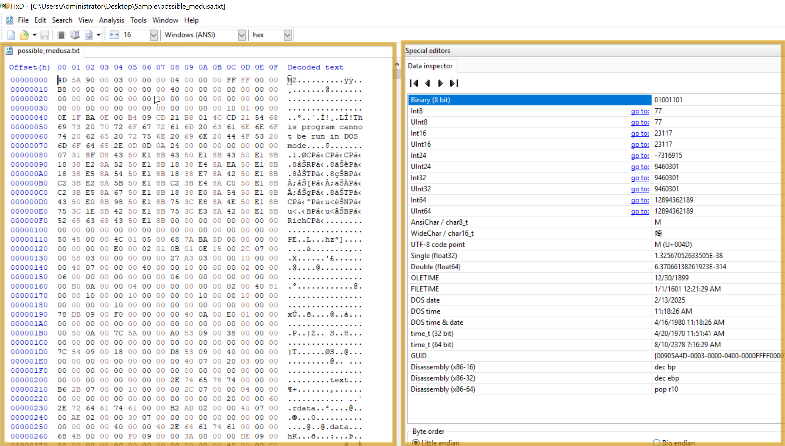

# Commonly Used Tools for Investigation: Overview

Let's examine the tools we will focus on in this module. These tools are the basic ones used for initial investigations. See the list below.

| **Tool** | **Investigative Value** |
| --- | --- |
| Procmon | A helpful tool for tracking system activity, especially regarding malware research, troubleshooting, and forensic investigations. |
| Process Explorer | Allows you to see the Process of the Parent-child relationship, DLLs loaded, and its path. |
| HxD | Malicious files can be examined or altered via hex editing. |
| Wireshark | Observing and investigating network traffic to look for unusual activity. |
| CFF Explorer | Can generate file hashes for integrity verification, authenticate the source of system files, and validate their validity. |
| PEStudio | <span style="color: inherit;">Static analysis</span> or studying executable file properties without running the files. |
| FLOSS | Extracts and de-obfuscates all strings from malware programs using advanced <span style="color: inherit;">static analysis</span> techniques. |

You can follow along and open the tools and files on the FlareVM while we discuss the overview of some of these tools.

## Process Monitor (Procmon)

A powerful Windows tool designed to help you record issues with your system's apps. It lets you **see, record, and keep track of system and Windows file activity in real-time**. Process Monitor is helpful for **tracking system activity, especially regarding malware research, troubleshooting, and forensic investigations**. It keeps real-time tabs on the file system, registry, and thread/process activity.

Here's how to utilize it effectively for investigation.


According to this log entry, the Local Security Authority Subsystem Service (LSASS)- related process lsass.exe has successfully read a file. LSASS handles authentication and frequently communicates with crucial system files such as lsasrv.<span style="color: inherit;">dll</span> (Local Security Authority Server Service).

Although this is a standard system process, LSASS may be the target of credential dumping attacks if you are examining logs for indications of malicious activity. Mimikatz and other tools frequently try to access LSASS memory. In these situations, you should watch for any additional suspicious activity related to LSASS, such as odd access patterns or processes reading or writing to lsass.exe.

Don’t worry—the sample above does not show any malware signs!

## Process Explorer (Procexp)

Process Explorer offers in-depth insights into the active processes running on your computer. It allows you to delve into the inner workings of your system, providing a comprehensive list of currently running processes and their linked user accounts. If you've ever been curious about which program is accessing a specific file or folder, Process Explorer can provide us with that information.


As you can see from the image above, the CFF Explorer app is open. Using **Process Explorer(procexp),** located on the desktop, we identified the process and its parent process. This is usually pretty useful when we want to monitor what other processes are being spawned, such as from a Word document, an <span style="color: inherit;">LNK</span> file, or even an ISO file, as threat actors typically abuse these.

## HxD

HxD is a quick and flexible hex editor for editing files, memory, and drives of any capacity. It can be applied to forensic investigation, data recovery, debugging, and exact manipulation of binary data. Important features include viewing file and memory contents, editing, searching, and comparing hex data. Let's look at how the tool works.



This HxD hex editor snapshot shows the binary file **possible_medusa.txt**. The hex data on the left indicates the file's contents in hexadecimal, and the ASCII interpretation appears on the right. Interestingly, the file starts with **4D 5A (Little Endian)**, indicating it is executable.

The **Data Inspector** on the right allows you to examine individual bytes by displaying their values in many data types (e.g., integer, float), facilitating a more straightforward data evaluation.

By permitting in-depth examination of a file's unprocessed hexadecimal data, HxD facilitates inquiry by identifying file kinds, structures, and possible corruption. Its Data Inspector feature helps by offering insights into particular byte values.

## CFF Explorer

With the help of CFF Explorer's comprehensive file information, investigators can generate file hashes for integrity verification, authenticate the source of system files, and validate their validity (e.g., by looking for unusual alterations). This is important to know when analyzing malware since dangerous code may be hidden in altered system files.


The **cryptominer.bin** file's details are displayed in the sample. On September 23, 2024, a 64-bit Portable Executable file was generated. The file's information can be verified by its hashes (SHA-1 and <span style="color: inherit;">MD5</span>). During investigations, this tool aids in confirming file information lookup and locating possible problems.

## Wireshark

Regarding network traffic analysis, Wireshark is a powerful tool that investigators may use to hunt down dubious connections, examine protocols, and spot possible assaults or data exfiltration. In this case, TLSv1.2 suggests a secure, encrypted connection that can mask harmful activity or safeguard legitimate traffic.


This Shows captured packets with details about the protocol, source, destination, and other information. Most packets show that TLSv1.2 and <span style="color: inherit;">TCP</span> are being used for encrypted transmission. The raw packet data is shown in ASCII and hexadecimal forms, with a significant chunk encrypted using TLSv1.2.

## PEStudio

<span style="color: inherit;">Static analysis</span>, or studying executable file properties without running the files, is done with PEstudio. This feature is beneficial in several situations. PEstudio offers a variety of information about a file without putting users in danger of execution, which aids in identifying executables that seem suspect or harmful.

So, how does it work? Let's look at the image below.


This example shows the examination of an executable file, PSexec.exe, using PEstudio 9.22, a static malware analysis tool. The file has a dual purpose—legitimate for system administrators but potentially exploited by hackers for remote access.

The file's **<span style="color: inherit;">entropy</span> value of 6.596** indicates a remote chance of packing or encryption, which is typical of dangerous software. **Version 2.34** of this 32-bit console-based application allows it to run programs remotely, a feature frequently used to migrate laterally during attacks. The file is assembled using **Visual C++ 8**.

The dual-use nature of **PsExec**, typically legitimate but suspicious in compromised environments, combined with **low to medium indicators** and moderately high <span style="color: inherit;">entropy</span>, makes its presence on a system concerning, especially if remote code execution is not expected. Its use in **post-exploitation phases** warrants further investigation to determine if it’s being misused maliciously.

## FLOSS

Using advanced <span style="color: inherit;">static analysis</span> techniques, the FLARE Obfuscated String Solver (FLOSS, formerly FireEye Labs Obfuscated String Solver) automatically extracts and de-obfuscates all strings from malware programs. Like strings.exe, it can enhance the basic <span style="color: inherit;">static analysis</span> of unknown binaries. FLOSS also includes more Python scripts in the script's directory, which can be used to load the script's output into other programs like IDA Pro or Binary Ninja.

```PowerShell
PS C:\Users\Administrator\Desktop\Sample > floss .\cobaltstrike.exe
INFO: floss: extracting static strings
finding decoding function features: 100%|█████████████████████████████████████████████| 74/74 [00:00<00:00, 2370.15 functions/s, skipped 0 library functions]
INFO: floss.stackstrings: extracting stackstrings from 50 functions
extracting stackstrings: 100%|██████████████████████████████████████████████████████████████████████████████████████| 50/50 [00:00<00:00, 128.00 functions/s]
INFO: floss.tightstrings: extracting tightstrings from 4 functions...
extracting tightstrings from function 0x402e80: 100%|██████████████████████████████████████████████████████████████████| 4/4 [00:00<00:00, 31.99 functions/s]
INFO: floss.string_decoder: decoding strings
emulating function 0x402e80 (call 1/1): 100%|████████████████████████████████████████████████████████████████████████| 21/21 [00:09<00:00,  2.21 functions/s]
INFO: floss: finished execution after 265.61 seconds
INFO: floss: rendering results 
```

**Results:**

```powershell
FLARE FLOSS RESULTS (version v3.1.0-0-gdb9af41)

+------------------------+------------------------------------------------------------------------------------+
| file path              | cobaltstrike.exe                                                                   |
| identified language    | unknown                                                                            |
| extracted strings      |                                                                                    |
|  static strings        | 189 (2050 characters)                                                              |
|   language strings     |   0 (   0 characters)                                                              |
|  stack strings         | 0                                                                                  |
|  tight strings         | 0                                                                                  |
|  decoded strings       | 0                                                                                  |
+------------------------+------------------------------------------------------------------------------------+


 ────────────────────────────
  FLOSS STATIC STRINGS (189)
 ────────────────────────────

+-----------------------------------+
| FLOSS STATIC STRINGS: ASCII (188) |
+-----------------------------------+

!This program cannot be run in DOS mode.
.text
P`.data
.rdata
P@.pdata
0@.xdata
0@.bss
.idata
.CRT
.tls
ffffff.
ATUWVSH
T$ E
t6H9
[^_]A\
ATUWVSH
L$ < H
@[^_]A\
UWVSH
L$LA
X[^_]
UWVSH
L$LA
X[^_]
D$P\
D$He
D$@p
D$8i
D$0p
D$(\
D$ .
T$XH
fff.
D$ tv
D$(H
T$ H
L$ H
L$(H
ATUWVSH
 [^_]A\
ffff.
CCG
8[^H
T$(H
\$8H
L$ H
ATUWVSH
d$0H
l$(H
@[^_]A\
D$XH
T$XL
D$`L
L$hH
ffffff.
AUATUWVSH
[^_]A\A]
T$PH
T$ H
[^_]A\A]
T$hH
L$PM
T$8H
L$ H
T$8L
[^_]A\A]
ATWVSH
[^_A\]
D$ H
tXw!
9MZt
HcQ<H
HcA<H
WVSH
tWHc
 [^_
 [^_
tPHc
B' t\tH
ffff.
UWVSH
tSHc
([^_]
([^_]
ATUWVSH
@[^_]A\
L3d$0H
@[^_]A\
D$0H
D$(H
UWVSH
([^_]H
UWVSH
([^_]
([^_]
QPH=
mNAj
+5:
mNAj
=E,z
mUDj
mN[3\
z(8(
R^~4
?\t{\
AAAAAAAAAAAAAAAAAAAAAAAAAAAAAAAAAAAAAAAAAAAAAAAAAAAAAAAAAAAAAAAAAAAAAAAAAAAAAAAAAAAAAAAAAAAAAAAAAAAAAAAAAAAAAAAAp
_set_invalid_parameter_handler
%c%c%c%c%c%c%c%c%cMSSE-%d-server
.pdata
Argument domain error (DOMAIN)
Argument singularity (SIGN)
Overflow range error (OVERFLOW)
Partial loss of significance (PLOSS)
Total loss of significance (TLOSS)
The result is too small to be represented (UNDERFLOW)
Unknown error
_matherr(): %s in %s(%g, %g)  (retval=%g)
Mingw-w64 runtime failure:
Address %p has no image-section
  VirtualQuery failed for %d bytes at address %p
  VirtualProtect failed with code 0x%x
  Unknown pseudo relocation protocol version %d.
  Unknown pseudo relocation bit size %d.
CloseHandle
ConnectNamedPipe
CreateFileA
CreateNamedPipeA
CreateThread
DeleteCriticalSection
EnterCriticalSection
GetCurrentProcess
GetCurrentProcessId
GetCurrentThreadId
GetLastError
GetModuleHandleA
GetProcAddress
GetStartupInfoA
GetSystemTimeAsFileTime
GetTickCount
InitializeCriticalSection
LeaveCriticalSection
LoadLibraryW
QueryPerformanceCounter
ReadFile
RtlAddFunctionTable
RtlCaptureContext
RtlLookupFunctionEntry
RtlVirtualUnwind
SetUnhandledExceptionFilter
Sleep
TerminateProcess
TlsGetValue
UnhandledExceptionFilter
VirtualAlloc
VirtualProtect
VirtualQuery
WriteFile
__C_specific_handler
__dllonexit
__getmainargs
__initenv
__iob_func
__lconv_init
__set_app_type
__setusermatherr
_acmdln
_cexit
_initterm
_onexit
abort
exit
fprintf
free
fwrite
malloc
memcpy
signal
sprintf
strlen
strncmp
vfprintf
KERNEL32.dll
msvcrt.dll


+------------------------------------+
| FLOSS STATIC STRINGS: UTF-16LE (1) |
+------------------------------------+

msvcrt.dll


 ─────────────────────────
  FLOSS STACK STRINGS (0)
 ─────────────────────────


 ─────────────────────────
  FLOSS TIGHT STRINGS (0)
 ─────────────────────────


 ───────────────────────────
  FLOSS DECODED STRINGS (0)
 ───────────────────────────
```

In the example above, FLOSS extracted **189 static strings** from the binary, which may contain hardcoded information such as file **paths**, **URLs** (likely for command-and-control servers), **IP addresses**, **<span style="color: inherit;">API</span> calls**, **error messages**, **registry, encryption keys**, and **configuration data**. However, no decoded strings were identified, suggesting that FLOSS did not detect or decode dynamically generated or obfuscated strings during this analysis. Malware frequently uses obfuscated strings to conceal its malicious behavior.