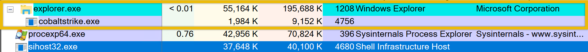

# Analyzing Malicious Files

In this module we'll follow a practical example that analyses multiple files with the tools mentioned in the previous module.

A suspicious **windows.exe** file was downloaded by a user on 09/24/2024 at 3:43 AM. This download was flagged as a potential threat. The monitoring team has sent you an email requesting to perform an analysis of it. They have sent you the file, which is now in the **C:\\Users\\Administrator\\Desktop\\Sample** folder.


Our initial approach for this investigation is to perform <span style="color: inherit;">static analysis</span> to get initial information from the binary.

## Analysis using PEStudio

Let's start with PEStudio. Open the file with this tool. What information can we use here?


For the computed <span style="color: inherit;">MD5</span> `9FDD4767DE5AEC8E577C1916ECC3E1D6` and SHA-1 `A1BC55A7931BFCD24651357829C460FD3DC4828F` hashes, comparisons with established databases like [VirusTotal](https://www.virustotal.com/gui/) are recommended. If there are no known detections, there's a greater chance that it's a fresh or undiscovered malware campaign.

Although the file claims to be connected to the Windows Registry Editor (REGEDIT), which you can see based on the **description**, this is likely an attempt to trick people and evade discovery.

Legitimate REGEDIT tools are usually found in the **C:\\Windows\\System32** directory rather than the user's download location.

What else?


If you look at the **version field**, it can be said that the presence of Russian text ("Редактор реестра" - "Registry Editor", "Операционная система Microsoft® Windows®") in the file’s metadata is suspicious, primarily if the user or the organization does not operate in a Russian-speaking environment. This could potentially have profound implications for our organization.

The absence of a **rich header** indicates that the file is potentially packed or obfuscated to avoid detection by <span style="color: inherit;">static analysis</span> tools. This is typical behaviour of sophisticated malware that tries to evade detection by altering critical sections of its <span style="color: inherit;">PE</span> file.

The **function** tabs list **<span style="color: inherit;">API</span> calls** that the file has imported. This is also known as the IAT (Import Address Table). By clicking on the blacklist tab, PeStudio will sort the <span style="color: inherit;">API</span> by moving all the blacklisted functions to the top. This is useful because it enables us to understand how malware may behave once it compromises a host. The image below shows what <span style="color: inherit;">API</span> has been imported.


Here are the important functions that we noted.

`set_UseShellExecute`: This function allows the process to use the operating system's shell to execute other processes. This is often seen in malware that spawns additional processes to carry out malicious actions.

`CryptoStream, RijndaelManaged, CipherMode, CreateDecryptor`: These APIs indicate that the executable uses cryptographic functions, specifically Rijndael (<span style="color: inherit;">AES</span> encryption). Malware may use cryptography to encrypt communication and files or even implement ransomware functionality.

## Analysis using FLOSS

Open <span style="color: inherit;">PowerShell</span> and go to the directory where our file is, which is **C:\\Users\\Administrator\\Desktop\\Sample**. Note that it might take a while before the <span style="color: inherit;">PowerShell</span> prompt appears. Run the command `FLOSS.exe .\windows.exe > windows.txt`. This will run the tool **floss.exe** and output it to a file named windows.txt in the same directory.

```powershell
PS C:\Users\Administrator\Desktop\Sample > FLOSS.exe .\windows.exe > windows.txt
WARNING: floss: .NET language-specific string extraction is not supported yet
WARNING: floss: FLOSS does NOT attempt to deobfuscate any strings from .NET binaries
INFO: floss: disabled string deobfuscation
INFO: floss: extracting static strings
INFO: floss: finished execution after 0.34 seconds
INFO: floss: rendering results
```

Open the file and go to the **bottom part of the result.**


Aren't these familiar? These are the functions that we saw earlier using the PEStudio tool!

## Analyze with Process Explorer and Process Monitor

In this example, we will analyze the network connectivity of the file **cobaltstrike.exe** located in `C:\Users\Administrator\Desktop\Sample`.

We will try to figure out if the file is making any network connectivity to any possible <span style="color: inherit;">c2</span> server. Let's get started! Run the file **cobaltstrike.exe** and open **Process Explorer** on the desktop or from the taskbar. You can also search for it in the Windows search bar. If you manually click the binary, **Explorer.exe** would be the parent process, and cobaltstrike.exe would be the child process. Let's see if that is indeed the case.



It is, as you can see from the screenshot above! Remember, this information is crucial, but let's focus on our goal to determine whether this process is making any network connectivity and to what destination. The **process ID is 4756**. Note that the Process ID might be different from your machine. Right-click on the process, select **Properties** and go to the **<span style="color: inherit;">TCP</span>/IP** tab. We should be able to determine the destination it connects to and the state it sends.


There we have it! On another note, when we are doing analysis, it needs to be verified and precise. Therefore, we won't be relying on a single tool. We will use another tool to determine if the information is correct. Stop the process and rerun it. This time, we will use **Procmon** or **Proces Monitor**. This is also located on the desktop or in the taskbar.

When we open Procmon, looking for the binary is challenging as it will list all active processes. What we are going to do is filter it. The image below points to the filter icon. Or you can press **CRTL + L**.


- Now, using this filter involves several steps. This includes:
    1.  Select the **Process Name**
    2.  Select **contains**
    3.  type any value containing any word related to the process. In this case, **cobalt**
    4.  Click **include**
    5.  And then **Add** and Click on Apply
    6.  You should be able to see the conditions added.


This should give us a more detailed result.


This confirms that the binary was indeed making a connection to an unknown IP address which is 47.120.46.210.