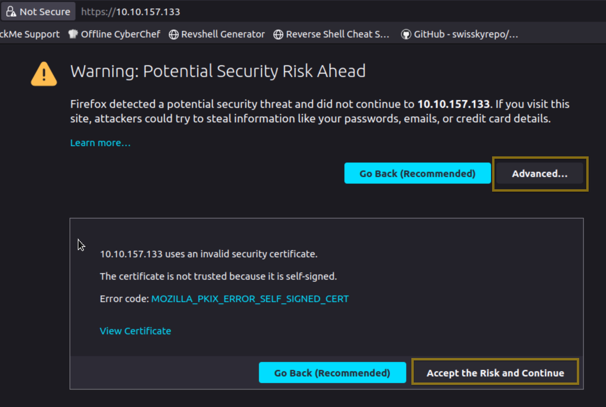
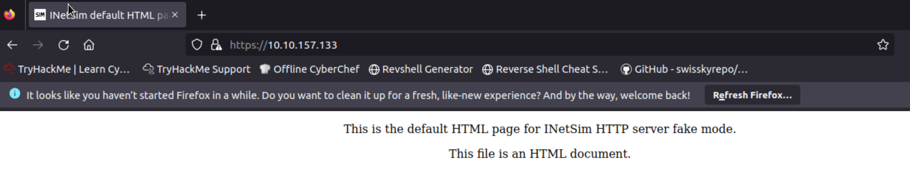
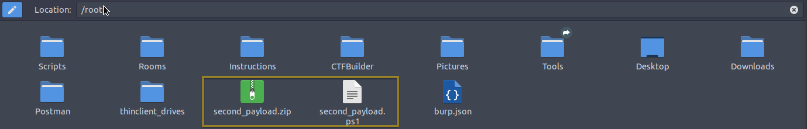

# Fake Network to Aid Analysis

During <span style="color: inherit;">dynamic analysis</span>, it is essential to observe the behaviour of potentially malicious software—especially its network activities. There are many approaches to this. We can create a whole infrastructure, a virtual environment with different core machines, and more. Alternatively, there is a tool inside our REMnux <span style="color: inherit;">VM</span> called **INetSim: Internet Services Simulation Suite!**

We will utilize INetSim's features to simulate a real network in this module.

## Virtual Machines

For this module, we will simulate two (2) machines. The first is our REMnux machine. The second <span style="color: inherit;">VM</span> is the AttackBox.

&nbsp;

## INetSim

Before we start, we must configure the tool INetSim inside our REMnux <span style="color: inherit;">VM</span>. Do not worry; this is a simple change of configuration. First, check the IP address assigned to your machine. This can be seen using the command `ifconfig` or simply by checking the IP address from the terminal. *The IP addresses may vary.*

Here, the machine’s IP is `10.10.28.63`. Take note of this, as we will need it.

Next, we need to change the INetSim configuration by running this command `sudo nano /etc/inetsim/inetsim.conf` and look for the value `#dns_default_ip 0.0.0.0`.

```shell
bob@BoB~$ sudo nano /etc/inetsim/inetsim.conf
#########################################
# dns_default_ip
#
# Default IP address to return with DNS replies
#
# Syntax: dns_default_ip 
#
# Default: 127.0.0.1
#
#dns_default_ip  0.0.0.0
```

Remove the comment or **#**, then change the value of **dns_default_ip** from `0.0.0.0` to the machine’s IP address you have identified earlier. In our case, this is `10.10.28.63`. Save the file using `CRTL + O` command, press enter and exit using `CTRL + X`.

Confirm that the changes have been successful by checking the value of `dns_default_ip` using this command `cat /etc/inetsim/inetsim.conf | grep dns_default_ip`. See below.

```shell
bob@BoB~$ cat /etc/inetsim/inetsim.conf | grep dns_default_ip
# dns_default_ip
# Syntax: dns_default_ip 
dns_default_ip	 10.10.28.63
```

Finally, run the command `sudo inetsim` to start the tool.

```shell
bob@BoB~$ sudo inetsim
INetSim 1.3.2 (2020-05-19) by Matthias Eckert & Thomas Hungenberg
Using log directory:      /var/log/inetsim/
Using data directory:     /var/lib/inetsim/
Using report directory:   /var/log/inetsim/report/
Using configuration file: /etc/inetsim/inetsim.conf
Parsing configuration file.
Warning: Unknown option '/var/log/inetsim/report/report.104162.txt#start_service' in configuration file '/etc/inetsim/inetsim.conf' line 43
Configuration file parsed successfully.
=== INetSim main process started (PID 4859) ===
Session ID:     4859
Listening on:   10.10.28.63
Real Date/Time: 2024-09-22 17:38:22
Fake Date/Time: 2024-09-22 17:38:22 (Delta: 0 seconds)
 Forking services...
  * dns_53_tcp_udp - started (PID 4863)
  * http_80_tcp - failed!
  * https_443_tcp - started (PID 4865)
  * ftps_990_tcp - started (PID 4871)
  * pop3_110_tcp - started (PID 4868)
  * smtp_25_tcp - started (PID 4866)
  * ftp_21_tcp - started (PID 4870)
  * pop3s_995_tcp - started (PID 4869)
  * smtps_465_tcp - started (PID 4867)
 done.
Simulation running.
```

After running the command, ensure you see the sentence "**Simulation running**" at the bottom of the result and ignore **the http_80_tcp—failed!** Our fake network is now running!

&nbsp;

## AttackBox

From the AttackBox, we open a browser and go to our REMnux's IP address using the command `https://10.10.28.63`. This will prompt a Security Risk; ignore it, click **Advance**, then **Accept the Risk and Continue.**



Once done, you should be redirected to the INetSim's homepage!



One usual malware behaviour is downloading another binary or script. We will try to mimic this behaviour by getting another file from INetsim. We can do this via the <span style="color: inherit;">CLI</span> or browser, but let's use the <span style="color: inherit;">CLI</span> to make it more realistic. Use this command: `sudo wget https://10.10.28.63/second_payload.zip --no-check-certificate`.

```shell
bob@BoB~# sudo wget https://10.10.28.63/second_payload.zip --no-check-certificate
--2024-09-22 22:18:49--  https://10.10.28.63/second_payload.zip
Connecting to 10.10.28.63:443... connected.
WARNING: cannot verify 10.10.28.63's certificate, issued by \u2018CN=inetsim.org,OU=Internet Simulation services,O=INetSim\u2019:
  Self-signed certificate encountered.
    WARNING: certificate common name \u2018inetsim.org\u2019 doesn't match requested host name \u2018MACHINE_IP\u2019.
HTTP request sent, awaiting response... 200 OK
Length: 258 [text/html]
Saving to: \u2018second_payload.zip\u2019

second_payload.zip  100%[===================>]     258  --.-KB/s    in 0s      

2024-09-22 22:18:49 (14.5 MB/s) - \u2018second_payload.zip\u2019 saved [258/258]
```

You can try downloading another file as well. For example, try downloading **second_payload.ps1** by using the command:`sudo wget https://10.10.28.63/second_payload.ps1 --no-check-certificate`.

To verify that the files were downloaded, check your root folder. See the sample below.



All of these are fake files! Try to open the second_payload.ps1. When executed, this will direct you to INetSim's homepage.

What we did here is **mimic a malware's behaviour**, wherein it will try to reach out to a server or URL and then **download a secondary file that may contain another malware**.

&nbsp;

## Connection Report

Lastly, go back to your REMnux <span style="color: inherit;">VM</span> and stop INetSim. By default, it will create a report on its captured connections. This is usually saved in **/var/log/inetsim/report/** directory. You should be able to see something like this.

```shell
Report written to '/var/log/inetsim/report/report.2594.txt' (14 lines)
=== INetSim main process stopped (PID 2594) ===
```

Read the file using this command `sudo cat /var/log/inetsim/report/report.2594.txt`. This may differ from your machine.

```shell
bob@BoB~$ sudo cat /var/log/inetsim/report/report.2594.txt
=== Report for session '2594' ===

Real start date            : 2024-09-22 21:04:42
Simulated start date       : 2024-09-22 21:04:42
Time difference on startup : none

2024-09-22 21:04:53  First simulated date in log file
2024-09-22 21:04:53  HTTPS connection, method: GET, URL: https://10.10.28.63/, file name: /var/lib/inetsim/http/fakefiles/sample.html
2024-09-22 21:16:07  HTTPS connection, method: GET, URL: https://10.10.28.63/test.exe, file name: /var/lib/inetsim/http/fakefiles/sample_gui.exe
2024-09-22 21:18:37  HTTPS connection, method: GET, URL: https://10.10.28.63/second_payload.ps1, file name: /var/lib/inetsim/http/fakefiles/sample.html
2024-09-22 21:18:49  HTTPS connection, method: GET, URL: https://10.10.28.63/second_payload.zip, file name: /var/lib/inetsim/http/fakefiles/sample.html
2024-09-22 21:18:49  Last simulated date in log file
===
```

These are the logs when the tool was running. We can see the connections made to the URL, the protocol, and the method it's using. We can also see the fake file that was downloaded.