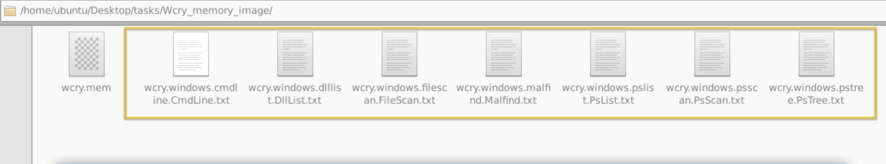
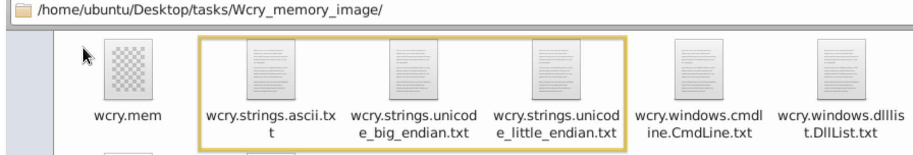

# Memory Investigation: Evidence Preprocessing

One of the most common investigative practices in Digital Forensics is the preprocessing of evidence. This involves running tools and saving the results in text or JSON format. The analyst often relies on tools such as Volatility when dealing with memory images as evidence. This tool is already included in the REMnux VM. Volatility commands are executed to identify and extract specific artefacts from memory images, and the resulting output can be saved to text files for further examination. Similarly, we can run a script involving the tool's different parameters to preprocess the acquired evidence faster.

&nbsp;

## Preprocessing With Volatility

In this module, we will use the Volatility 3 tool version. However, we won’t go deep into the investigation and analysis part of the result—we could write a whole book about it! Instead, we want you to be familiar with and get a feel for how the tool works. Run the command as instructed and wait for the result to show. Each plugin takes 2-3 minutes to show the output.

Here are some of the parameters or plugins we will use. We will focus on Windows plugins.

- windows.pstree.PsTree
- windows.pslist.PsList
- windows.cmdline.CmdLine
- windows.filescan.FileScan
- windows.dlllist.DllList
- windows.malfind.Malfind
- windows.psscan.PsScan

Let’s get started then!

In your RemnuxVM, run `sudo su`, then navigate to **/home/ubuntu/Desktop/tasks/Wcry_memory_image/** directory, and our file would be **wcry.mem**. We will run each plugin after the command `vol3 -f wcry.mem`.

&nbsp;

## PsTree

This plugin lists processes in a tree based on their parent process ID.

```shell
bob@BoB~/home/ubuntu/Desktop/tasks/Wcry_memory_image$ vol3 -f wcry.mem windows.pstree.PsTree
Volatility 3 Framework 2.0.0
Progress:  100.00		PDB scanning finished

PID		PPID	ImageFileName	Offset(V)	Threads	Handles	SessionId	Wow64	CreateTime			ExitTime

4		0	System		0x823c8830	51	244	N/A		False	N/A				N/A
* 348		4	smss.exe	0x82169020	3	19	N/A		False	2017-05-12 21:21:55.000000 	N/A
** 620		348	winlogon.exe	0x8216e020	23	536	0		False	2017-05-12 21:22:01.000000 	N/A
*** 664		620	services.exe	0x821937f0	15	265	0		False	2017-05-12 21:22:01.000000 	N/A
**** 1024	664	svchost.exe	0x821af7e8	79	1366	0		False	2017-05-12 21:22:03.000000 	N/A
***** 1768	1024	wuauclt.exe	0x81f747c0	7	132	0		False	2017-05-12 21:22:52.000000 	N/A
***** 1168	1024	wscntfy.exe	0x81fea8a0	1	37	0		False	2017-05-12 21:22:56.000000 	N/A
**** 1152	664	svchost.exe	0x821bea78	10	173	0		False	2017-05-12 21:22:06.000000 	N/A
**** 544	664	alg.exe		0x82010020	6	101	0		False	2017-05-12 21:22:55.000000 	N/A
**** 836	664	svchost.exe	0x8221a2c0	19	211	0		False	2017-05-12 21:22:02.000000 	N/A
**** 260	664	svchost.exe	0x81fb95d8	5	105	0		False	2017-05-12 21:22:18.000000 	N/A
**** 904	664	svchost.exe	0x821b5230	9	227	0		False	2017-05-12 21:22:03.000000 	N/A
**** 1484	664	spoolsv.exe	0x821e2da0	14	124	0		False	2017-05-12 21:22:09.000000 	N/A
**** 1084	664	svchost.exe	0x8203b7a8	6	72	0		False	2017-05-12 21:22:03.000000 	N/A
*** 676		620	lsass.exe	0x82191658	23	353	0		False	2017-05-12 21:22:01.000000 	N/A
** 596		348	csrss.exe	0x82161da0	12	352	0		False	2017-05-12 21:22:00.000000 	N/A
1636		1608	explorer.exe	0x821d9da0	11	331	0		False	2017-05-12 21:22:10.000000 	N/A
* 1956		1636	ctfmon.exe	0x82231da0	1	86	0		False	2017-05-12 21:22:14.000000 	N/A
* 1940		1636	tasksche.exe	0x82218da0	7	51	0		False	2017-05-12 21:22:14.000000 	N/A
** 740		1940	@WanaDecryptor@	0x81fde308	2	70	0		False	2017-05-12 21:22:22.000000 	N/A
```

&nbsp;

## PsList

This plugin is used to list all currently active processes in the machine.

```shell
bob@BoB~/home/ubuntu/Desktop/tasks/Wcry_memory_image$ vol3 -f wcry.mem windows.pslist.PsList
Volatility 3 Framework 2.0.0
Progress:  100.00		PDB scanning finished

PID	PPID	ImageFileName	Offset(V)	Threads	Handles	SessionId	Wow64	CreateTime			ExitTime	File output

4	0	System		0x823c8830	51	244	N/A		False	N/A				N/A		Disabled
348	4	smss.exe	0x82169020	3	19	N/A		False	2017-05-12 21:21:55.000000 	N/A		Disabled
596	348	csrss.exe	0x82161da0	12	352	0		False	2017-05-12 21:22:00.000000 	N/A		Disabled
620	348	winlogon.exe	0x8216e020	23	536	0		False	2017-05-12 21:22:01.000000 	N/A		Disabled
664	620	services.exe	0x821937f0	15	265	0		False	2017-05-12 21:22:01.000000 	N/A		Disabled
676	620	lsass.exe	0x82191658	23	353	0		False	2017-05-12 21:22:01.000000 	N/A		Disabled
836	664	svchost.exe	0x8221a2c0	19	211	0		False	2017-05-12 21:22:02.000000 	N/A		Disabled
904	664	svchost.exe	0x821b5230	9	227	0		False	2017-05-12 21:22:03.000000 	N/A		Disabled
1024	664	svchost.exe	0x821af7e8	79	1366	0		False	2017-05-12 21:22:03.000000 	N/A		Disabled
1084	664	svchost.exe	0x8203b7a8	6	72	0		False	2017-05-12 21:22:03.000000 	N/A		Disabled
1152	664	svchost.exe	0x821bea78	10	173	0		False	2017-05-12 21:22:06.000000 	N/A		Disabled
1484	664	spoolsv.exe	0x821e2da0	14	124	0		False	2017-05-12 21:22:09.000000 	N/A		Disabled
1636	1608	explorer.exe	0x821d9da0	11	331	0		False	2017-05-12 21:22:10.000000 	N/A		Disabled
1940	1636	tasksche.exe	0x82218da0	7	51	0		False	2017-05-12 21:22:14.000000 	N/A		Disabled
1956	1636	ctfmon.exe	0x82231da0	1	86	0		False	2017-05-12 21:22:14.000000 	N/A		Disabled
260	664	svchost.exe	0x81fb95d8	5	105	0		False	2017-05-12 21:22:18.000000 	N/A		Disabled
740	1940	@WanaDecryptor@	0x81fde308	2	70	0		False	2017-05-12 21:22:22.000000 	N/A		Disabled
1768	1024	wuauclt.exe	0x81f747c0	7	132	0		False	2017-05-12 21:22:52.000000 	N/A		Disabled
544	664	alg.exe		0x82010020	6	101	0		False	2017-05-12 21:22:55.000000 	N/A		Disabled
1168	1024	wscntfy.exe	0x81fea8a0	1	37	0		False	2017-05-12 21:22:56.000000 	N/A		Disabled
```

&nbsp;

## CmdLine

This plugin is used to list process command line arguments.

```shell
bob@BoB~/home/ubuntu/Desktop/tasks/Wcry_memory_image$ vol3 -f wcry.mem windows.cmdline.CmdLine
Volatility 3 Framework 2.0.0
Progress:  100.00		PDB scanning finished

PID	Process		Args

4	System		Required memory at 0x10 is not valid (process exited?)
348	smss.exe	\SystemRoot\System32\smss.exe
596	csrss.exe	C:\WINDOWS\system32\csrss.exe ObjectDirectory=\Windows SharedSection=1024,3072,512 Windows=On SubSystemType=Windows ServerDll=basesrv,1 ServerDll=winsrv:UserServerDllInitialization,3 ServerDll=winsrv:ConServerDllInitialization,2 ProfileControl=Off MaxRequestThreads=16
620	winlogon.exe	winlogon.exe
664	services.exe	C:\WINDOWS\system32\services.exe
676	lsass.exe	C:\WINDOWS\system32\lsass.exe
836	svchost.exe	C:\WINDOWS\system32\svchost -k DcomLaunch
904	svchost.exe	C:\WINDOWS\system32\svchost -k rpcss
1024	svchost.exe	C:\WINDOWS\System32\svchost.exe -k netsvcs
1084	svchost.exe	C:\WINDOWS\system32\svchost.exe -k NetworkService
1152	svchost.exe	C:\WINDOWS\system32\svchost.exe -k LocalService
1484	spoolsv.exe	C:\WINDOWS\system32\spoolsv.exe
1636	explorer.exe	C:\WINDOWS\Explorer.EXE
1940	tasksche.exe	"C:\Intel\ivecuqmanpnirkt615\tasksche.exe" 
1956	ctfmon.exe	"C:\WINDOWS\system32\ctfmon.exe" 
260	svchost.exe	C:\WINDOWS\system32\svchost.exe -k LocalService
740	@WanaDecryptor@	@WanaDecryptor@.exe
1768	wuauclt.exe	"C:\WINDOWS\system32\wuauclt.exe" /RunStoreAsComServer Local\[400]SUSDS81a6658cb72fa845814e75cca9a42bf2
544	alg.exe		C:\WINDOWS\System32\alg.exe
1168	wscntfy.exe	C:\WINDOWS\system32\wscntfy.exe
```

&nbsp;

## FileScan

This plugin scans for file objects in a particular Windows memory image. The results have more than 1,400 lines.

```shell
bob@BoB~/home/ubuntu/Desktop/tasks/Wcry_memory_image$ vol3 -f wcry.mem windows.filescan.FileScan
Volatility 3 Framework 2.0.0
Progress:  100.00		PDB scanning finished

Offset		Name						Size
0x1f40310	\Endpoint					112
0x1f65718	\Endpoint					112
0x1f66cd8	\WINDOWS\system32\wbem\wmipcima.dll		112
0x1f67198	\WINDOWS\Prefetch\TASKDL.EXE-01687054.pf	112
0x1f67a70	\WINDOWS\system32\security.dll			112
0x1f67c68	\boot.ini					112
0x1f67ef8	\WINDOWS\system32\cfgmgr32.dll			112
0x1f684d0	\WINDOWS\system32\wbem\framedyn.dll		112
0x1f686d8	\WINDOWS\system32\wbem\cimwin32.dll		112
0x1f6a7f0	\WINDOWS\system32\kmddsp.tsp			112
0x1f6ae20	\$Directory					112
0x1f6b9b0	\$Directory					112
0x1f6bbf8	\$Directory					112
0x1f6bdc8	\PIPE_EVENTROOT\CIMV2SCM EVENT PROVIDER		112
0x1f6be60	\WINDOWS\win.ini				112
[...]
```

&nbsp;

## DllList

This plugin lists the loaded modules in a particular Windows memory image. Due to a text limitation, this one won't have results.

```shell
bob@BoB~/home/ubuntu/Desktop/tasks/Wcry_memory_image$ vol3 -f wcry.mem windows.dlllist.DllList
Volatility 3 Framework 2.0.0
Progress:  100.00		PDB scanning finished
```

&nbsp;

## PsScan

This plugin is used to scan for processes present in a particular Windows memory image.

```shell
bob@BoB~/home/ubuntu/Desktop/tasks/Wcry_memory_image$ vol3 -f wcry.mem windows.psscan.PsScan
Volatility 3 Framework 2.0.0
Progress:  100.00		PDB scanning finished

PID	PPID	ImageFileName	Offset(V)	Threads	Handles	SessionId	Wow64	CreateTime			ExitTime			File output
860	1940	taskdl.exe	0x1f4daf0	0	-	0		False	2017-05-12 21:26:23.000000 	2017-05-12 21:26:23.000000 	Disabled
536	1940	taskse.exe	0x1f53d18	0	-	0		False	2017-05-12 21:26:22.000000 	2017-05-12 21:26:23.000000 	Disabled
424	1940	@WanaDecryptor@	0x1f69b50	0	-	0		False	2017-05-12 21:25:52.000000 	2017-05-12 21:25:53.000000 	Disabled
1768	1024	wuauclt.exe	0x1f747c0	7	132	0		False	2017-05-12 21:22:52.000000 	N/A				Disabled
576	1940	@WanaDecryptor@	0x1f8ba58	0	-	0		False	2017-05-12 21:26:22.000000 	2017-05-12 21:26:23.000000 	Disabled
260	664	svchost.exe	0x1fb95d8	5	105	0		False	2017-05-12 21:22:18.000000 	N/A				Disabled
740	1940	@WanaDecryptor@	0x1fde308	2	70	0		False	2017-05-12 21:22:22.000000 	N/A				Disabled
1168	1024	wscntfy.exe	0x1fea8a0	1	37	0		False	2017-05-12 21:22:56.000000 	N/A				Disabled
544	664	alg.exe		0x2010020	6	101	0		False	2017-05-12 21:22:55.000000 	N/A				Disabled
1084	664	svchost.exe	0x203b7a8	6	72	0		False	2017-05-12 21:22:03.000000 	N/A				Disabled
596	348	csrss.exe	0x2161da0	12	352	0		False	2017-05-12 21:22:00.000000 	N/A				Disabled
348	4	smss.exe	0x2169020	3	19	N/A		False	2017-05-12 21:21:55.000000 	N/A				Disabled
620	348	winlogon.exe	0x216e020	23	536	0		False	2017-05-12 21:22:01.000000 	N/A				Disabled
676	620	lsass.exe	0x2191658	23	353	0		False	2017-05-12 21:22:01.000000 	N/A				Disabled
664	620	services.exe	0x21937f0	15	265	0		False	2017-05-12 21:22:01.000000 	N/A				Disabled
1024	664	svchost.exe	0x21af7e8	79	1366	0		False	2017-05-12 21:22:03.000000 	N/A				Disabled
904	664	svchost.exe	0x21b5230	9	227	0		False	2017-05-12 21:22:03.000000 	N/A				Disabled
1152	664	svchost.exe	0x21bea78	10	173	0		False	2017-05-12 21:22:06.000000 	N/A				Disabled
1636	1608	explorer.exe	0x21d9da0	11	331	0		False	2017-05-12 21:22:10.000000 	N/A				Disabled
1484	664	spoolsv.exe	0x21e2da0	14	124	0		False	2017-05-12 21:22:09.000000 	N/A				Disabled
1940	1636	tasksche.exe	0x2218da0	7	51	0		False	2017-05-12 21:22:14.000000 	N/A				Disabled
836	664	svchost.exe	0x221a2c0	19	211	0		False	2017-05-12 21:22:02.000000 	N/A				Disabled
1956	1636	ctfmon.exe	0x2231da0	1	86	0		False	2017-05-12 21:22:14.000000 	N/A				Disabled
4	0	System		0x23c8830	51	244	N/A		False	N/A				N/A				Disabled
```

&nbsp;

## Malfind

This plugin is used to lists process memory ranges that potentially contain injected code. There won't be any View Results icon for this one due to text limitation.

```shell
bob@BoB~/home/ubuntu/Desktop/tasks/Wcry_memory_image$ vol3 -f wcry.mem windows.malfind.Malfind
Volatility 3 Framework 2.0.0
Progress:  100.00		PDB scanning finished
```

For more information regarding other plugins, you may check this [link](https://volatility3.readthedocs.io/en/stable/volatility3.plugins.html).

Now, you have the plugins running individually and seeing the result. What you will do now is process this in bulk. Remember, one of the investigative practices involves preprocessing evidence and saving the results to text files, right? The question is how?

The answer? Do a loop statement! See the command below.

```shell
bob@BoB~/home/ubuntu/Desktop/tasks/Wcry_memory_image$ for plugin in windows.malfind.Malfind windows.psscan.PsScan windows.pstree.PsTree windows.pslist.PsList windows.cmdline.CmdLine windows.filescan.FileScan windows.dlllist.DllList; do vol3 -q -f wcry.mem $plugin > wcry.$plugin.txt; done
```

Let’s break this command down, shall we?

- We created a variable named `$plugin` with values of each volatility plugin
- Then ran vol3 parameters `-q`, which means quiet mode or does not show the progress in the terminal
- And `-f,` which means read from the memory capture.
- The `$plugin > wcry.$plugin.done;` means run volatility with the plugins and output it to a file with wcry at the beginning of the text, followed by the name of the plugins and with an extension of `.txt`. Repeat until the value of variable $plugin is used.

After running the command, you won't see any output from the terminal; you'll see files within the same directory where you ran the command.



&nbsp;

## Preprocessing With Strings

Next, we will preprocess the memory image with the <span style="color: inherit;">Linux</span> <span style="color: #2dc26b;">strings</span> utility. We will extract the **ASCII**, 16-bit **little-endian**, and 16-bit **big-endian** strings. See the command below.

```shell
bob@BoB~/home/ubuntu/Desktop/tasks/Wcry_memory_image$ strings wcry.mem > wcry.strings.ascii.txt
bob@BoB~/home/ubuntu/Desktop/tasks/Wcry_memory_image$ strings -e l  wcry.mem > wcry.strings.unicode_little_endian.txt
bob@BoB~/home/ubuntu/Desktop/tasks/Wcry_memory_image$ strings -e b  wcry.mem > wcry.strings.unicode_big_endian.txt
```

The strings command extracts printable ASCII text. The `-e l` option tells strings to extract 16-bit little endian strings. The `-e b` option tells strings to extract 16-bit big endian strings. All three string formats can provide useful information about the system under investigation.

You should have the same output below.



Now, this is ready for analysis, but remember, our goal here in this task is to preprocess the evidence so that any analyst who will investigate this can expedite searches and analysis.