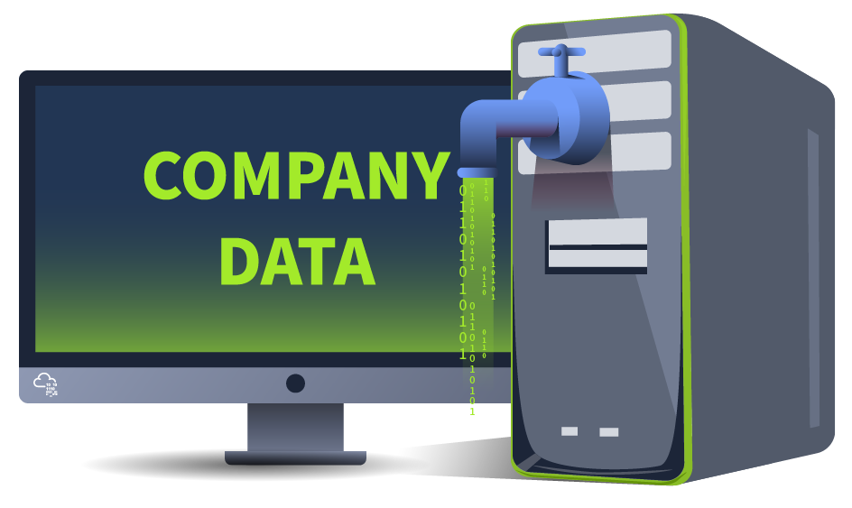

# Types of Incidents

People usually label every harmful activity associated with the digital world as a hacking attempt. This may be correct, but it is very generic in terms of cyber security. Security Incidents can be of different types. In the previous module, we saw an example of a true positive alert, which became an incident after the analysis of the security team. This incident was related to the phishing email, which probably came with a malicious attachment. If downloaded into the system, this attachment may have harmful consequences. This is one type of incident. There are several other types of incidents. These types can occur independently or altogether within the same victim.

- **Malware Infections**: Malware is a malicious program that can damage a system, network, or application. The majority of incidents are associated with malware infections. There are different types of malware, each with a unique potential to cause damage. Malware infections are mostly caused by files that can be text, documents, executables, etc.

- **Security Breaches:** Security Breaches arise when an unauthorized person gets access to confidential data (something we don’t want them to see or have). Security Breaches are of the utmost importance as many businesses rely on their confidential data, which must only be accessible to authorized personnel.

- **Data Leaks:** Data leaks are incidents in which confidential information of an individual or an organization is exposed to unauthorized entities. Many attackers use data leaks for reputational damage to their victims or use this technique to threaten their victims and get what they need from them. Unlike Security Breaches, data leaks can also be unintentionally caused by human errors or misconfigurations.

- **Insider Attacks:** Incidents from within an organization are known as insider attacks. Think about a disgruntled employee infecting the whole network through a USB on his last day. This is an example of an insider attack. Someone within your organization intentionally initiating an attack comes under this category. These attacks can be hazardous, as an insider always has greater access to resources than an outsider.

- **Denial Of Service Attacks:** Availability is one of the three pillars of cyber security. Defensive security solutions and people constantly find ways to protect information; they ensure that the data is available to the people simultaneously. This is because there is no point in protecting something that is unavailable to us. Denial of Service attacks, or DoS attacks, are incidents where the attacker floods a system/network/application with false requests, eventually making it unavailable to legitimate users. This happens due to the exhaustion of resources available to entertain the requests.

All these incidents have their unique potential to impact the victim negatively. These incidents can not be compared in terms of the severity of the impact they create. This is because a particular incident can be disastrous for one organization while it can cause minor damage to another. For example, XYZ Corp. may not be heavily impacted by a data leak as the information it stores can be useless to anybody else. However, it can undergo a massive loss in case of a Denial of Service (DoS) attack on its primary website, as its services depend on that website.