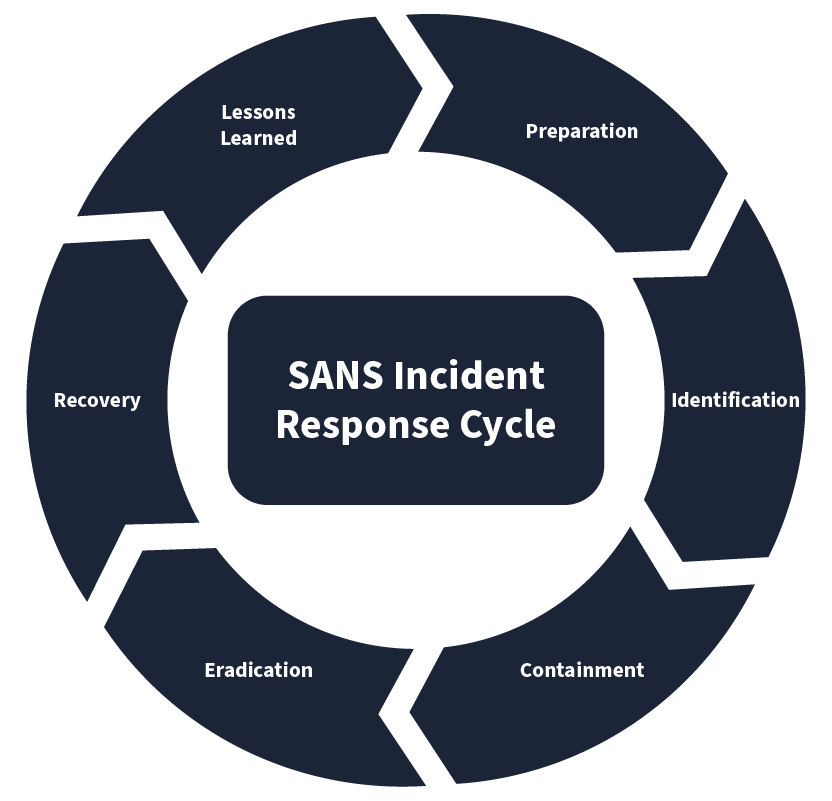
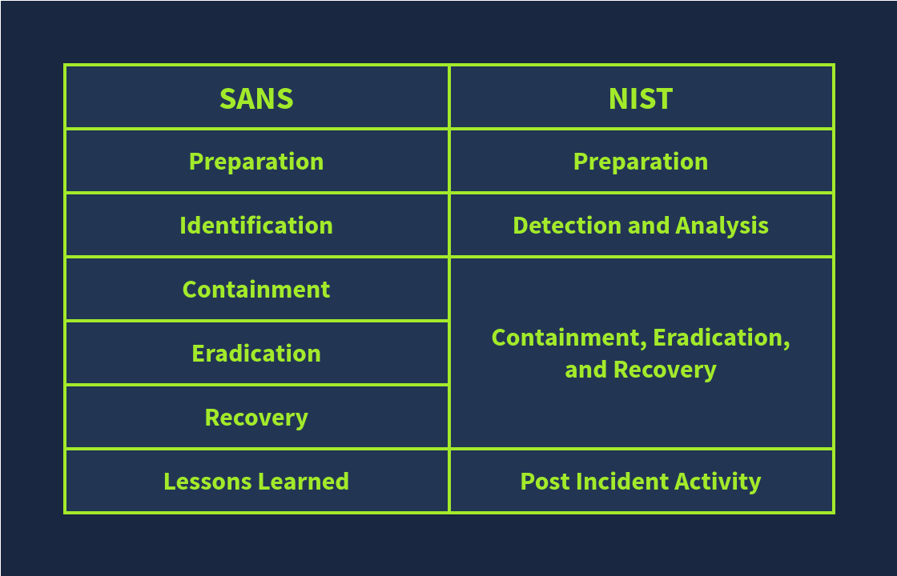

# Incident Response Process

In the previous module, we saw different types of incidents. Sometimes, handling a variety of incidents in an environment can be difficult. Due to the distinct nature of incidents in organizations, there should be a structured process for incident response. Incident Response Frameworks help us in this regard. These are the generic approaches to follow in any incident for effective response. We will discuss the two widely used incident response frameworks: SANS and NIST.

SANS and NIST are popular organizations contributing to cyber security. SANS has offered various courses and certifications in cyber security, and NIST played its role in developing standards and guidelines for cyber security. Both SANS and NIST have quite similar incident response frameworks.

The SANS incident Response framework has 6 phases, which can be called 'PICERL' to remember them easily.

| Phase | Explanation | Example |
| --- | --- | --- |
| Preparation | This is the first phase. The preparation phase includes building the necessary resources to handle an incident. These resources include developing incident response teams, having a proper incident response plan in place, and deploying necessary security solutions to combat the incidents. | Conducting awareness training for employees on phishing emails. Phishing emails are fraudulent emails sent by malicious attackers that can trick you into performing actions that can lead you to an incident. |
| Identification | The identification phase refers to looking for any abnormal behavior that may indicate an incident. This involves using various security solutions and techniques to monitor abnormal events. | The security team notices a huge amount of data being sent out from one of the hosts. Upon analysis, it was found to be compromised after a malicious file was downloaded from a phishing email attachment. |
| Containment | Once an incident has been identified, the next step should be to contain it. This means minimizing the impact of the attack. This is usually done by isolating the victim machine, disabling the compromised user accounts, etc. | The Security team isolates the host from the network to minimize the impact and not allow the attacker to jump to other systems, leveraging the compromised host. |
| Eradication | This phase, as its name suggests, involves removing the threat from the attacked environment. The threat may be of any kind. The eradication phase will ensure the subject environment is clean, and now we can move to the recovery phase. | A deep malware scan was executed on the system to remove the malicious software from the host. |
| Recovery | The recovery phase is very important in this chain. It involves recovering the affected systems from backup or rebuilding them. The recovered systems are then tested and are ready to use. | The compromised host was re-configured, and the exfiltrated data was restored from the backup. |
| Lessons Learned | This is also an important part of the incident response lifecycle. Gaps in the detection and analysis of the incident are identified and documented, helping to improve the overall process in future incidents. | Conducting a post-incident review meeting to analyze the incident's root cause and improve the security to prevent future attacks. |

The Incident Response Framework of NIST is similar to the SANS framework we studied above. The number of phases in this framework is reduced to 4.

Following is the comparison of both:

Organizations may derive their incident response processes by following these frameworks. Every process has a formal document listing all the relevant organizational procedures. The formal incident response document is called the **Incident Response Plan**. This structured document underlines the approach during any incident. It is formally approved by senior management and consists of the procedures to be followed before, during, and after an incident has been completed.

The key components of this plan include (and are not limited to):

- Roles and Responsibilities
- Incident Response methodology
- Communication plan with stakeholders, including law enforcement
- Escalation path to be followed