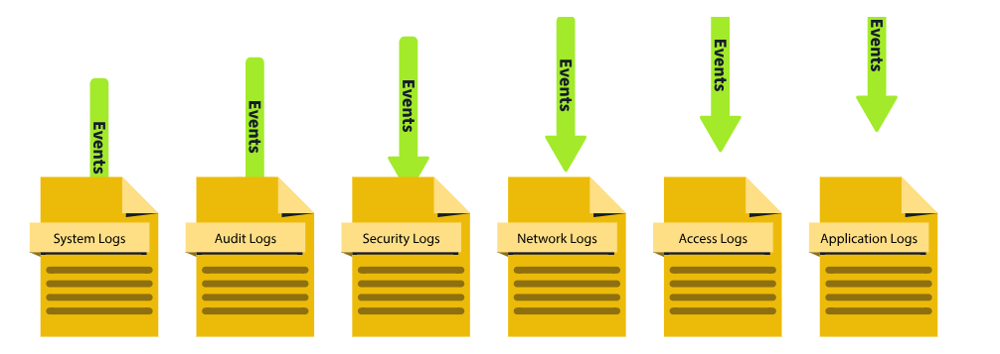

# Types of Logs

In the previous module, we saw various use cases of logs. But there is a challenge. Imagine you have to investigate an issue in a system through the logs; you open the log file of that system, and now you are lost after seeing numerous events of different categories.

Here is the solution: Logs are segregated into multiple categories according to the type of information they provide. So now you just need to look into the specific log file for which the issue relates.

For example, you need to investigate the successful logins from yesterday at a specific timeframe in Windows OS. Instead of looking into all the logs, you only need to see the system’s **Security Logs** to find the login information. We also have other types of logs that are useful in investigating different incidents. Let’s have a look at them.

| Log Type | Usage | Example |
| --- | --- | --- |
| System Logs | The system logs can be helpful in troubleshooting running issues in the OS. These logs provide information on various operating system activities. | \- System Startup and shutdown events   \- Driver Loading events   \- System Error events   \- Hardware events |
| Security Logs | The security logs help detect and investigate incidents. These logs provide information on the security-related activities in the system. | \-Authentication events   \- Authorization events   \- Security Policy changes events   \- User Account changes events - Abnormal Activity events |
| Application Logs | The application logs contain specific events related to the application. Any interactive or non-interactive activity happening inside the application will be logged here. | \- User Interaction events   \- Application Changes events   \- Application Update events   \- Application Error events |
| Audit Logs | The Audit logs provide detailed information on the system changes and user events. These logs are helpful for compliance requirements and can play a vital role in security monitoring as well. | \- Data Access events   \- System Change events   \- User Activity events   \- Policy Enforcement events |
| Network Logs | Network logs provide information on the network’s outgoing and incoming traffic. They play crucial roles in troubleshooting network issues and can also be handy during incident investigations. | \- Incoming Network Traffic events   \- Outgoing Network Traffic events   \- Network Connection Logs - Network Firewall Logs |
| Access Logs | The Access logs provide detailed information about the access to different resources. These resources can be of different types, providing us with information on their access. | \- Webserver Access Logs   \- Database Access Logs - Application Access Logs   \- API Access Logs |

**Note:** There can be various other types of logs depending on the different applications and the services they provide.

Now that we understand what these logs are and how various types of logs can be helpful in different scenarios, let’s see how we analyze these logs and extract valuable information required from them. Log Analysis is a technique for extracting valuable data from logs. It involves looking for any signs of abnormal or unusual activities. Searching for a specific activity or abnormalities in the logs with the naked eye is impossible. For this reason, we have several manual and automated techniques for log analysis. We will manually carry out log analysis on Windows and Web Server Access Logs in the upcoming modules.