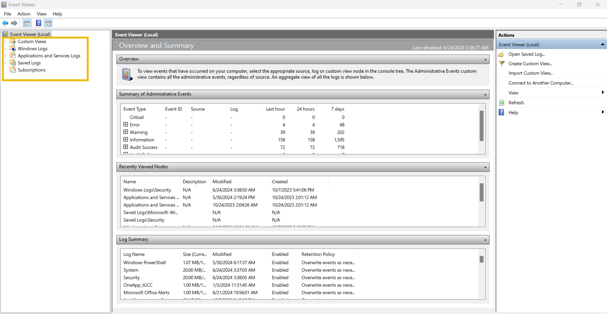
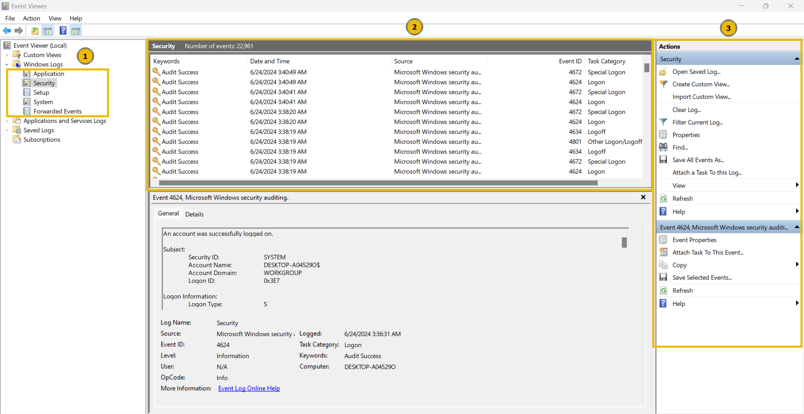
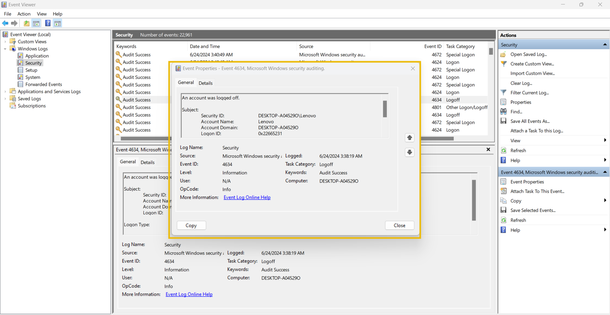
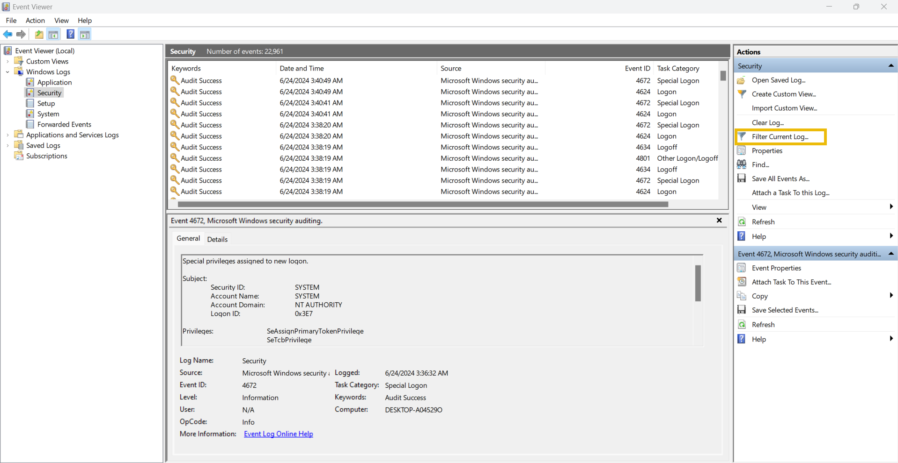
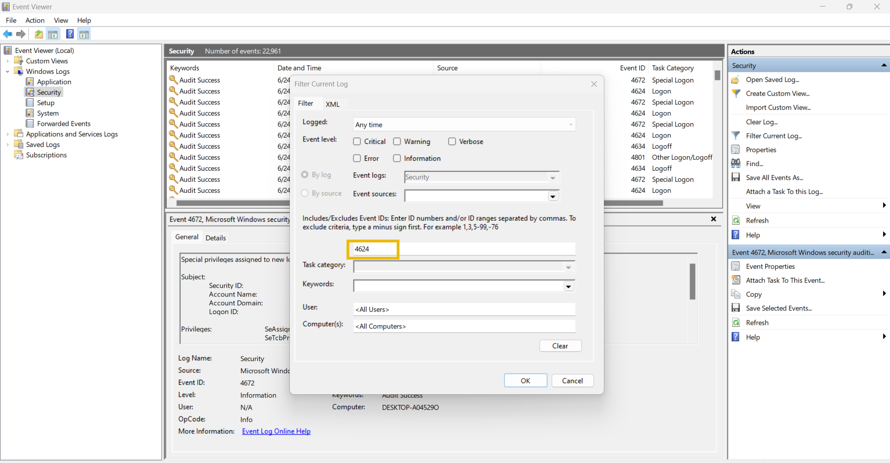
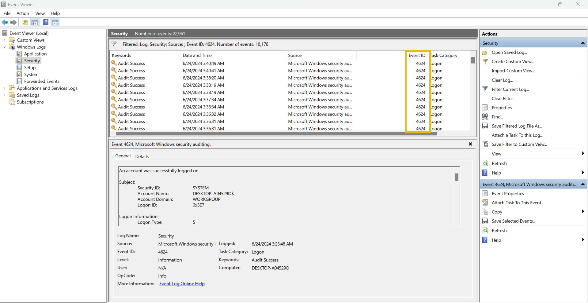

# Windows Event Logs Analysis

Like other operating systems, Windows OS also logs many of the activities that take place. These are stored in segregated log files, each with a specific log category. Some of the crucial types of logs stored in a Windows Operating System are:

- **Application:** There are many applications running on the operating system. Any information related to those applications is logged into this file. This information includes errors, warnings, compatibility issues, etc.
- **System:** The operating system itself has different running operations. Any information related to these operations is logged in the System log file. This information includes driver issues, hardware issues, system startup and shutdown information, services information, etc.
- **Security:** This is the most important log file in Windows OS in terms of security. It logs all security-related activities, including user authentication, changes in user accounts, security policy changes, etc.

Besides these, several other log files in the Windows operating system are designed for logging activities related to specific actions and applications.

Unlike other log files studied in the previous modules, which had no built-in application to view them, Windows OS has a utility known as Event Viewer, which gives a nice graphical user interface to view and search for anything in these logs.

To open Event Viewer, click on the Start button of Windows and type ‘Event Viewer’. It will open the Event Viewer for you, as shown below. The highlighted area in the screenshot below shows the different available logs.

You can click ‘Windows Logs’ from the highlighted section to see the different types of logs we discussed at the beginning of this module.

The first highlighted portion shows the different log files. When we click one of these log files, we will see the different logs, as can be seen in the second highlighted portion. Lastly, in the third highlighted portion, we have different options for analyzing the logs.

Let’s double-click on one of these logs to see its contents.

This is how a Windows event log looks. It has different fields. The major fields are discussed below:

- **Description:** This field has a detailed information of the activity.
- **Log Name:** The Log Name indicates the log file name.
- **Logged:** This field indicates the time of the activity.
- **Event ID:** Event IDs are unique identifiers for a specific activity.

Numerous event IDs are available in Windows event logs. We can use these event IDs to search for any specific activity. For example, event ID 4624 uniquely identifies the activity of a successful login, so you only need to search for this event ID 4624 when investigating successful logins.

Here is a table of some important Event IDs in Windows Operating System.

| Event ID | Description |
| --- | --- |
| 4624 | A user account successfully logged in |
| 4625 | A user account failed to login |
| 4634 | A user account successfully logged off |
| 4720 | A user account was created |
| 4724 | An attempt was made to reset an account’s password |
| 4722 | A user account was enabled |
| 4725 | A user account was disabled |
| 4726 | A user account was deleted |

There are many more event IDs. It is not necessary to remember all of them, but it is good to remember the crucial event IDs.

Event Viewer allows us to search for the logs related to a specific event ID with its ‘Filter Current Log’ feature. We can click on this feature to apply any filter.

When we click on the ‘Filter Current Log’ option, we will be prompted to enter the event IDs we want to filter. In the screenshot below, I filtered the event ID 4624.

Once I hit the 'OK' button, I can see all the logs with the event ID: 4624. I can now view any of these logs by double-clicking them.

