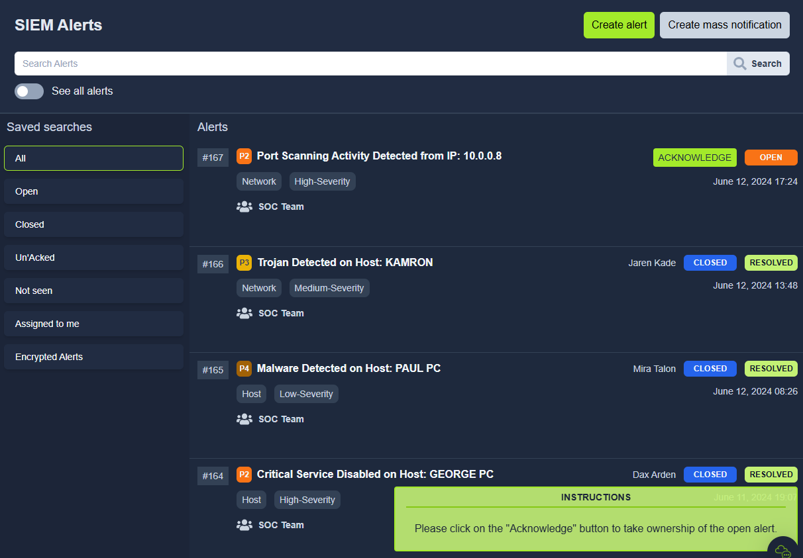
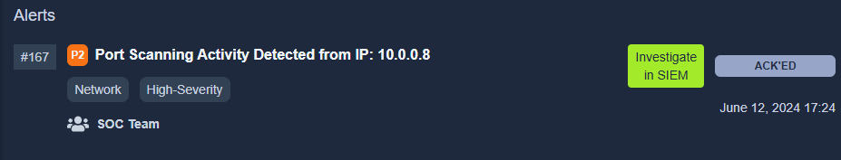
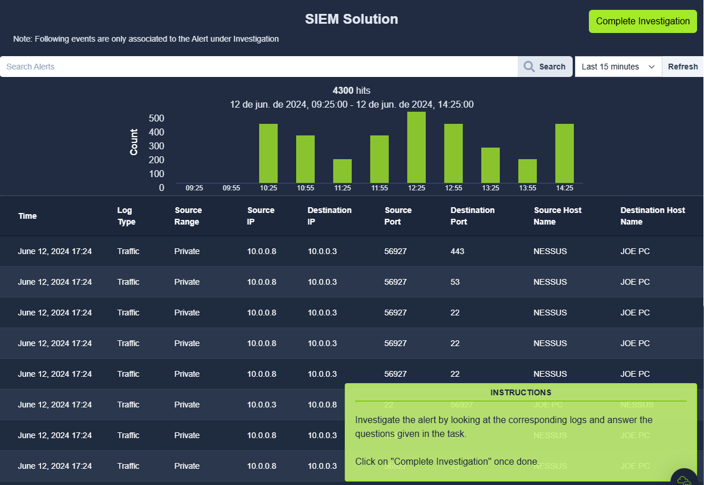
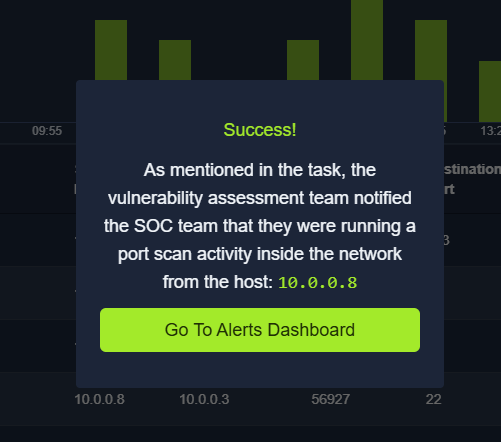

# Practical Example

This practical exercise uses People, Processes, and Technology and gives you a practical walkthrough of the role of a Level 1 Analyst in the SOC team.

Click on the **View Site** button below to display the lab on the right side of the screen.

## Scenario

You are the Level 1 Analyst of your organization’s SOC team. You receive an alert that a port scanning activity has been observed on one of the hosts in the network. You have access to the SIEM solution, where you can see all the associated logs for this alert. You are tasked to view the logs individually and answer the question to the 5 Ws given below.

**Note**: The vulnerability assessment team notified the SOC team that they were running a port scan activity inside the network from the host: `10.0.0.8`

&nbsp;

## Exercises

### Question 1

What: Activity that triggered the alert?

answer: Port Scan

&nbsp;

### Question 2

When: Time of the activity?

answer: June 12, 2024 17:24

&nbsp;

### Question 3

Where: Destination host IP?

answer: 10.0.0.3

&nbsp;

### Question 4

Who: Source host name?

answer: Nessus

&nbsp;

### Question 5

Why: Reason for the activity? Intended/Malicious

answer: intended

&nbsp;

### Question 6

Additional Investigation Notes: Has any response been sent back to the port scanner IP? (yea/nay)

answer: yes

&nbsp;

&nbsp;