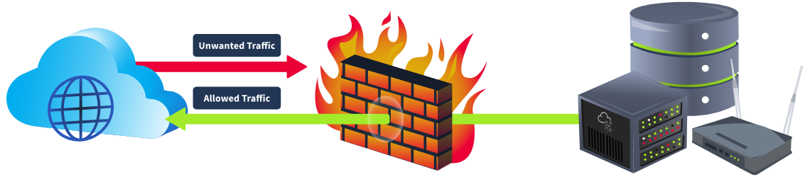

# Introduction

A firewall is designed to inspect a network's or digital device’s incoming and outgoing traffic. The goal is the same as for the security guard sitting outside a building: not letting any unauthorized visitor enter a system or a network. You instruct the firewall by giving it rules to check against all the traffic. Anything that comes in or goes out of your device or network would face the firewall first. The firewall will allow or deny that traffic based on its maintained rules. Most firewalls today go beyond rule-based filtering and offer extra functionalities to protect your device or network from the outside world.

A **firewall** is a network security device or software that monitors and controls incoming and outgoing network traffic based on predefined security rules. It acts as a barrier between a trusted internal network (such as a private company network) and untrusted external networks (such as the internet).

### Key Functions of a Firewall

1.  **Traffic Filtering** – Blocks or allows network traffic based on rules.
2.  **Threat Protection** – Prevents malicious attacks, such as malware or unauthorized access.
3.  **Monitoring & Logging** – Keeps records of network activity for security audits.
4.  **Access Control** – Restricts users and devices based on policies.
5.  **Prevention of Data Leakage** – Stops sensitive data from being transmitted outside the network.

* * *

### Types of Firewalls

1.  **Packet Filtering Firewalls**
    
    - Examines packets (data units) based on IP addresses, ports, and protocols.
    - Fast but lacks deep inspection.
2.  **Stateful Inspection Firewalls**
    
    - Monitors active connections and determines whether packets are part of a legitimate session.
    - More secure than packet filtering.
3.  **Proxy Firewalls**
    
    - Acts as an intermediary between users and the internet.
    - Masks internal network details and provides deep security filtering.
4.  **Next-Generation Firewalls (NGFWs)**
    
    - Includes deep packet inspection (DPI), intrusion prevention systems (IPS), and threat intelligence.
    - Offers advanced security beyond traditional firewalls.
5.  **Cloud-Based Firewalls**
    
    - Also known as Firewall-as-a-Service (FaaS).
    - Protects cloud infrastructure and remote users.

* * *

### Where Firewalls Are Used

- **Personal Computers** (Windows/Mac built-in firewalls)
- **Businesses & Enterprises** (Corporate networks)
- **Data Centers & Cloud Providers** (AWS, Azure, Google Cloud)
- **Government & Military Networks** (Highly classified systems)

* * *

### Why Firewalls Matter

Without a firewall, networks are vulnerable to cyberattacks, hacking, data theft, and malware infections. Firewalls act as the first line of defense in cybersecurity.