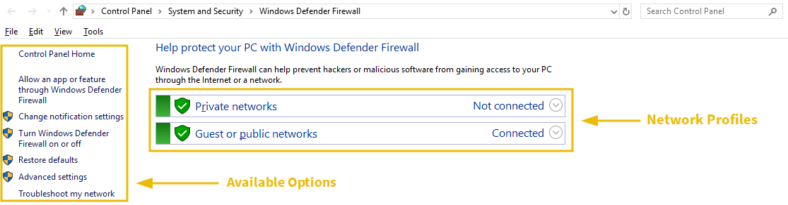
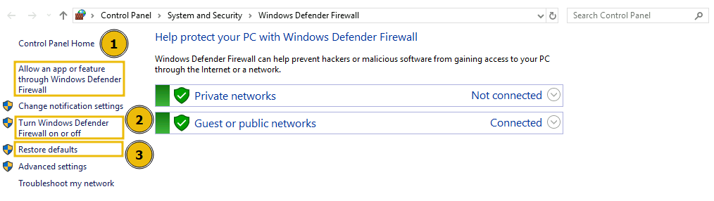
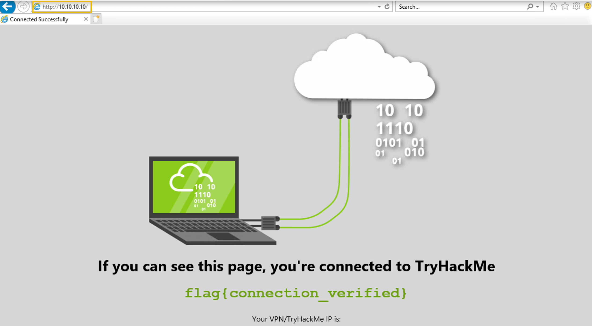
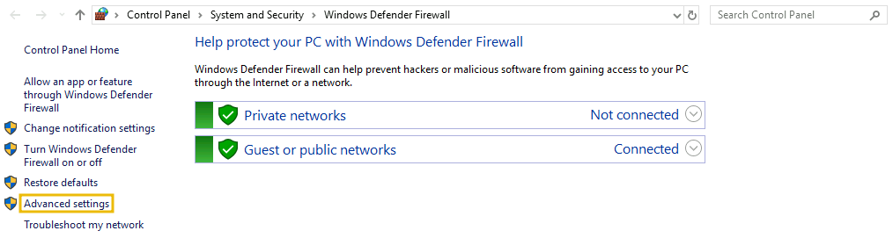
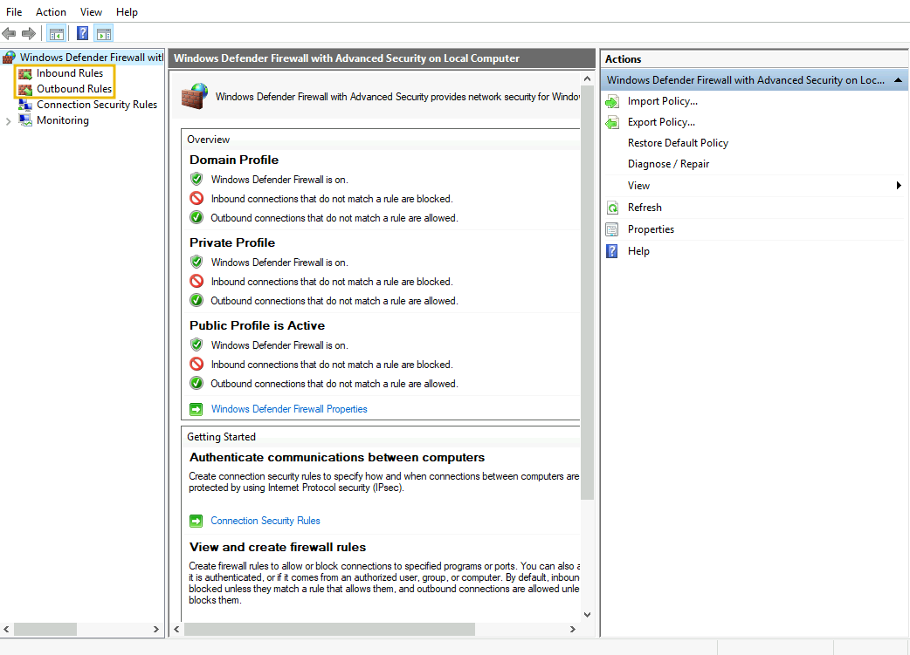
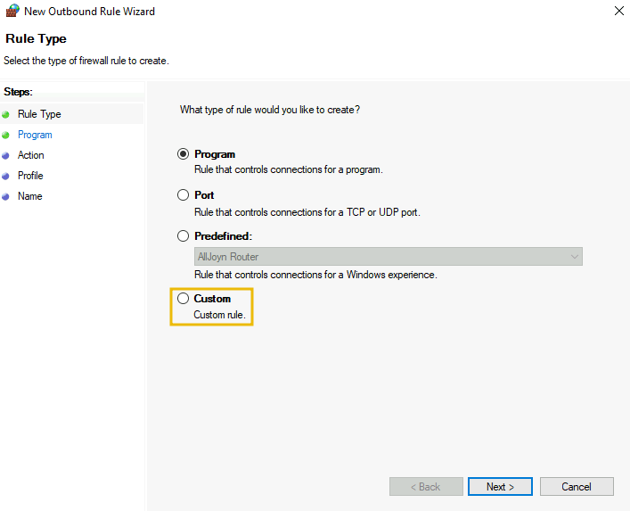
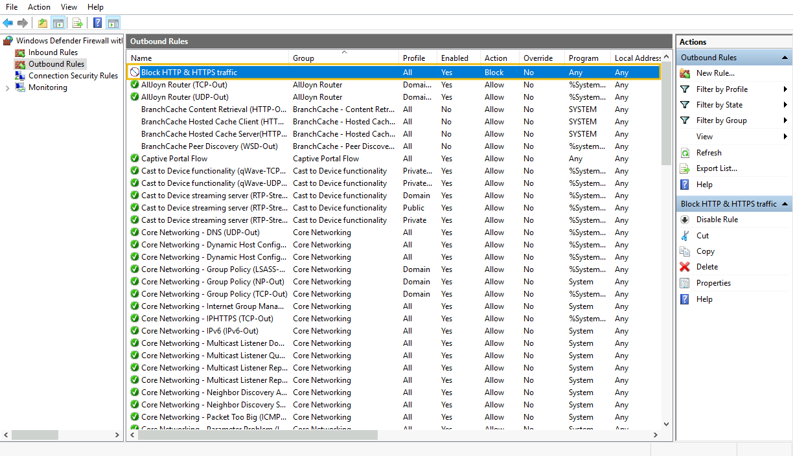
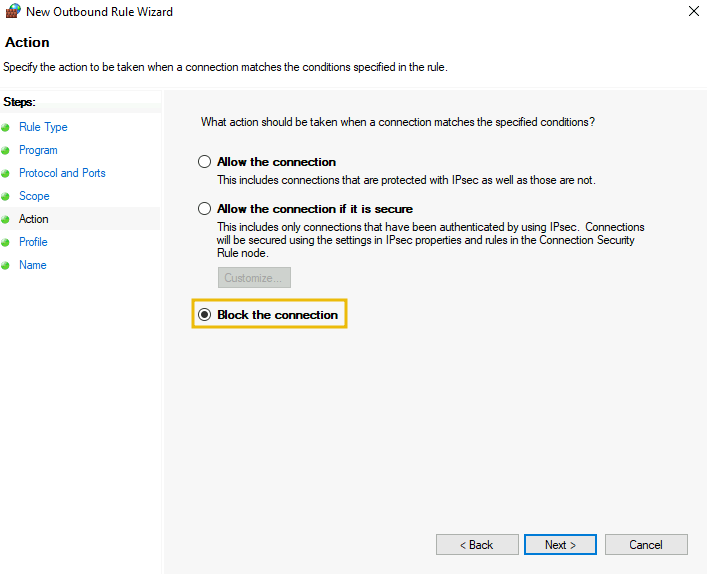
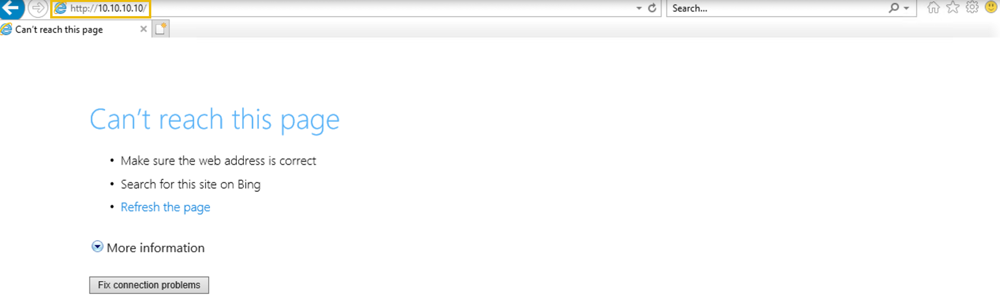

# Windows Defender Firewall

Windows Defender is a built-in firewall introduced by Microsoft in the Windows OS. This firewall contains all the basic functionality for creating, allowing, or denying specific programs or creating customized rules. This module is designed to cover some of the essential components of the Windows Defender Firewall through a practical example, which you can utilize to restrict your system’s incoming and outgoing network traffic. To open this firewall, you have to open the Windows search and type "Windows Defender Firewall."

The Windows Defender Firewall’s home page shows the "Network Profiles" and the available options. This is the main dashboard with all the options for the firewall.

## Network Profiles

There are two available network profiles. Windows firewall determines your current network based on Network Location Awareness (NLA) and applies that profile firewall settings for you. We can have different firewall settings for each of them.

1.  **Private networks:** This includes the firewall configurations to apply when connected to our home network.
2.  **Guest or public networks:** This includes the firewall configurations to apply when connected to a public or untrusted network like coffee shops, restaurants, or similar. For example, when connecting to public networks, you can configure firewall settings to block all incoming network connections and allow only some outgoing connections that are essential for you. These settings will apply to the public network profile and will not be implemented when you are in your private home network.

To allow/disallow any application in any of your network profiles, click on the option (highlighted as 1 in the screenshot). This will take you to the page listing all the apps and features installed in your system. You can checkmark the ones you want to allow in any of your network profiles or uncheck those if not needed. Windows Defender Firewall is turned on by default. However, if you want to turn it on/off, you can click on the option (highlighted as 2 in the screenshot). This will take you to the settings for both of your network profiles. Rather than completely turning it off, which Microsoft doesn’t recommend, you can also block all incoming connections. You can also click on "Restore Defaults" (highlighted as 3 in the screenshot) from the main dashboard anytime to restore all the firewall's default settings.

## Custom Rules

Windows Defender Firewall also allows you to create custom rules for your network to allow/disallow specific traffic as needed. Let’s create a custom rule to block all outgoing traffic on HTTP (port 80) or HTTPS (port 443). After creating this rule, we will be unable to browse any website on the Internet as the websites are working on port 80 or 443, which we will be blocking.

Before creating this rule, let's test if we are able to visit a website. For testing, let's visit `http://10.10.10.10/`. As shown in the screenshot below, we are able to visit this website.

To create a custom rule, choose "Advanced Settings" from the available options in the main dashboard. This will open a new tab where you can create your own rules.

You can see the available options to create inbound and outbound rules.

Let’s create an outbound rule to block all our outgoing HTTP and HTTPS traffic. For this, click on the **Outbound Rules** option on the left side, then click on **New Rule** on the right side. It will open the rule wizard. In the first step, select the **Custom** option and press **Next**.

In the second step, select **All programs** from the next option and press **Next**. It will ask you to select the protocol type in the third step. Select the **Protocol type** as "TCP", keep the **Local port** as it is, and change the **Remote port** to "Specific ports" from the dropdown. Write the port numbers in the field below (in our case, 80,443). Now, click on **Next**.

**Note:** Separate the port numbers by commas, and please don’t leave spaces between them.

In the **Scope** tab, keep the local and remote IP addresses as they are and press the **Next** button. In the **Action** tab, enable the **Block the connection** option and press **Next**.

In the **Profile** tab, we keep all the network profiles check-marked. Lastly, the final phase is to give your rule a name and an optional description and press the **Finish** button.

We can see our rule is there in the available outbound rules.

Now, let’s test our rule by browsing to `http://10.10.10.10/`. We get an error message saying we cannot reach this page, meaning the rule works.

&nbsp;