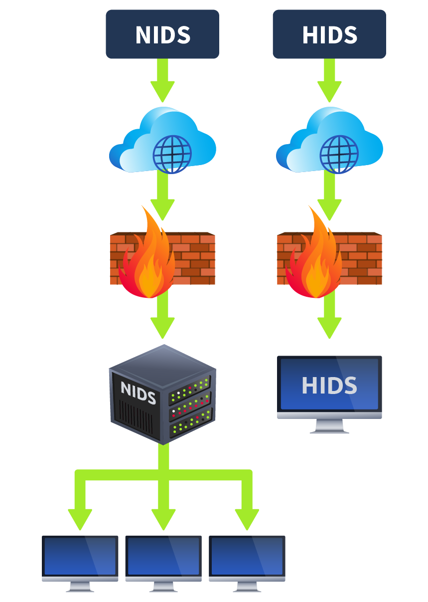

# Types of IDS

IDS can be categorized differently depending on certain factors. An IDS’s main categorization depends on its deployment and detection modes.

## Deployment Modes

IDS can be deployed in the following ways:

- **Host Intrusion Detection System (HIDS):** Host-based IDS solutions are installed individually on the hosts and are responsible for only detecting potential security threats associated with that particular host. They provide detailed visibility of the host’s activities. However, host intrusion detection systems can be challenging to manage in large networks as they are resource-intensive and require management on each host.
    
- **Network Intrusion Detection System (NIDS):** Network-based IDS solutions are crucial in detecting potentially malicious activities within the whole network, regardless of any specific hosts. They monitor the network traffic of all the hosts involved to detect suspicious activities. It provides a centralized view of all the detections inside the whole network.
    

## Detection Modes

- **Signature-Based IDS:** Many attacks occur every day. Each attack has its unique pattern, which is known as a signature. These signatures are preserved by the IDS in their databases so that if the same attack happens in the future, it gets detected by its signature and reported to the security administrators for action. The stronger the signature database of the IDS is, the more efficiently it would detect known threats. However, the signature-based IDS is unable to detect zero-day attacks. Zero-day attacks have no prior signatures (patterns) and are not saved inside the IDS databases. Therefore, the signature-based IDS can only detect the attacks that happened previously, and its signatures (patterns) are saved inside the database.
    
- **Anomaly-Based IDS:** This type of IDS first learns the normal behavior (baseline) of the network or system and performs detections if there is any deviation from the normal behavior. Anomaly-based IDS can also detect zero-day attacks because they don’t rely on the available signatures for the detections, but detect abnormalities inside the network or system by comparing the current state with the normal behavior (baseline). However, this type of IDS may generate a lot of false positives (marking benign activities as malicious) because the nature of most legitimate programs matches the malicious ones. Anomaly-based IDS would mark them malicious and believe anything behaving unusually is malicious. We can also reduce the false positives generated by anomaly-based IDS by fine-tuning it (manually defining the normal behavior in the IDS).
    
- **Hybrid IDS:** A hybrid IDS combines the detection methods of signature-based IDS and anomaly-based IDS to leverage the strengths of each approach. Some known threats may already have some signatures in the IDS database; in this case, the hybrid IDS would use the detection technique of the signature-based IDS. If it encounters a new threat, it can leverage the detection method of anomaly-based IDS.
    

Signature-based IDS can detect threats quickly, while other IDS can have a high processing overhead. However, it is also essential to consider the IDS based on several different factors. Signature-based IDS can be a good option for covering a small threat surface. Anomaly-based IDS and hybrid IDS can help detect modern zero-day attacks, which are increasing daily and can cause massive damage to organizations.