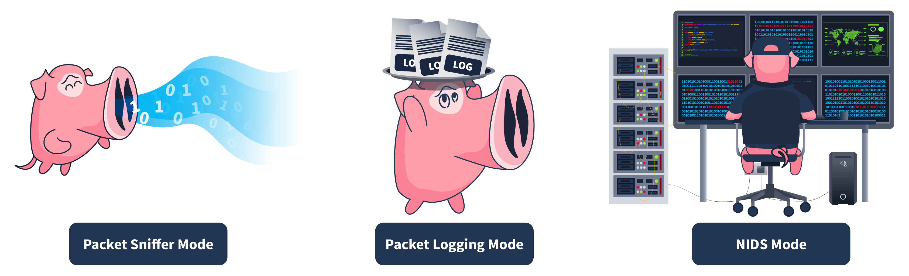

# IDS Example: Snort

Snort is one of the most widely used open-source IDS solutions developed in 1998. It uses signature-based and anomaly-based detections to identify known threats. These are defined in the rule files of the Snort tool. Several built-in rule files come pre-installed in this tool’s package. These built-in rule files contain a variety of known attack patterns. Snort’s built-in rules can detect a lot of malicious traffic for you. However, you can configure Snort to detect specific types of network traffic that are not covered by the default rule files. You can create custom rules based on your requirements to detect specific traffic. You can also disable any built-in detection rules if they don’t point to harmful traffic for your system or network and define some custom rules instead.

## Modes of Snort

| Mode | Description | Use Case |
| --- | --- | --- |
| Packet sniffer mode | This mode reads and displays network packets without performing any analysis on them. The packet sniffer mode of Snort does not directly relate to IDS capabilities, but it can be helpful in network monitoring and troubleshooting. In some cases, system administrators might need to read the traffic flow without performing any detection to diagnose specific issues. In this case, they can utilize the packet sniffer mode of Snort. This mode allows you to display the network traffic on the console or even output it in a file. | The network team observes some network performance issues. To diagnose the issue, they need detailed insights into the network traffic. For this purpose, they can utilize Snort’s packet sniffer mode. |
| Packet logging mode | Snort performs detection on the network traffic in real-time and displays the detections as alerts on the console for the security administrators to take action. However, in some cases, the network traffic needs to be logged for later analysis. The packet logging mode of Snort allows you to log the network traffic as a PCAP (standard packet capture format) file. This includes all the network traffic and any detections from it. Forensic investigators can use these Snort log files to perform the root cause analysis of previous attacks. | The security team needs to initiate a forensic investigation of a network attack. They would need the traffic logs to perform the root cause analysis. The network traffic logged through Snort’s packet logging mode can help them. |
| Network Intrusion Detection System mode | Snort’s NIDS mode is the primary mode that monitors network traffic in real-time and applies its rule files to identify any match to the known attack patterns stored as signatures. If there is a match, it generates an alert. This mode provides the main functionality of an IDS solution. | The security team must proactively monitor their network or systems to detect potential threats. They can leverage Snort’s NIDS mode to achieve this. |

The most relevant use of Snort as an IDS comes from its NIDS mode. However, Snort can be used in any of the above modes depending upon the requirement.