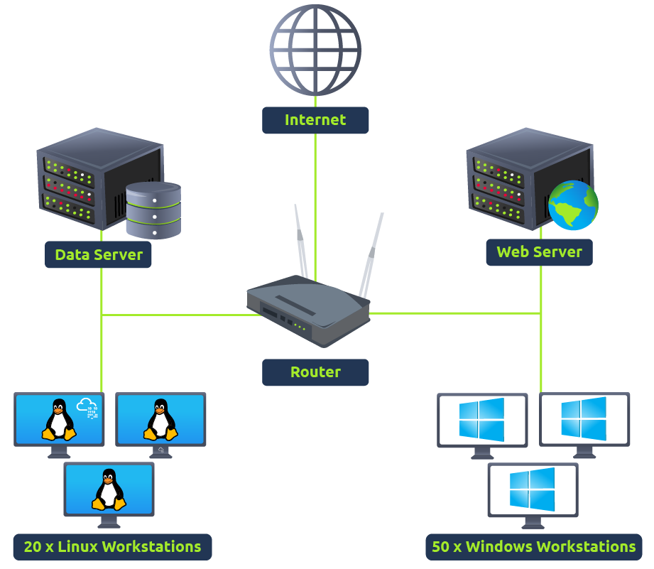
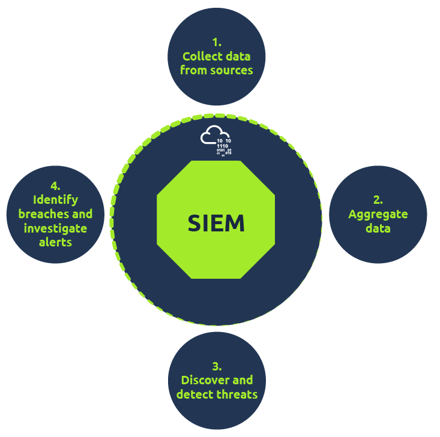

# Network Visibility through SIEM

Before explaining the importance of SIEM, let's first understand why it is critical to have better visibility of all the activities within a network. The image below shows an example of a simple network that comprises multiple Linux/Windows based Endpoints, one data server, and one website. Each component communicates with the other or accesses the internet through a router.

As we know, each network component can have one or more log sources generating different logs. One example could be setting up Sysmon along with Windows Event logs to have better visibility of Windows Endpoint. We can divide our network log sources into two logical parts:

### 1) Host-Centric Log Sources

These are log sources that capture events that occurred within or related to the host. Some log sources that generate host-centric logs are Windows Event logs, Sysmon, Osquery, etc. Some examples of host-centric logs are:

- A user accessing a file
- A user attempting to authenticate.
- A process Execution Activity
- A process adding/editing/deleting a registry key or value.
- Powershell execution

### 2) Network-Centric Log Sources

Network-related logs are generated when the hosts communicate with each other or access the internet to visit a website. Some network-based protocols are SSH, VPN, HTTP/s, FTP, etc. Examples of such events are:

- SSH connection
- A file being accessed via FTP
- Web traffic
- A user accessing company's resources through VPN.
- Network file sharing Activity

## Importance of SIEM

Now that we have covered various types of logs, it's time to understand the importance of SIEM. As all these devices generate hundreds of events per second, examining the imglogs on each device one by one in case of any incident can be a tedious task. That is one of the advantages of having a SIEM solution in place. It not only takes logs from various sources in real-time but also provides the ability to correlate between events, search through the logs, investigate incidents and respond promptly. Some key features provided by SIEM are:

- Real-time log Ingestion
    
- Alerting against abnormal activities
    
- 24/7 Monitoring and visibility
    
- Protection against the latest threats through early detection
    
- Data Insights and visualization
    
- Ability to investigate past incidents.