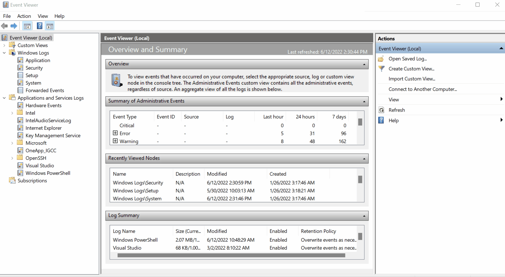

# Log Sources and Log Ingestion

Every device in the network generates some kind of log whenever an activity is performed on it, like a user visiting a website, connecting to <span style="color: inherit;">SSH</span>, logging into his workstation, etc. Some common devices that are found in a network environment are discussed below:

## Windows Machine

Windows records every event that can be viewed through the Event Viewer utility. It assigns a unique ID to each type of log activity, making it easy for the analyst to examine and keep track of. To view events in a Windows environment, type `Event Viewer` in the search bar, and it takes you to the tool where different logs are stored and can be viewed, as shown below. These logs from all windows endpoints are forwarded to the <span style="color: inherit;">SIEM</span> solution for monitoring and better visibility.



## <span style="color: inherit;">Linux</span> Workstation

<span style="color: inherit;">Linux</span> <span style="color: inherit;">OS</span> stores all the related logs, such as events, errors, warnings, etc. Which are then ingested into <span style="color: inherit;">SIEM</span> for continuous monitoring. Some of the common locations where <span style="color: inherit;">Linux</span> store logs are:

- **/var/log/httpd** : Contains <span style="color: inherit;">HTTP</span> Request / Response and error logs.
    
- **/var/log/cron** : Events related to cron jobs are stored in this location.
    
- **/var/log/auth.log** and **/var/log/secure** : Stores authentication related logs.
    
- **/var/log/kern** : This file stores kernel related events.
    

Here is a sample of a cron log:

```plaintext
May 28 13:04:20 ebr crond[2843]: /usr/sbin/crond 4.4 dillon's cron daemon, started with loglevel notice  
May 28 13:04:20 ebr crond[2843]: no timestamp found (user root job sys-hourly)  
May 28 13:04:20 ebr crond[2843]: no timestamp found (user root job sys-daily)  
May 28 13:04:20 ebr crond[2843]: no timestamp found (user root job sys-weekly)  
May 28 13:04:20 ebr crond[2843]: no timestamp found (user root job sys-monthly)  
Jun 13 07:46:22 ebr crond[3592]: unable to exec /usr/sbin/sendmail: cron output for user root job sys-daily to /dev/null
```

&nbsp;

## Web Server

It is important to keep an eye on all the requests/responses coming in and out of the webserver for any potential web attack attempt. In <span style="color: inherit;">Linux</span>, common locations to write all <span style="color: inherit;">apache</span> related logs are /var/log/<span style="color: inherit;">apache</span> or /var/log/httpd.

Here is an example of <span style="color: inherit;">Apache</span> Logs:

```plaintext
192.168.21.200 - - [21/March/2022:10:17:10 -0300] "GET /cgi-bin/try/ HTTP/1.0" 200 3395
127.0.0.1 - - [21/March/2022:10:22:04 -0300] "GET / HTTP/1.0" 200 2216
```

&nbsp;

## Log Ingestion


All these logs provide a wealth of information and can help in identifying security issues. Each <span style="color: inherit;">SIEM</span> solution has its own way of ingesting the logs. Some common methods used by these <span style="color: inherit;">SIEM</span> solutions are explained below:

1.  **Agent / Forwarder:** These <span style="color: inherit;">SIEM</span> solutions provide a lightweight tool called an agent (forwarder by <span style="color: inherit;">Splunk</span>) that gets installed in the Endpoint. It is configured to capture all the important logs and send them to the <span style="color: inherit;">SIEM</span> server.
    
2.  **Syslog:** Syslog is a widely used protocol to collect data from various systems like web servers, databases, etc., are sent real-time data to the centralized destination.
    
3.  **Manual Upload:** Some <span style="color: inherit;">SIEM</span> solutions, like <span style="color: inherit;">Splunk</span>, <span style="color: inherit;">ELK</span>, etc., allow users to ingest offline data for quick analysis. Once the data is ingested, it is normalized and made available for analysis.
    
4.  **Port-Forwarding:** <span style="color: inherit;">SIEM</span> solutions can also be configured to listen on a certain port, and then the endpoints forward the data to the <span style="color: inherit;">SIEM</span> instance on the listening port.
    

An example of how <span style="color: inherit;">Splunk</span> provides various methods for log Ingestion is shown below:

