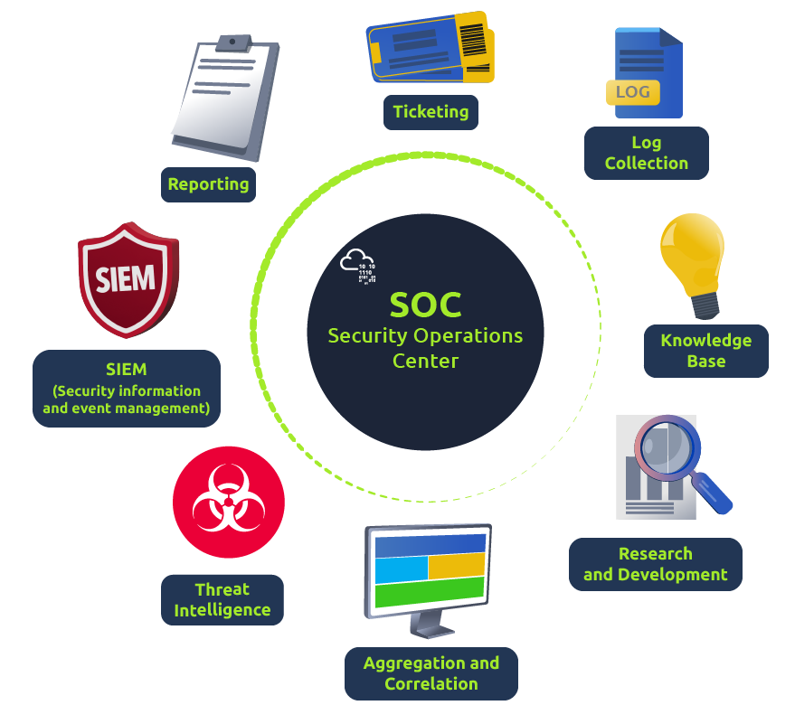

# Why SIEM

SIEM is used to provide correlation on the collected data to detect threats. Once a threat is detected, or a certain threshold is crossed, an alert is raised. This alert enables the analysts to take suitable actions based on the investigation. SIEM plays an important role in the Cyber Security domain and helps detect and protect against the latest threats in a timely manner. It provides good visibility of what's happening within the network infrastructure.

## SIEM Capabilities

SIEM is one major component of a Security Operations Center (SOC) ecosystem, as illustrated below. SIEM starts by collecting logs and examining if any event/flow has matched the condition set in the rule or crossed a certain threshold

Some of the common capabilities of SIEM are:

- Correlation between events from different log sources.
- Provide visibility on both Host-centric and Network-centric activities.
- Allow analysts to investigate the latest threats and timely responses.
- Hunt for threats that are not detected by the rules in place.

SOC Analyst Responsibilities

SOC Analysts utilize SIEM solutions in order to have better visibility of what is happening within the network. Some of their responsibilities include:

- Monitoring and Investigating.
- Identifying False positives.
- Tuning Rules which are causing the noise or False positives.
- Reporting and Compliance.
- Identifying blind spots in the network visibility and covering them.