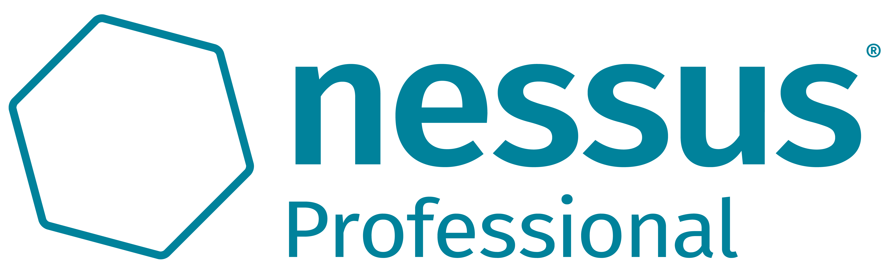
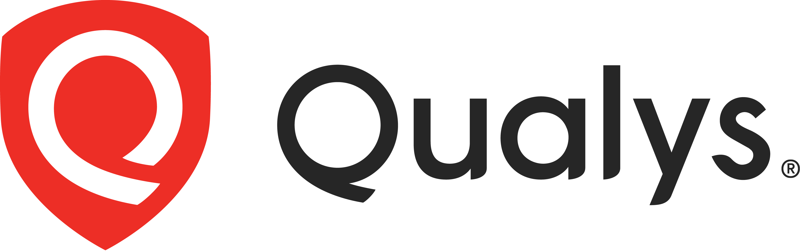
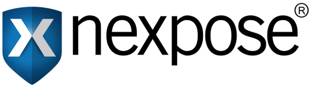
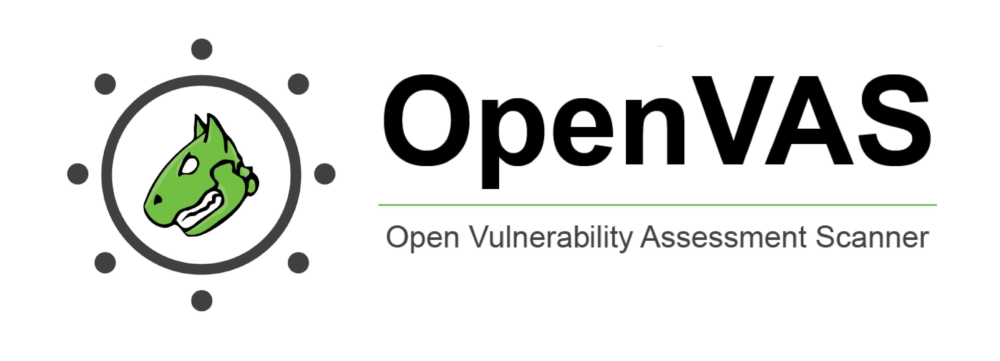

# Tools for Vulnerability Scanning

There are many tools available for performing automated vulnerability scanning, each offering unique features. Let’s discuss some of the widely used vulnerability scanners.

## Nessus

[Nessus](https://www.tenable.com/products/nessus) was developed as an open-source project in 1998. It was later acquired by Tenable in 2005 and became proprietary software. It has extensive vulnerability scanning options and is widely used by large enterprises. It is available in both free and paid versions. The free version offers a limited number of scan features. In contrast, its commercial version offers advanced scanning features, unlimited scans, and professional support. Nessus needs to be deployed and managed on-premises.

## Qualys

[Qualys](https://qualys.com/) was developed in 1999 as a subscription-based vulnerability management solution. Along with continuous vulnerability scanning, it provides compliance checks and asset management. It automatically alerts on the vulnerabilities found during continuous monitoring. The best thing about Qualys is that it is a cloud-based platform, which means there is no extra cost or effort to keep it up and running on our physical hardware and manage it.

## Nexpose

[Nexpose](https://www.rapid7.com/products/nexpose/) was developed by Rapid7 in 2005 as a subscription-based vulnerability management solution. It continuously discovers new assets in the network and performs vulnerability scans on them. It gives vulnerability risk scores depending on the asset value and the vulnerability’s impact. It also provides compliance checks against various standards. Nexpose offers both on-premises and hybrid (cloud and on-premises) deployment modes.

## OpenVAS (Open Vulnerability Assessment System)

[OpenVAS](https://www.openvas.org/) is an open-source vulnerability assessment solution developed by Greenbone Security. It offers basic features with known vulnerabilities scanned through its database. It is less extensive than commercial tools; however, it gives you the flavor of a complete vulnerability scanner. It is beneficial for small organizations and individual systems. The next section will explore this tool in more detail by performing vulnerability scanning.

Almost all vulnerability scanners offer reporting capabilities. They generate a detailed report after every vulnerability scan. These reports contain a list of the vulnerabilities discovered, their risk scores, and detailed descriptions. Some vulnerability scanners offer advanced reporting capabilities that provide remediation methods for all the discovered vulnerabilities and allow you to export these vulnerability assessment reports in different formats.

Each of the tools mentioned above has its strengths. When choosing a suitable vulnerability scanner for your digital assets, you must consider the scope, resources, depth of analysis, and other factors.