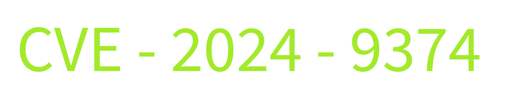

# CVE & CVSS

Imagine yourself as the person sitting on the help desk of an IT complaint office managing many clients. You deal with hundreds of complaints daily regarding IT outages or several other problems requiring support from your company. Let’s see how CVE and CVSS help you track all these inquiries and complaints.

## CVE

CVE stands for Common Vulnerabilities and Exposures. Consider CVE a unique number for each of your inquiries and complaints. If there is any update to any issue, you can easily follow up on that using the unique CVE number. Coming out of the help desk example scenario, this CVE number is a unique number given to vulnerabilities. This was developed by the MITRE Corporation. Whenever a new vulnerability is discovered in any software application, it is given a unique CVE number as a reference and published online in a CVE database. This publication aims to make people aware of these vulnerabilities so they can apply protective measures to remediate them. You can find the details of any previously discovered vulnerability in the CVE database. An example of a CVE number given to a vulnerability can be seen in the picture below:

- **CVE prefix:** Every CVE number has the prefix “CVE” in the beginning.
- **Year:** The second part of every CVE number contains the year it was discovered (e.g., 2024).
- **Arbitrary Digits:** The last part of the CVE numbers contains four or more arbitrary digits (e.g., 9374)

## CVSS

CVSS stands for Common Vulnerability Scoring System. If we return to the help desk example again, you would always need to prioritize the complaints. The most efficient way to prioritize the complaints is by their severity level. What if all your complaints are registered with a score ranging from 0 to 10, where a higher score indicates a more severe complaint? This would resolve the problem of prioritizing critical complaints. This is called a CVSS score. In the computing world, just as each vulnerability has a CVE number that uniquely identifies it, each has a CVSS score that tells you its severity. The CVSS score is calculated by considering multiple factors, including its impact, ease of exploitability, etc. The severity as per the CVSS scores can be seen in the table below:

| CVSS Score Range | Severity Levels |
| --- | --- |
| 0.0-3.9 | Low |
| 4.0-6.9 | Medium |
| 7.0-8.9 | High |
| 9.0-10 | Critical |