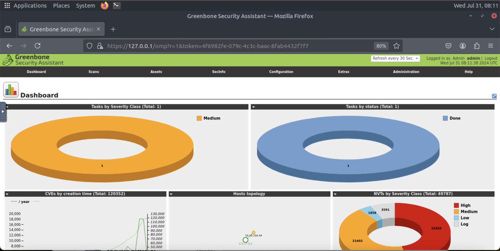
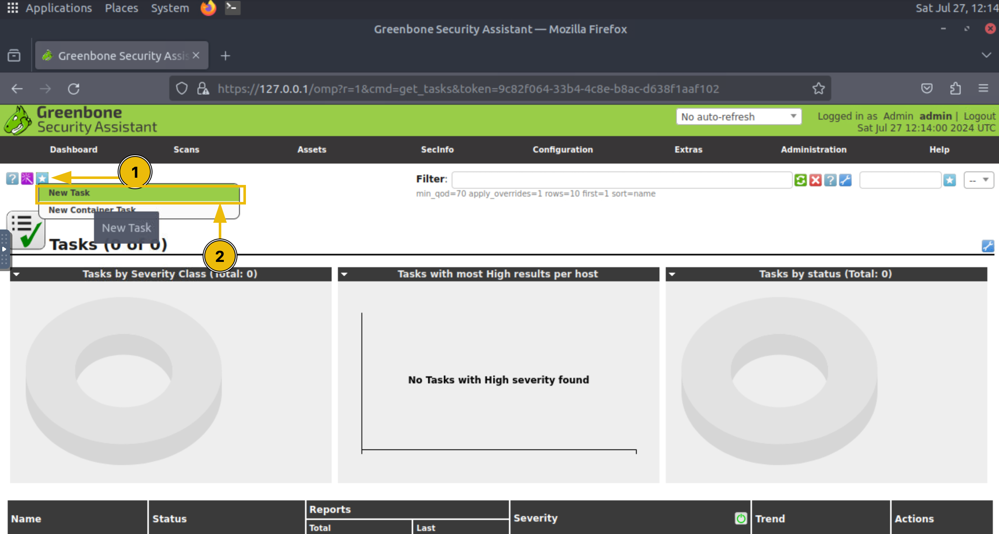
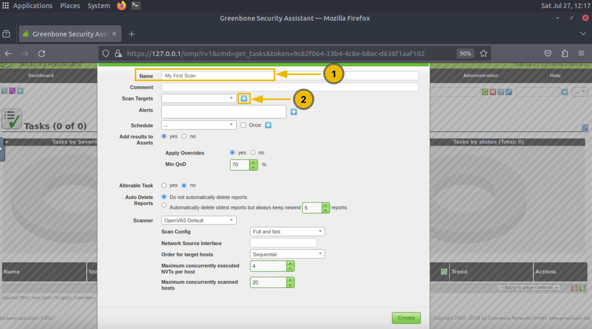
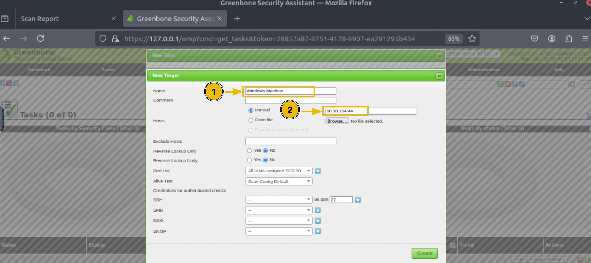
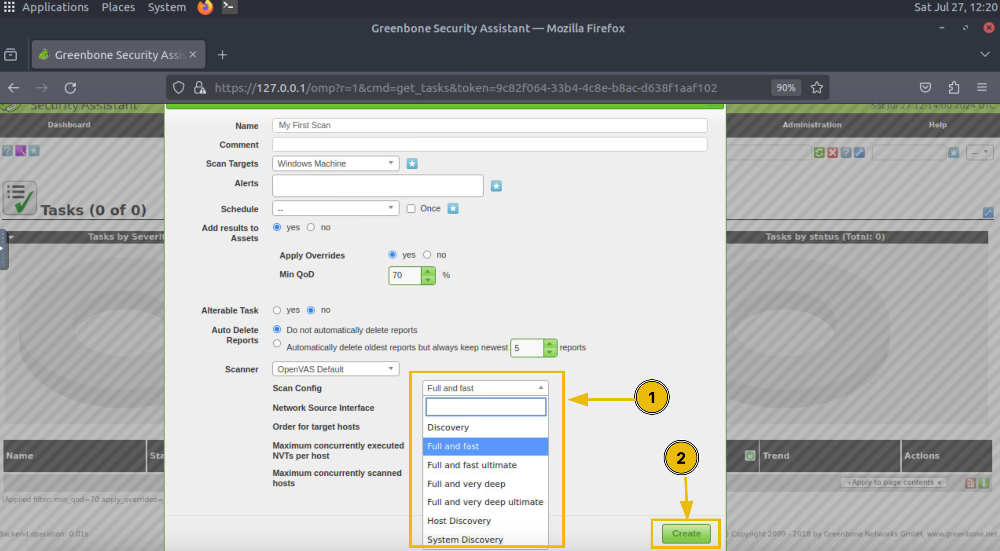
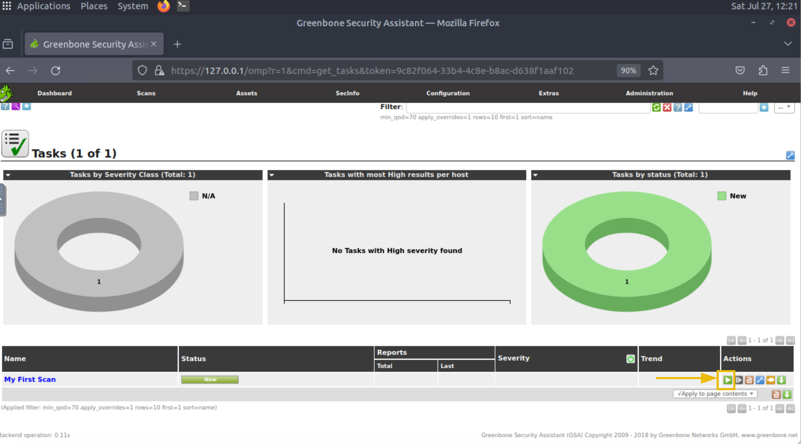
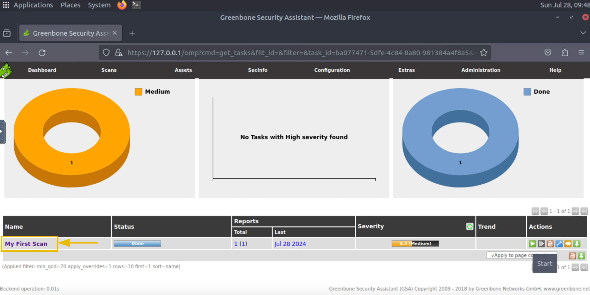
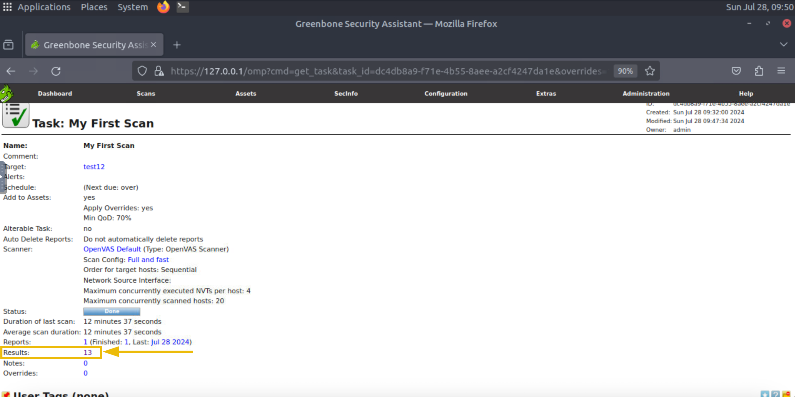
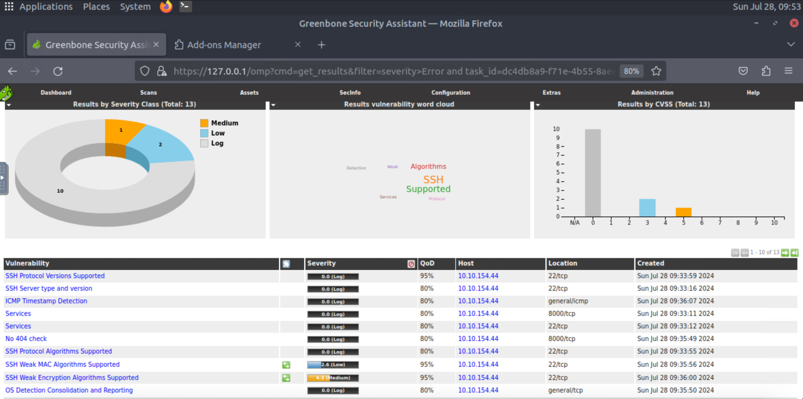

# OpenVAS

OpenVAS is a complete open-source vulnerability scanner. In this module, we will see how to conduct a vulnerability scan using the OpenVAS scanner.

## Installation

We will be installing OpenVAS on an Ubuntu machine. The installation of OpenVAS can be very hectic as it has many dependencies. We will use docker to install OpenVAS. Docker is a platform that helps you create and distribute packages of different applications. These packages are known as containers. A <span style="color: inherit;">container</span> of an application has all the dependencies already installed inside it, so we do not need to spend more time installing the application’s dependencies.

```shell
sudo apt install docker.io
```

As the docker is now installed on our machine, we will run the following command to install the OpenVAS <span style="color: inherit;">container</span> with all the dependencies installed:

```shell
sudo docker run -d -p 443:443 --name openvas mikesplain/openvas
```

## Accessing OpenVAS

Once you have completed the installation process mentioned above, you can access the OpenVAS web interface by opening any of your browsers and typing the following in the URL:

`https://127.0.0.1`

This will take you to the login page of OpenVAS. Once you enter the correct login credentials, the following dashboard will open. This dashboard provides a comprehensive overview of all your vulnerability scans:



## Performing a Vulnerability Scan

Now, we are going to perform a vulnerability scan on a machine. The first step is to create a task inside the OpenVAS dashboard. We will fill out the details for this task and execute it to run the vulnerability scan.

Click the “Tasks” option available inside the “Scans” option displayed on the dashboard:

You will reach the page where all the running tasks are displayed. We would not see any task on this page because we have not yet performed any scans. To create a task, click the star icon and then the “New Task” option as highlighted in the screenshot:



Enter the name of the task, and click the “Scan Targets” option as highlighted in the screenshot:



Enter the name of the target machine and its IP address, and click “Create”:



You will have multiple scan options available. Each scan option has its scope of scanning; you can study the details of each scan type and choose accordingly, and then click on the “Create” button:



The task is created and will be displayed to you on the Tasks dashboard. To initiate the scan, click the play button in the “Actions” option of the task:



It will take a few minutes to complete the scan. After the scan is completed, you will see its status marked as “Done”. The visualizations inside the Tasks dashboard will display some numbers indicating the severity of vulnerabilities found. To check the details of the scan, you have to click on the task name:



To see the details of all the vulnerabilities discovered during the scan, you can click on the number indicating the count of vulnerabilities found in the subject host:



Now, we have a list of all the vulnerabilities found in this machine and their severity. We can also click on any of them to see more details:



Like other vulnerability scanners, OpenVAS allows us to export these results as reports. You can fetch the reports in any format from the Tasks dashboard.