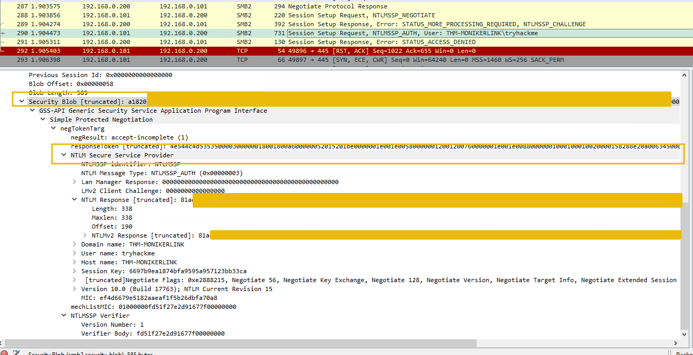

# Detection

&nbsp;

## YARA

A [Yara rule](https://github.com/Neo23x0/signature-base/blob/master/yara/expl_outlook_cve_2024_21413.yar) has been created by [Florian Roth](https://twitter.com/cyb3rops/status/1758792873254744344) to detect emails containing the `file:\\` element in the Moniker Link.

```shell
bob@BoB:# cat cve-2024-21413.yar 


rule EXPL_CVE_2024_21413_Microsoft_Outlook_RCE_Feb24 {

   meta:

      description = "Detects emails that contain signs of a method to exploit CVE-2024-21413 in Microsoft Outlook"

      author = "X__Junior, Florian Roth"

      reference = "https://github.com/xaitax/CVE-2024-21413-Microsoft-Outlook-Remote-Code-Execution-Vulnerability/"

      date = "2024-02-17"

      modified = "2024-02-19"

      score = 75

   strings:

      $a1 = "Subject: "

      $a2 = "Received: "


      $xr1 = /file:\/\/\/\\\\[^"']{6,600}\.(docx|txt|pdf|xlsx|pptx|odt|etc|jpg|png|gif|bmp|tiff|svg|mp4|avi|mov|wmv|flv|mkv|mp3|wav|aac|flac|ogg|wma|exe|msi|bat|cmd|ps1|zip|rar|7z|targz|iso|dll|sys|ini|cfg|reg|html|css|java|py|c|cpp|db|sql|mdb|accdb|sqlite|eml|pst|ost|mbox|htm|php|asp|jsp|xml|ttf|otf|woff|woff2|rtf|chm|hta|js|lnk|vbe|vbs|wsf|xls|xlsm|xltm|xlt|doc|docm|dot|dotm)!/

   condition:

      filesize < 1000KB

      and all of ($a*)

      and 1 of ($xr*)

}
```

&nbsp;

## Wireshark

Additionally, the SMB request from the victim to the client can be seen in a packet capture with a truncated netNTLMv2 hash.

