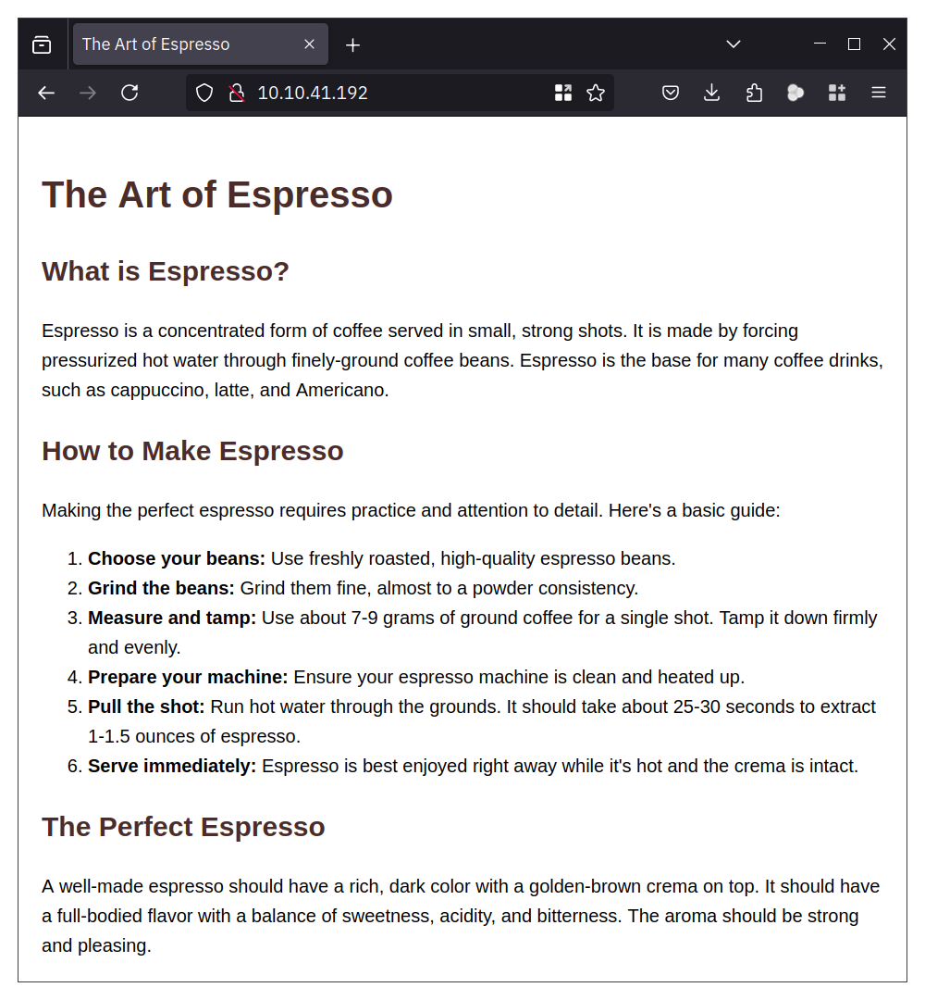
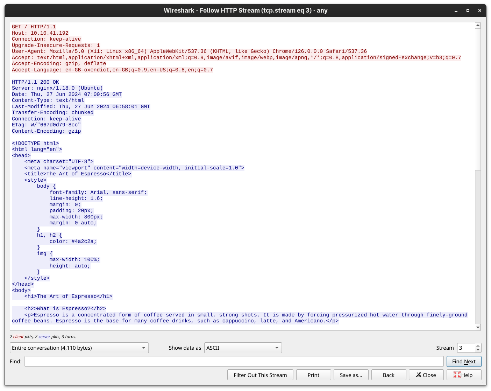

# Hypertext Transfer Protocol (HTTP)

When you fire up your browser, you mainly use HTTP and HTTPS protocols. HTTP stands for Hypertext Transfer Protocol; the S in HTTPS stands for Secure. This protocol relies on TCP and defines how your web browser communicates with the web servers.

Some of the commands or methods that your web browser commonly issues to the web server are:

- `GET` retrieves data from a server, such as an HTML file or an image.
- `POST` allows us to submit new data to the server, such as submitting a form or uploading a file.
- `PUT` is used to create a new resource on the server and to update and overwrite existing information.
- `DELETE`, as the name suggests, is used to delete a specified file or resource on the server.

HTTP and HTTPS commonly use TCP ports 80 and 443, respectively, and less commonly other ports such as 8080 and 8443.

In the following example, we use our Firefox browser to access the web server on `10.10.41.192`. Our browser fetches the web page and displays it perfectly; however, we are interested in what happens behind the scenes.

Using Wireshark, we can examine the exchange between the Firefox browser and the web server more closely. The screenshot below from Wireshark shows the text sent by our browser in red and the web server response in blue. As you can tell, a lot of information is exchanged between the client and the server that does not get rendered to the user. Examples include the web server version and when the page was last modified.

With the telnet client it's possible to connect to a web server on an IP at port 80. With this it's necessary to send a couple of lines to get to the desired page: `GET / HTTP/1.1` and `Host: anything` (On some servers, you might get the file without sending `Host: anything`). You can use this method to access any page and not just the default page `/`. To get `file.html`, you would send `GET /file.html HTTP/1.1`, for instance (`GET /file.html` might work depending on the web server in use). This approach is efficient for troubleshooting as you would be “talking HTTP” with the server.