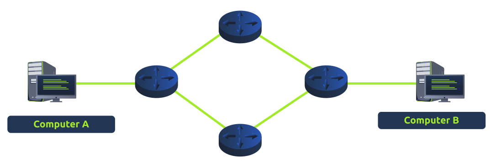
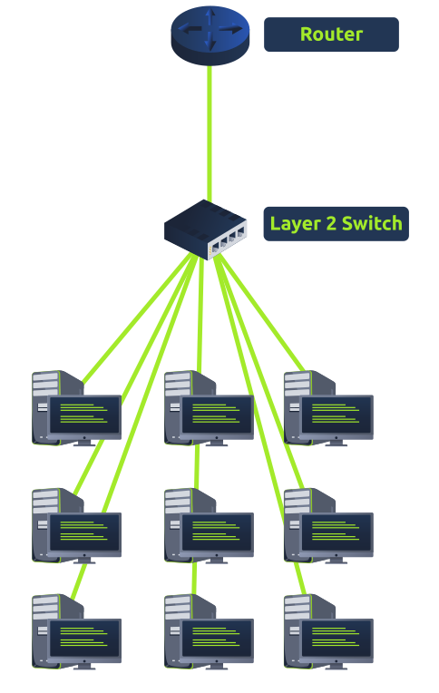
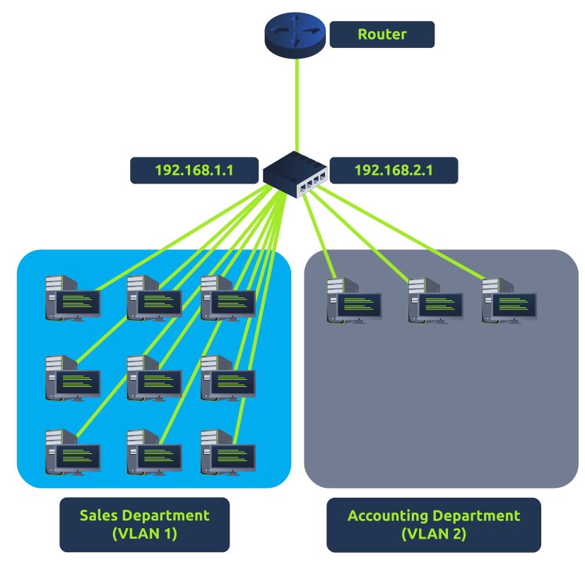

# LAN Devices

## Router

It's a router's job to connect networks and pass data between them by the process of routing. Routing is the label given to the process of data travelling across networks. Routing involves creating a path between networks so that this data can be successfully delivered. Routers operate at the Network layer (layer 3) of the OSI model. They often feature an interactive interface (such as a website or a console) that allows an administrator to configure various rules such as port forwarding or firewalling.

Routing is useful when devices are connected by many paths, such as in the example diagram below, where the most optimal path must be taken:

Routers are dedicated devices and do not perform the same functions as switches.

We can see that computer A's network is connected to the network of computer B by two routers in the middle. The question is: what path will be taken? Different protocols will decide what path should be taken, but factors include:

- \-What path is the shortest?
- \-What path is the most reliable?
- \-Which path has the faster medium (e.g. copper or fibre)?

&nbsp;

## Switch

A switch is a dedicated networking device responsible for providing a means of connecting to multiple devices. Switches can facilitate many devices (from 3 to 63) using ethernet cables.

Switches can operate at both the Data Link layer (layer 2) and the Network layer (layer 3) of the OSI model. However, these are exclusive in the sense that the Data Link layer switches cannot operate at the Network layer.

Take, for example, a Data Link layer switch in the diagram below. These switches will forward frames (these are no longer packets as the IP protocol has been stripped) onto the connected devices using their MAC address.

These switches are solely responsible for sending frames to the correct devices.

Network layer switches are more sophisticated than Data Link layers, as they can perform \*some\* of the responsibilities of a router. Namely, these switches will send frames to devices (as Data Link layer does) and route packets to other devices using the IP protocol.

Let's take a look at the diagram below of a Network layer switch in action. We can see that there are two IP addresses:

- 192.168.1.1
- 192.168.2.1

A technology called Virtual Local Area Network (VLAN) allows specific devices within a network to be virtually split up. This split means they can all benefit from things such as an internet connection, but are treated separately. This network separation provides security because it means that rules in place determine how specific devices communicate with each other.

In the context of the diagram above, the "Sales Department" and "Accounting Department" will be able to access the Internet, but not able to communicate with each other (although they are connected to the same switch).