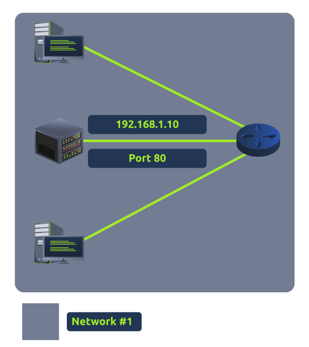

# Port Forwarding

Port forwarding is an essential component in connecting applications and services to the internet. Without port forwarding, applications and services such as web servers are only available to devices within the same direct network. Port forwarding is configured at the router of a network.

Take the network below as an example. Within this network, the server with an IP address of "192.168.1.10" runs a webserver on port 80. Only the two other computers on this network will be able to access it (this is known as an intranet).

&nbsp;

If the administrator wanted the website to be accessible to the public (using the internet), they would have to implement port forwarding, like the diagram below:

&nbsp;

With this design, Network #2 will now be able to access the webserver running on Network #1 using the public IP address of Network #1 (82.62.51.70).

It is easy co confuse port forwarding with the behaviors of a firewall. However, port forwarding opens specific ports, in comparison thee firewall determine if traffic can travel across these ports, even if these ports are open by port forwarding.