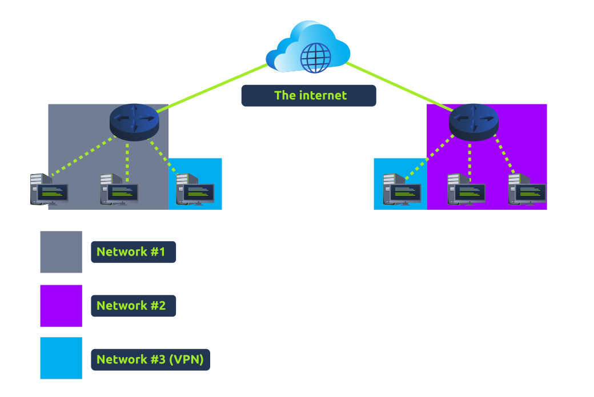

# VPN

A Virtual Private Network (VPN) is a technology that allows devices on separate networks to communicate securely by creating a dedicated path between each other over the internet (known as a tunnel). Devices connected within this tunnel form their own private network.

For example, only devices within the same network (such as within a business) can directly communicate. However, a VPN allows two offices to be connected, let's take the diagram below, where there are three networks.

1.  Network #1 (Office #1)
    
2.  Network #2 (Office #2)
    
3.  Network #3 (Two devices connected via a VPN)
    

The devices connected on Network #3 are still a part of Network #1 and Network #2 but also form together to create a private network (Network #3) that only devices that are connected via this VPN can communicate over.

&nbsp;

Here are some benefits offered by VPNs:

| **Benefit** | **Description** |
| --- | --- |
| Allows networks in different geographical locations to be connected. | For example, a business with multiple offices will find VPNs beneficial, as it means that resources like servers/infrastructure can be accessed from another office. |
| Offers privacy. | VPN technology uses encryption to protect data. This means that it can only be understood between the devices it was being sent from and is destined for, meaning the data isn't vulnerable to sniffing.    This encryption is useful in places with public WiFi, where no encryption is provided by the network. You can use a VPN to protect your traffic from being viewed by other people. |
| Offers anonymity. | Journalists and activists depend upon VPNs to safely report on global issues in countries where freedom of speech is controlled.    Usually, your traffic can be viewed by your ISP and other intermediaries and, therefore, tracked.    The level of anonymity a VPN provides is only as much as how other devices on the network respect privacy. For example, a VPN that logs all of your data/history is essentially the same as not using a VPN in this regard. |

&nbsp;

VPN technology has improved over the years. Let's explore some existing VPN technologies below:

| **VPN Technology** | **Description** |
| --- | --- |
| PPP | This technology is used by PPTP (explained below) to allow for authentication and provide encryption of data. VPNs work by using a private key and public certificate (similar to **SSH**). A private key & certificate must match for you to connect.    This technology is not capable of leaving a network by itself (non-routable). |
| PPTP | The **P**oint-to-**P**oint **T**unneling **P**rotocol (**PPTP**) is the technology that allows the data from PPP to travel and leave a network.    PPTP is very easy to set up and is supported by most devices. It is, however, weakly encrypted in comparison to alternatives. |
| IPSec | Internet Protocol Security (IPsec) encrypts data using the existing **I**nternet **P**rotocol (**IP**) framework.    IPSec is difficult to set up in comparison to alternatives; however, if successful, it boasts strong encryption and is also supported on many devices. |