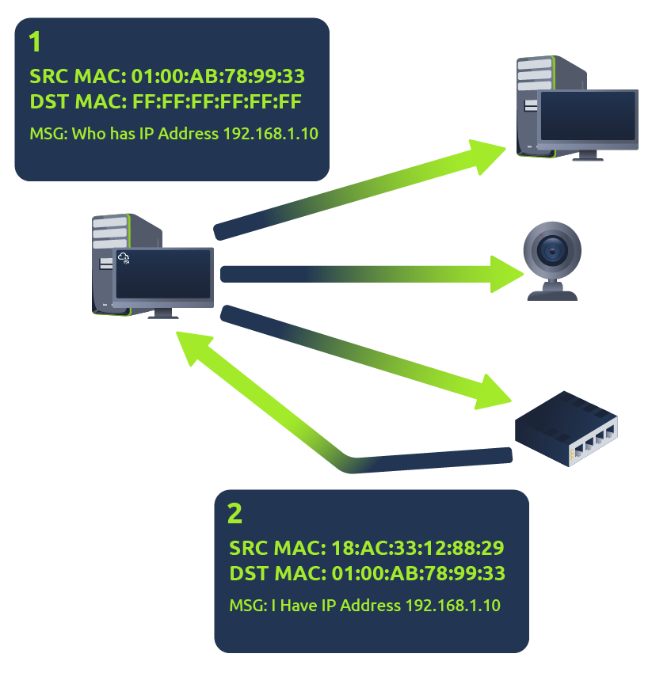

# ARP

The Address Resolution Protocol (ARP) is the technology responsible for allowing devices to identify themselves on a network. It allows a device to associate its MAC address with an IP address on the network. Each device on a network will keep a log of the MAC addresses associated with other devices.

When devices wishes to communicate with another, they will send a broadcast to the entire network searching for the specific device. Devices can use ARP to find the MAC address (and therefore the physical identifier) of a device for communication.

## How does ARP work

Each device whithin a network has a ledger to store information on, which is called a cache. In the context of ARP, this cache stores the identifiers of other devices on the network.

In order to map these two identifiers together (IP and MAC addresses), ARP sends two types of messages:

- ARP Request
- ARP Reply

When an ARP request is sent, a message is broadcasted on the network to other devices, asking "What is the mac address that owns this IP address?", when the other devices receive that message, they will only respond if they own that IP and will send an ARP reply with its MAC address. The requesting device can now remember this mapping and store it in its ARP cache for future use.

&nbsp;

# DHCP

IP addresses can be assigned either manually, by entering the physically into a device, or automatically and most commonly by using a DHCP (Dynamic Host Configuration Protocol) server. When a device connects to a network, if it has not already been manually assigned an IP address, it sends out a request (DHCP Discover) to see if any DHCP servers are on the network. The DHCP server then replies back with an IP address the device could use (DHCP Offer). The device then sends a reply confirming it wants the offered IP Address (DHCP Request), and then lastly, the DHCP server sends a reply acknowledging this has been completed, and the device can start using the IP Address (DHCP ACK).

