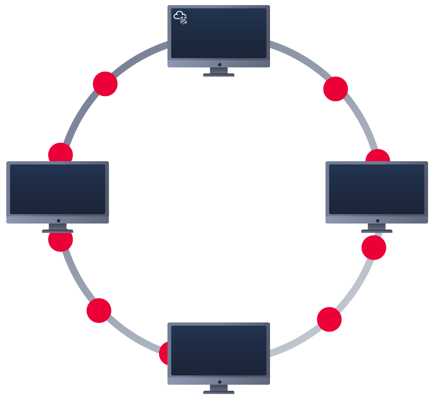

# Local Area Network Topologies

In reference to networking, when we refer to the term "topology", we are actually referring to the design or look of the network at hand. Let's discuss the advantages and disadvantages of these topologies below.

&nbsp;

## Star Topology

The main premise of a star topology is that devices are individually connected via a central networking device such as a switch or hub. This topology is the most commonly found today because of its reliability and scalability - despite the cost.

Any information sent to a device in this topology is sent via the central device to which it connects. Some of the advantages and disadvantages offered by this topology includes:

Because more cabling and the purchase of dedicated networking equipment is required for this topology, it is more expensive than any of the other topologies. However, despite the added cost, this does provide some significant advantages. For example, this topology is much more scalable in nature, which means that it is very easy to add more devices as the demand for the network increases.

Unfortunately, the more the network scales, the more maintenance is required to keep the network functional. This increased dependence on maintenance can also make troubleshooting faults much harder. Furthermore, the star topology is still prone to failure - albeit reduced. For example, if the centralized hardware that connects device fails, these devices will no longer be able to send or receive data. Thankfully, these centralized hardware devices are often robust.

&nbsp;

## Bus Topology

This type of connection relies upon a single connection which is known as a backbone cable. This type of topology is similar to the branch of a tree in the sense that devices (leafs) stem from where the branches are in this cable.

Because all data destined for each device travels along the same cable, it is very quickly prone to becoming slow and bottlenecked if devices within the topology are simultaneously requesting data. This bottleneck also results in very difficult troubleshooting because it quickly becomes difficult to identify which device is experiencing issues with data all travelling along the same route.

However, with this said, bus topologies are one of the easier and more cost-efficient topologies to set up because of their expenses, such as cabling or dedicated networking equipment used to connect these devices.

Lastly, another disadvantage of the bus topology is that there is little redundancy in place in case of failures. This disadvantage is because there is a single point of failure along the backbone cable. If this cable were to break, devices can no longer receive or transmit data along the bus.

&nbsp;

## Ring Topology

The ring topology (also known as token topology) boasts some similarities. Devices such as computers are connected directly to each other to form a loop, meaning that there is little cabling required and less dependence on dedicated hardware such a within a star topology.

A ring topology works by sending data across the loop until it reaches the destined device, using other devices along the loop to forward the data. Interestingly, a device will only forward received data from another device in this topology if it does not have any to send itself. If the device happens to have data to send, it will send its own data first before sending data from another device.

Because there is only one direction for data to travel across this topology, it is fairly easy to troubleshoot any faults that arise. However, this is a double-edged sword because it isn't an efficient way of data travelling across a network, as it may have to visit many multiple devices first before reaching the intended destination.

Lastly, ring topologies are less prone to bottlenecks, such as within a bus topology, as large amounts of traffic are not travelling across the network at any one time. The design of this topology does, however, mean that a fault such as cut cable, or broken device will result in the entire network breaking.

&nbsp;

## What is a Switch

Switches are dedicated devices within a network that are designed to aggregate multiple other devices such as computers, printers, or any other networking-capable device using ethernet. These various devices plug into a switch's port. Switches are usually found in larger networks such as businesses, schools, or similar-sized networks, where there are many devices to connect to the network. Switches can connect a large number of devices by having ports of 4, 8, 16, 24, 32, and 64 for devices to plug into.

Both switches and routers can be connected to one another. The ability to do this increases the redundancy (reliability) of a network by adding multiple paths for data to take. If one path goes down, another can be used. Whilst this may reduce the overall performance of a network because packets have to take longer to travel, there is no downtime -- a small price to pay considering the alternative.

&nbsp;

## What is a Router

It is a router's job to connect networks and pass data between them. It does this by using routing. Routing is the label given to the process of data travelling across networks. Routing involves creating a path between networks so that this data can be successfully delivered. Routing is useful when devices are connected by many paths, such as in the example diagram below.

