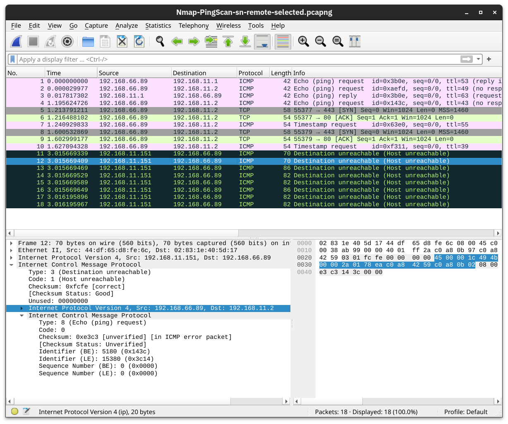

# Host Discovery

Nmap can be used in various sophisticated ways to discover live hosts, offering multiple options to specify its targets:

- IP range using `-`: If you want to scan all the IP addresses from 192.168.0.1 to 192.168.0.10, you can write `192.168.0.1-10`
- IP subnet using `/`: If you want to scan a subnet, you can express it as `192.168.0.1/24`, and this would be equivalent to `192.168.0.0-255`
- Hostname: You can also specify your target by hostname, for example, `example.thm`

Let’s say you want to discover the online hosts on a network. <span style="color: inherit;">Nmap</span> offers the `-sn` option, i.e., ping scan. However, don’t expect this to be limited like `ping`. Let’s see this in action.

note: nmap offers different limitations when not running as root or by using sudo, restricting Nmap’s abilities with account privileges. Running Nmap as a local (non-root) user would limit us to fundamental types of scans such as ICMP echo and TCP connect scans.

&nbsp;

## Scanning a “Local” Network

In this context, we use the term “local” to refer to the network we are directly connected to, such as an Ethernet or WiFi network. In the first demonstration, we will scan the WiFi network to which we are connected. Our IP address is `192.168.66.89`, and we are scanning the `192.168.66.0/24` network. The `nmap -sn 192.168.66.0/24` command and its output are shown in the terminal below.

```shell
root@BoB~# nmap -sn 192.168.66.0/24
Starting Nmap 7.92 ( https://nmap.org ) at 2024-08-07 13:49 EEST
Nmap scan report for XiaoQiang (192.168.66.1)
Host is up (0.0069s latency).
MAC Address: 44:DF:65:D8:FE:6C (Unknown)
Nmap scan report for S190023240007 (192.168.66.88)
Host is up (0.090s latency).
MAC Address: 7C:DF:A1:D3:8C:5C (Espressif)
Nmap scan report for wlan0 (192.168.66.97)
Host is up (0.20s latency).
MAC Address: 10:D5:61:E2:18:E6 (Tuya Smart)
Nmap scan report for 192.168.66.179
Host is up (0.10s latency).
MAC Address: E4:AA:EC:8F:88:C9 (Tianjin Hualai Technology)
[...]
Nmap done: 256 IP addresses (7 hosts up) scanned in 2.64 seconds
```

Because we are scanning the local network, where we are connected via Ethernet or WiFi, we can look up the MAC addresses of the devices. Consequently, we can figure out the network card vendors, which is beneficial information as it can help us guess the type of target device(s).

When scanning a directly connected network, Nmap starts by sending <span style="color: inherit;">ARP</span> requests. When a device responds to the <span style="color: inherit;">ARP</span> request, <span style="color: inherit;">Nmap</span> labels it with “Host is up”.

&nbsp;

## Scanning a “Remote” Network

Consider the case of a “remote” network. In this context, “remote” means that at least one router separates our system from this network. As a result, all our traffic to the target systems must go through one or more routers. Unlike scanning a local network, we cannot send an <span style="color: inherit;">ARP</span> request to the target.

Our system has the IP address `192.168.66.89` and belongs to the `192.168.66.0/24` network. In the terminal below we scan the target network `192.168.11.0/24` where there are two or more routers (hops) separate our local system from the target hosts.

```shell
root@BoB~# nmap -sn 192.168.11.0/24
Starting Nmap 7.92 ( https://nmap.org ) at 2024-08-07 14:05 EEST
Nmap scan report for 192.168.11.1
Host is up (0.018s latency).
Nmap scan report for 192.168.11.151
Host is up (0.0013s latency).
Nmap scan report for 192.168.11.152
Host is up (0.13s latency).
Nmap scan report for 192.168.11.154
Host is up (0.22s latency).
Nmap scan report for 192.168.11.155
Host is up (2.3s latency).
Nmap done: 256 IP addresses (5 hosts up) scanned in 10.67 seconds
```

The <span style="color: inherit;">Nmap</span> output shows that five hosts are up. But how did <span style="color: inherit;">Nmap</span> discover this? To learn more, let’s see some sample traffic generated by <span style="color: inherit;">Nmap</span>. In the screenshot below, we can see the responses from two hosts:

- `192.168.11.1` is live and responded to the ICMP echo (ping) request.
- `192.168.11.2` seems down. Nmap sent two ICMP echo (ping) requests, two ICMP timestamp requests, two <span style="color: inherit;">TCP</span> packets to port 443 with the SYN flag set, and two <span style="color: inherit;">TCP</span> packets to port 80 with the ACK flag set. The target didn’t respond to any. We observe several ICMP destination unreachable packets from the `192.168.11.151` router.

&nbsp;

It is worth noting that we can have more control over how <span style="color: inherit;">Nmap</span> discovers live hosts such as `-PS[portlist]`, `-PA[portlist]`, `-PU[portlist]` for TCP SYN, TCP ACK, and <span style="color: inherit;">UDP</span> discovery via the given ports.

As a final point, <span style="color: inherit;">Nmap</span> offers a list scan with the option `-sL`. This scan only lists the targets to scan without actually scanning them. For example, `nmap -sL 192.168.0.1/24` will list the 256 targets that will be scanned. This option helps confirm the targets before running the actual scan.

As we mentioned earlier, `-sn` aims to discover live hosts without attempting to discover the services running on them. This scan might be helpful if you want to discover the devices on a network without causing much noise. However, this won’t tell us which services are running. If we want to learn more about the network services running on the live hosts, we need a more “noisy” type of scan.