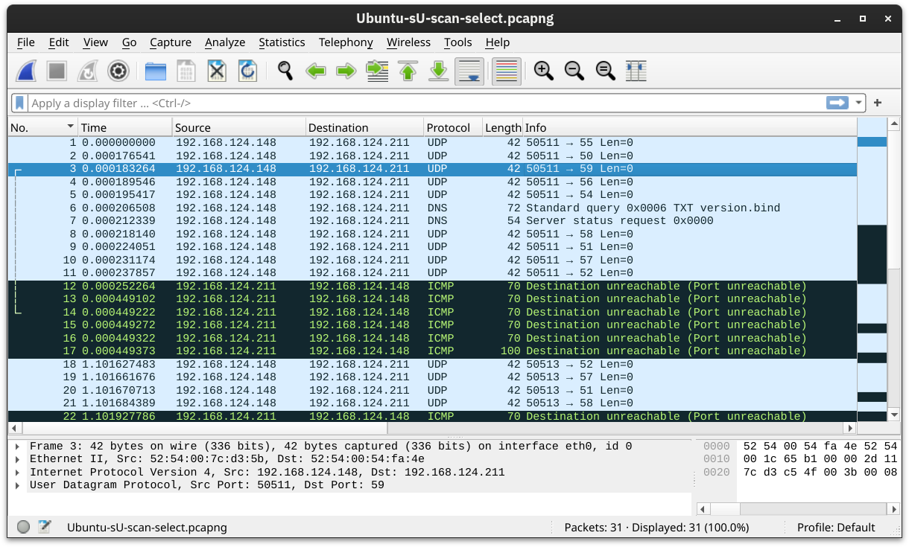

# Port Scanning

At [Host Discovery](../../Networking/NMaP%20Basics/2.%20Host%20Discovery.md), we used `-sn` to discover live hosts. Now we want to discover the network services listening on these live hosts. By network service, we mean any process that is listening for incoming connections on a TCP or UDP port. Common network services include web servers, which usually listen on TCP ports 80 and 443, and DNS servers, which typically listen on UDP (and TCP) port 53.

By design, TCP has 65,535 ports, and the same applies to UDP. How can we determine which ports have a service bound to it? Let’s find out.

&nbsp;

## Scanning TCP Ports

The easiest and most basic way to know whether a TCP port is open would be to attempt to `telnet` to the port. If you are inclined to scan a network range with a Telnet client, you will try to establish a TCP connection with every target port. In other words, you attempt to complete the TCP three-way handshake with every target port; however, only open TCP ports would respond appropriately and allow a TCP connection to be established. This procedure is not very different from Nmap’s connect scan.

### Connect Scan

The connect scan can be triggered using `-sT`. It tries to complete the TCP three-way handshake with every target TCP port. If the TCP port turns out to be open and Nmap connects successfully, Nmap will tear down the established connection.

In the screenshot below, our scanning machine has the IP address `192.168.124.148` and the target system has TCP port 22 open and port 23 closed. In the part marked with 1, you can see how the TCP three-way handshake was completed and later torn down with a TCP RST-ACK packet by Nmap. The part marked with 2 shows a connection attempt to a closed port, and the target system responded with a TCP RST-ACK packet.

&nbsp;

### SYN Scan (Stealth)

Unlike the connect scan, which tries to **connect** to the target TCP port, i.e., complete a three-way handshake, the SYN scan only executes the first step: it sends a TCP SYN packet. Consequently, the TCP three-way handshake is never completed. The advantage is that this is expected to lead to fewer logs as the connection is never established, and hence, it is considered a relatively stealthy scan. You can select the SYN scan using the `-sS` flag.

In the screenshot below, we scan the same system with port 22 open. The part marked with 1 shows the listening service replying with a TCP SYN-ACK packet. However, Nmap responded with a TCP RST packet instead of completing the TCP three-way handshake. The part marked with 2 shows a TCP connection attempt to a closed port. In this case, the packet exchange is the same as in the connect scan.

## Scanning UDP Ports

Although most services use TCP for communication, many use UDP. Examples include DNS, DHCP, NTP (Network Time Protocol), SNMP (Simple Network Management Protocol), and VoIP (Voice over IP). UDP does not require establishing a connection and tearing it down afterwards. Furthermore, it is very suitable for real-time communication, such as live broadcasts. All these are reasons to consider scanning for and discovering services listening on UDP ports.

Nmap offers the option `-sU` to scan for UDP services. Because UDP is simpler than TCP, we expect the traffic to differ. The screenshot below shows several ICMP destination unreachable (port unreachable) responses as Nmap sends UDP packets to closed UDP ports.

&nbsp;

## Limiting the Target Ports

Nmap scans the most common 1,000 ports by default. However, this might not be what you are looking for. Therefore, Nmap offers you a few more options.

- `-F` is for Fast mode, which scans the 100 most common ports (instead of the default 1000).
- `-p[range]` allows you to specify a range of ports to scan. For example, `-p10-1024` scans from port 10 to port 1024, while `-p-25` will scan all the ports between 1 and 25. Note that `-p-` scans all the ports and is equivalent to `-p1-65535` and is the best option if you want to be as thorough as possible.

&nbsp;

## Summary

| Option | Explanation |
| --- | --- |
| `-sT` | TCP connect scan – complete three-way handshake |
| `-sS` | TCP SYN – only first step of the three-way handshake |
| `-sU` | UDP scan |
| `-F` | Fast mode – scans the 100 most common ports |
| `-p[range]` | Specifies a range of port numbers – `-p-` scans all the ports |