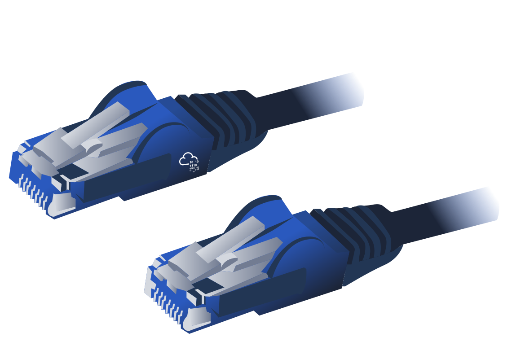

# Physical Layer

This layer is one of the easiest layers to grasp. Put simply, this layer references the physical components of the hardware used in networking and is the lowest layer that you will find. Devices use electrical signals to transfer data between each other in a binary numbering system.

For example, ethernet cables connecting devices.