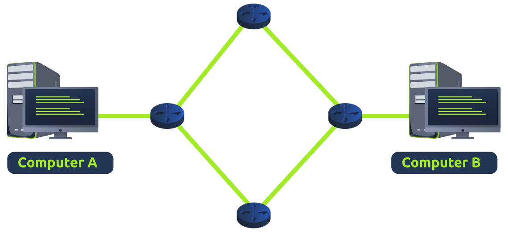

# Network Layer

The network layer is where the routing & re-assembly of data takes place (from the small chunks to the larger chunks). Routing simply determines the most optimal path in which these chunks of data should be sent.

Whilst some protocols at this layer determine exactly what is the optimal path data should take to reach a device. These protocols include OSPF (Open Shortest Path First) and RIP (Routing Information Protocol). The factors that decide what route is taken is decided by the following:

- What path is the shortest? i.e has the least amount of devices that the packet has to travel across.
- What path is the most reliable? i.e. have packets been lost on that path before?
- Which path has the faster physical connection? i.e. is one path using a copper connection (slower) or  a fibre (considerably faster)?

At this layer, everything is dealt with via IP addresses such as 192.168.1.100. Devices such as routers capable of delivering packets using IP addresses are known as Layer 3 devices - because they are capable of working at the third layer of the OSI model.

The data link layer focuses on sending data between two nodes on the same network segment. The network layer, i.e., layer 3, is concerned with sending data between different networks. In more technical terms, the network layer handles logical addressing and routing, i.e., finding a path to transfer the network packets between the diverse networks.

In the data link layer, we gave an example of one company office with ten computers, where the data link layer is responsible for providing a connection between them. Let’s say that this company has multiple offices distributed across various cities, countries, or even continents. The network layer is responsible for connecting the different offices together.

The network below shows that computers A and B are connected, although on different networks. You can also notice two paths connecting the two computers; the network layer will route the network packets through the path it deems better.

Examples of the network layer include Internet Protocol (IP), Internet Control Message Protocol (ICMP), and Virtual Private Network (VPN) protocols such as IPSec and SSL/TLS VPN.