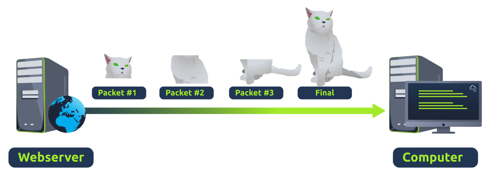
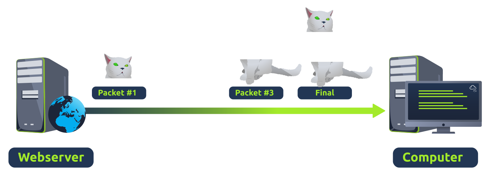

# Transport Layer

Layer 4, the transport layer, enables end-to-end communication between running applications on different hosts. Your web browser is connected to a website web server over the transport layer, which can support various functions like flow control, segmentation, and error correction.

The transport layer plays a vital part in transmitting data across a network. When data is sent between devices, it follows one of the two different protocols that are decided based upon several factors:

- TCP
- UDP

&nbsp;

## TCP

The Transmission Control Protocol (TCP) is designed with reliability and guarantee in mind. This protocol reserves a constant connection between the two devices for the amount of time it takes for the data to be sent and received.

Not only this, but TCP incorporates error checking into its design, guaranteeing that data sent from the session layer (layer 5) has then been received and reassembled in the same order.

| **Advantages of TCP   ** | **Disadvantages of TCP   ** |
| --- | --- |
| Guarantees the accuracy of data. | Requires a reliable connection between the two devices. If one small chunk of data is not received, then the entire chunk of data cannot be used. |
| Capable of synchronizing two devices to prevent each other from being flooded with data. | A slow connection can bottleneck another device as the connection will be reserved on the receiving computer the whole time. |
| Performs a lot more processes for reliability. | TCP is significantly slower than UDP because more work has to be done by the devices using this protocol. |

TCP is used for situations such as file sharing, internet browsing or sending an email. This usage is because these services require the data to be accurate and complete.

In the diagram below, we can see how a picture of a cat is broken down into small pieces of data (known as packets) from the "webserver", where the "computer" re-constructs the picture of the cat into the correct order.

&nbsp;

## UDP

The User Datagram Protocol (UDP) is not nearly as advanced as TCP, not handling extra features like error checking and reliability. In fact, any data sent via UDP is sent to the computer whether it gets there or not. There is no synchronisation between the two devices or guarantee.

| **Advantages of UDP** | **Disadvantages of UDP** |
| --- | --- |
| UDP is much faster than TCP. | UDP doesn't care if the data is received. |
| UDP leaves the application layer (user software) to decide if there is any control over how quickly packets are sent. | It is quite flexible to software developers in this sense. |
| UDP does not reserve a continuous connection on a device as TCP does. | This means that unstable connections result in a terrible experience for the user. |

Using the same example as before, we can see that only Packets #1 and #3 have been received by the "Computer", meaning that half of the image is missing.

UDP is useful in situations where there are small pieces of data being sent. For example, protocols used for discovering devices (ARP and DHCP) or larger files such as video streaming where it is okay if some part of the video is pixelated.