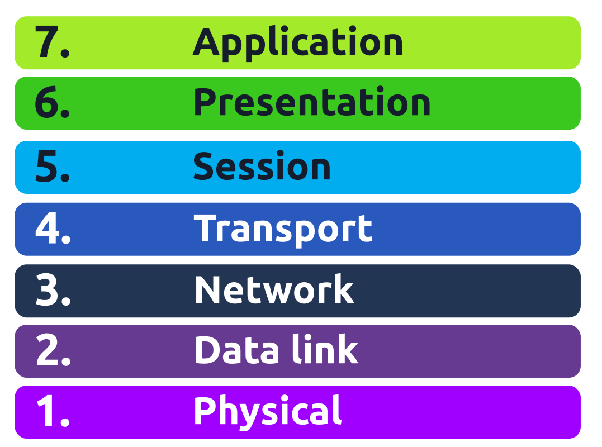

# OSI Model

The OSI model (Open Systems Interconnection Model) is an absolute fundamental model used in networking. This critical model provides a framework dictating how all network devices will send, receive and interpret data.

One of the main benefits of the OSI model is that devices can have different functions and designs on a network while communicating with other devices. Data sent across a network that follows the uniformity of the OSI model can be understood by other devices.

The OSI model consists of seven layers, each has a different set of responsibilities and is arranged from Layer 7 to Layer 1.

At every individual layer that data travels through, specific processes take place, and pieces of information are added to this data, this process is called encapsulation.

