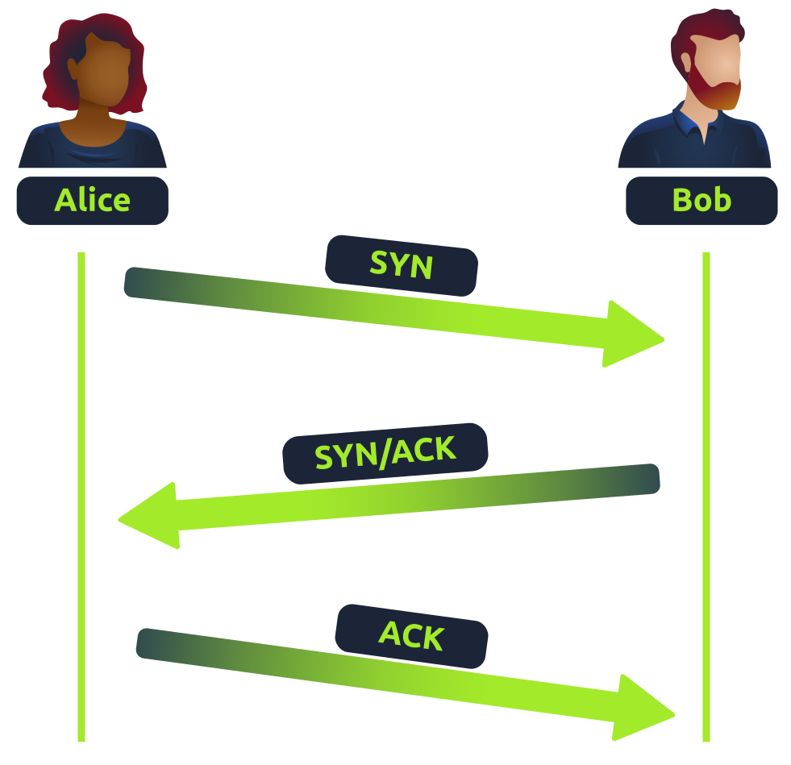
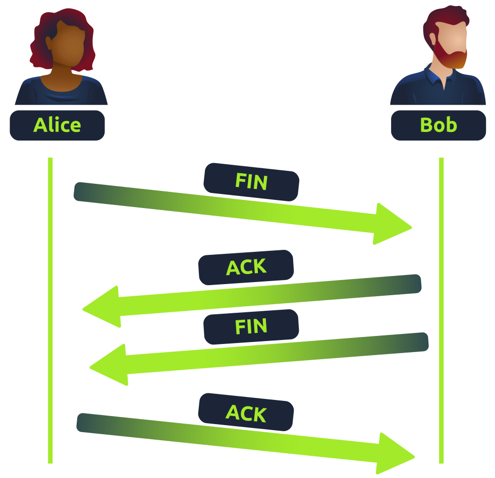

# TCP/IP

The Transmission Control Protocol (TCP) is similar to the OSI model. THE TCP/IP protocol consists of four layers and is arguably just a summarized version of the OSI model:

- Application
- Transport
- Internet
- Network Interface

Very similar to how the OSI works, information is added to each layer of the TCP model as the piece of data (packet) traverses it. As you may recall, this process is known as encapsulation - where the reverse of this process is decapsulation.

One defining feature of TCP is that it is **connection-based**, which means that TCP must establish a connection between both a client and a device acting as a server **before** data is sent.

Because of this, TCP guarantees that any data sent will be received on the other end. This process is named the Three-way handshake.

| **Advantages of TCP** | **Disadvantages of TCP** |
| --- | --- |
| Guarantees the integrity of data. | Requires a reliable connection between the two devices. If one small chunk of data is not received, then the entire chunk of data cannot be used and must be re-sent. |
| Capable of synchronizing two devices to prevent each other from being flooded with data in the wrong order. | A slow connection can bottleneck another device as the connection will be reserved on the other device the whole time. |
| Performs a lot more processes for reliability | TCP is significantly slower than UDP because more work (computing) has to be done by the devices using this protocol. |

&nbsp;

TCP packets contains contain various sections of information known as headers that are added from encapsulation. Some of the crucial headers are as follows:

| Header | Description |
| --- | --- |
| Source Port | This value is the port opened by the sender to send the TCP packet from. This value is chosen randomly (out of the ports from 0-65535 that aren't already in use at the time). |
| Destination Port | This value is the port number that an application or service is running on the remote host (the one receiving data); for example, a webserver running on port 80. Unlike the source port, this value is not chosen at random. |
| Source IP | This is the IP address of the device that is sending the packet. |
| Destination IP | This is the IP address of the device that the packet is destined for. |
| Sequence Number | When a connection occurs, the first piece of data transmitted is given a random number. |
| Acknowledgement Number | After a piece of data has been given a sequence number, the number for the next piece of data will have the sequence number + 1. |
| Checksum | This value is what gives TCP integrity. A mathematical calculation is made where the output is remembered. When the receiving device performs the mathematical calculation, the data must be corrupt if the output is different from what was sent. |
| Data | This header is where the data, i.e. bytes of a file that is being transmitted, is stored. |
| Flag | This header determines how the packet should be handled by either device during the handshake process. Specific flags will determine specific behaviors. |

&nbsp;

## Three-way Handshake

The three-way handshake is the term given for the process used to establish a connection between two devices. The Three-way handshake communicates using a few special messages:

| **Step** | **Message** | **Description** |
| --- | --- | --- |
| 1   | SYN | A SYN message is the initial packet sent by a client during the handshake. This packet is used to initiate a connection and synchronise the two devices together. |
| 2   | SYN/ACK | This packet is sent by the receiving device (server) to acknowledge the synchronisation attempt from the client. |
| 3   | ACK | The acknowledgement packet can be used by either the client or server to acknowledge that a series of messages/packets have been successfully received. |
| 4   | DATA | Once a connection has been established, data (such as bytes of a file) is sent via the "DATA" message. |
| 5   | FIN | This packet is used to *cleanly (properly)* close the connection after it has been complete. |
| #   | RST | This packet abruptly ends all communication. This is the last resort and indicates there was some problem during the process. For example, if the service or application is not working correctly, or the system has faults such as low resources. |

&nbsp;

The diagram below shows a normal three-way handshake process between two devices.

Any sent data is given a random number sequence and is reconstructed using this number sequence and incrementing by 1. Both computers must agree on the same number sequence for data to be sent in the correct order. This order is agreed upon during three steps:

1.  SYN - Client> Here's my initial sequence number (ISN) to Synchronize with (0)
2.  SYN/ACK - Server: Here's my Initial Sequence Number (ISN) to Synchronize with (5000), and I Acknowledge your initial number sequence (0)
3.  ACK - Client: I Acknowledge your initial Sequence Number (ISN) of (5000), here is some data that is my ISN+1 (0 + 1)

| Device | **Initial Number Sequence (ISN)   ** | **Final Number Sequence   ** |
| --- | --- | --- |
| Client (Sender) | 0   | 0 + 1 = 1 |
| Client (Sender) | 1   | 1 + 1 = 2 |
| Client (Sender) | 2   | 2 + 1 = 3 |

&nbsp;

## TCP Closing a Connection

Let's quickly explain the process behind TCP closing a connection. First, TCP will close a connection once a device has determined that the other device has successfully received all of the data.

Because TCP reserves system resources on a device, it is best practice to close TCP connections ass soon as possible.

To initiate the closure of a TCP connection, the device will send a "FIN" packet to the other device, which will need to be acknowledged by the other device:

In the illustration, Alice has sent Bob a "FIN" packet. Because Bob received this, he will let Alice know that he received it and that he also wants to close the connection (using FIN). Alice has heard Bob loud and clear and will let Bob know that she acknowledges this.