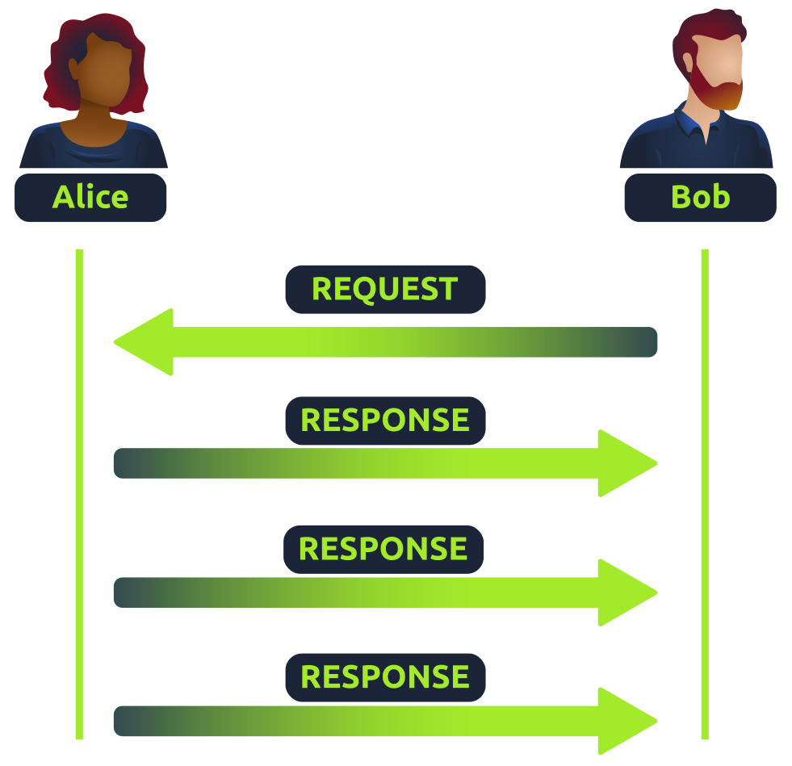

# UDP

Unlike TCP, the User Datagram Protocol (UDP) is a **stateless** protocol that doesn't require a constant connection between the two devices for data to be sent. For example, the three-way handshake does not occur, nor is there any synchronization or acknowledgement between the two devices.

USP is used in situations where applications can tolerate data being lost (such as video streaming or voice chat) or in scenarios where an unstable connection is not the end-all.

| **Advantages of UDP** | **Disadvantages of UDP** |
| --- | --- |
| UDP is much faster than TCP. | UDP doesn't care if the data is received or not. |
| UDP leaves the application (user software) to decide if there is any control over how quickly packets are sent. | It is quite flexible to software developers in this sense. |
| UDP does not reserve a continuous connection on a device as TCP does. | This means that unstable connections result in a terrible experience for the user. |

&nbsp;

Because no process takes place in setting up a connection between two devices,  There is no regard for whether or not the data is received, and there are no safeguards such as those offered by TCP, such as data integrity.

UDP packets are much simpler and have fewer headers compared to TCP. However, both protocols share some standard headers that need to be present:

| **Header** | **Description** |
| --- | --- |
| Time to Live (TTL) | This field sets an expiry timer for the packet, so it doesn't clog up your network if it never manages to reach a host or escape! |
| Source Address | The IP address of the device that the packet is being sent from, so that data knows where to return to. |
| Destination Address | The device's IP address the packet is being sent to so that data knows where to travel next. |
| Source Port | This value is the port that is opened by the sender to send the UDP packet from. This value is randomly chosen (out of the ports from 0-65535 that aren't already in use at the time). |
| Destination Port | This value is the port number that an application or service is running on the remote host (the one receiving the data); for example, a webserver running on port 80. Unlike the source port, this value is not chosen at random. |
| Data | This header is where data, i.e. bytes of a file that is being transmitted, is stored. |

&nbsp;

The diagram below shows a normal UDP connection between two devices:

&nbsp;