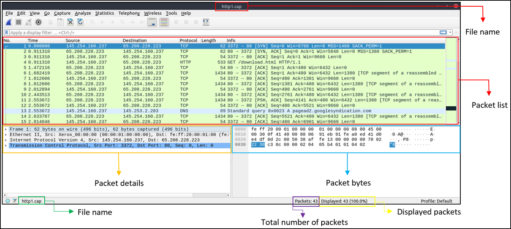
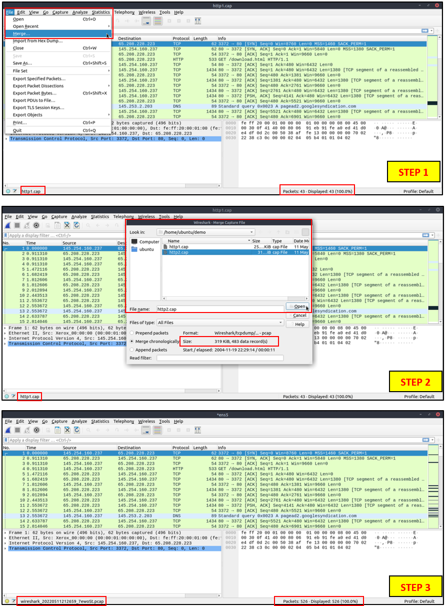

# Overview

Wireshark is an open-source, cross-platform network packet analyzer tool capable of sniffing and investigating live traffic and inspecting packet captures (PCAP). It is commonly used as one of the best packet analysis tools.

This section follows a practical example of wireshark usage with an example file "http1.cap"

## **Use Cases**

Wireshark is one of the most potent traffic analyzer tools available in the wild. There are multiple purposes for its use:

- Detecting and troubleshooting network problems, such as network load failure points and congestion.
- Detecting security anomalies, such as rogue hosts, abnormal port usage, and suspicious traffic.
- Investigating and learning protocol details, such as response codes and payload data.

**Note:** Wireshark is not an Intrusion Detection System (IDS). It only allows analysts to discover and investigate the packets in depth. It also doesn't modify packets; it reads them. Hence, detecting any anomaly or network problem highly relies on the analyst's knowledge and investigation skills.

&nbsp;

## GUI & Data

Wireshark GUI opens with a single all-in-one page, which helps users investigate the traffic in multiple ways. At first glance, five sections stand out.

| **Toolbar** | The main toolbar contains multiple menus and shortcuts for packet sniffing and processing, including filtering, sorting, summarizing, exporting and merging. |
| :---: | :--- |
| **Display Filter Bar** | The main query and filtering section. |
| **Recent Files** | List of the recently investigated files. You can recall listed files with a double-click. |
| **Capture Filter and Interfaces** | Capture filters and available sniffing points (network interfaces). The network interface is the connection point between a computer and a network. The software connection (e.g., lo, eth0 and ens33) enables networking hardware. |
| **Status Bar** | Tool status, profile and numeric packet information. |

The below picture shows Wireshark's main window. The sections explained in the table are highlighted.

## Loading PCAP Files

The above picture shows Wireshark's empty interface. The only available information is the recently processed "http1.cap" file. Let's load that file and see Wireshark's detailed packet presentation. Note that you can also use the **"File"** menu, dragging and dropping the file, or double-clicking on the file to load a pcap.

Now, we can see the processed filename, detailed number of packets and packet details. Packet details are shown in three different panes, which allow us to discover them in different formats.

| **Packet List Pane** | Summary of each packet (source and destination addresses, protocol, and packet info). You can click on the list to choose a packet for further investigation. Once you select a packet, the details will appear in the other panels. |
| :---: | :--- |
| **Packet Details Pane** | Detailed protocol breakdown of the selected packet. |
| **Packet Bytes Pane** | Hex and decoded ASCII representation of the selected packet. It highlights the packet field depending on the clicked section in the details pane. |

&nbsp;

## Coloring Packets

Along with quick packet information, Wireshark also colour packets in order of different conditions and the protocol to spot anomalies and protocols in captures quickly (this explains why almost everything is green in the given screenshots). This glance at packet information can help track down exactly what you're looking for during analysis. You can create custom colour rules to spot events of interest by using display filters. Now let's focus on the defaults and understand how to view and use the represented data details.

Wireshark has two types of packet colouring methods: temporary rules that are only available during a program session and permanent rules that are saved under the preference file (profile) and available for the next program session. You can use the "right-click menu" or **"View --> Coloring Rules"** menu to create permanent colouring rules. The **"Colourise Packet List"** menu activates/deactivates the colouring rules. Temporary packet colouring is done with the "right-click menu" or **"View --> Conversation Filter"** menu.

The default permanent colouring is shown below.

## Traffic Sniffing

You can use the blue **"shark button"** to start network sniffing (capturing traffic), the red button will stop the sniffing, and the green button will restart the sniffing process. The status bar will also provide the used sniffing interface and the number of collected packets.

## Merge PCAP Files

Wireshark can combine two pcap files into one single file. You can use the **"File --> Merge"** menu path to merge a pcap with the processed one. When you choose the second file, Wireshark will show the total number of packets in the selected file. Once you click "open", it will merge the existing pcap file with the chosen one and create a new pcap file. Note that you need to save the "merged" pcap file before working on it.

&nbsp;

## View File Details

Knowing the file details is helpful. Especially when working with multiple pcap files, sometimes you will need to know and recall the file details (File hash, capture time, capture file comments, interface and statistics) to identify the file, classify and prioritise it. You can view the details by following **"Statistics --> Capture File Properties"** or by clicking the **"pcap icon located on the left bottom"** of the window.

