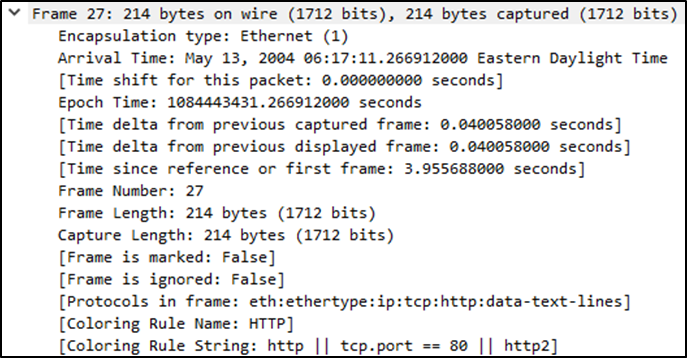
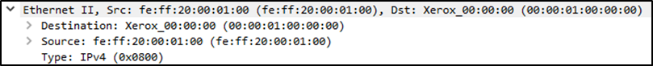
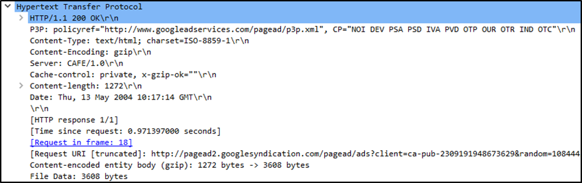

# Packet Dissection

Packet dissection is also known as protocol dissection, which investigates packet details by decoding available protocols and fields. Wireshark supports a long list of protocols for dissection, and you can also write your dissection scripts. You can find more details on dissection [here](https://github.com/boundary/wireshark/blob/master/doc/README.dissector).

&nbsp;

## Packet Details

You can click on a packet in the packet list pane to open its details (double-click will open details in a new window). Packets consist of 5 to 7 layers based on the OSI model. We will go over all of them in an HTTP packet from a sample capture. The picture below shows viewing packet number 27.

Each time you click a detail, it will highlight the corresponding part in the packet bytes pane.

Let's have a closer view of the details pane.

We can see seven distinct layers to the packet: frame/packet, source \[MAC\], source \[IP\], protocol, protocol errors, application protocol, and application data. Below we will go over the layers in more detail.

### The Frame (Layer 1):

This will show you what frame/packet you are looking at and details specific to the Physical layer of the OSI model.

### Source \[MAC\] (Layer 2):

This will show you the source and destination MAC Addresses; from the Data Link layer of the OSI model.

### Source \[IP\] (Layer 3):

This will show you the source and destination IPv4 Addresses; from the Network layer of the OSI model.

### Protocol (Layer 4):

This will show you details of the protocol used (UDP/TCP) and source and destination ports; from the Transport layer of the OSI model.

### Protocol Errors:

This continuation of the 4th layer shows specific segments from TCP that needed to be reassembled.

### Application Protocol (Layer 5):

This will show details specific to the protocol used, such as HTTP, FTP, and SMB. From the Application layer of the OSI model.

### Application Data:

This extension of the 5th layer can show the application-specific data.

