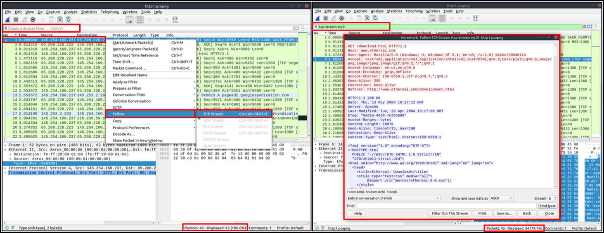

# Packet Filtering

Wireshark has a powerful filter engine that helps analysts to narrow down the traffic and focus on the event of interest. Wireshark has two types of filtering approaches: capture and display filters. Capture filters are used for **"capturing"** only the packets valid for the used filter. Display filters are used for **"viewing"** the packets valid for the used filter.

Filters are specific queries designed for protocols available in Wireshark's official protocol reference. While the filters are only the option to investigate the event of interest, there are two different ways to filter traffic and remove the noise from the capture file. The first one uses queries, and the second uses the right-click menu. Wireshark provides a powerful GUI, and there is a golden rule for analysts who don't want to write queries for basic tasks: **"If you can click on it, you can filter and copy it"**.

&nbsp;

## Apply as Filter

This is the most basic way of filtering traffic. While investigating a capture file, you can click on the field you want to filter and use the "right-click menu" or **"Analyse --> Apply as Filter"** menu to filter the specific value. Once you apply the filter, Wireshark will generate the required filter query, apply it, show the packets according to your choice, and hide the unselected packets from the packet list pane. Note that the number of total and displayed packets are always shown on the status bar.

## Conversation Filter

When you use the "Apply as a Filter" option, you will filter only a single entity of the packet. This option is a good way of investigating a particular value in packets. However, suppose you want to investigate a specific packet number and all linked packets by focusing on IP addresses and port numbers. In that case, the "Conversation Filter" option helps you view only the related packets and hide the rest of the packets easily. You can use the"right-click menu" or **"Analyse --> Conversation Filter"** menu to filter conversations.

## Colorize Conversation

This option is similar to the "Conversation Filter" with one difference. It highlights the linked packets without applying a display filter and decreasing the number of viewed packets. This option works with the "Colouring Rules" option ad changes the packet colours without considering the previously applied colour rule. You can use the "right-click menu" or **"View --> Colourise Conversation"** menu to colourise a linked packet in a single click. Note that you can use the **"View --> Colourise Conversation --> Reset Colourisation"** menu to undo this operation.

## Prepare as Filter

Similar to "Apply as Filter", this option helps analysts create display filters using the "right-click" menu. However, unlike the previous one, this model doesn't apply the filters after the choice. It adds the required query to the pane and waits for the execution command (enter) or another chosen filtering option by using the **".. and/or.."** from the "right-click menu".

## Apply as Column

By default, the packet list panel provides basic information about each packet. You can use the "right-click menu" or **"Analyse --> Apply as Column"** menu to add columns to the packet list panel. Once you click on a value and apply it as a column, it will be visible on the packet list panel. This function helps analysts examine the appearance of a specific value/field across the available packets in the capture file. You can enable/disable the columns shown in the packet list panel by clicking on the top of the packet list panel.

## Follow Stream

Wireshark displays everything in packet portion size. However, it is possible to reconstruct the streams and view the raw traffic as it is presented at the application level. Following the protocol, streams help analysts recreate the application-level data and understand the event of interest. It is also possible to view the unencrypted protocol data like usernames, passwords and other transferred data.

You can use the"right-click menu" or **"Analyse --> Follow TCP/UDP/HTTP Stream"** menu to follow traffic streams. Streams are shown in a separate dialogue box; packets originating from the server are highlighted with blue, and those originating from the client are highlighted with red.

Once you follow a stream, Wireshark automatically creates and applies the required filter to view the specific stream. Remember, once a filter is applied, the number of the viewed packets will change. You will need to use the **"X button"** located on the right upper side of the display filter bar to remove the display filter and view all available packets in the capture file.