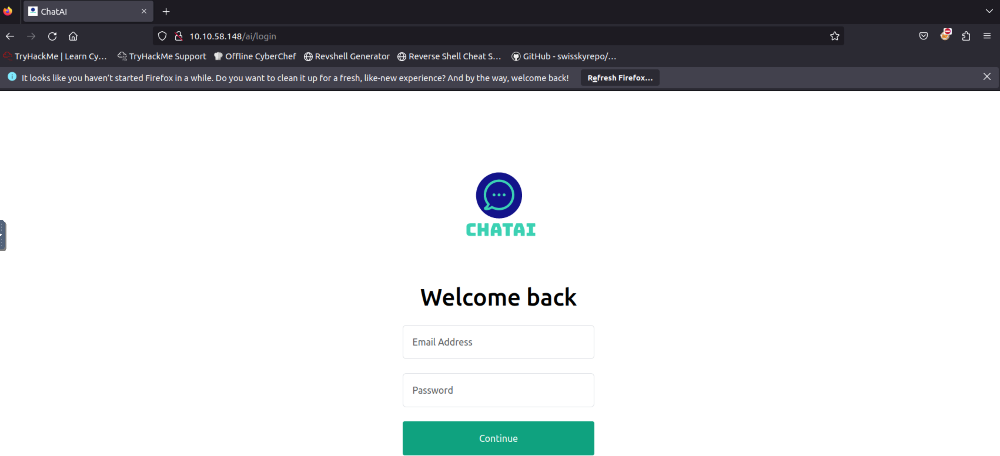

# Practical Example

The web application has a login page that is hosted at `http://MACHINE_IP/ai/login`. When you visit this URL, you will see a login page that is vulnerable to <span style="color: inherit;">SQL</span> injection.



In the previous module, we saw that if we see GET parameters in the URL, they might be vulnerable to <span style="color: inherit;">SQL</span> injection, and we can copy that URL to use it with <span style="color: inherit;">SQLMap</span>. We also saw that if there is a POST request and the data is sent inside the body rather than the URL, we can intercept the request and use it with the <span style="color: inherit;">SQLMap</span> tool to exploit a <span style="color: inherit;">SQL</span> injection vulnerability, if there is any.

However, in this task, on the login page, we have used the GET requests, but the parameters of this request are not visible in the URL as they were on the previous task's website. To test the URL with <span style="color: inherit;">SQLMap</span>, we need to have the URL along with the GET parameters.

So, to get the complete URL along with its GET parameters, we need to right-click on the login page and click the inspect option (the process may vary slightly from browser to browser). From here, we have to select the Network tab; then we have to enter some test credentials in the username and password fields and click the login button, and we will be able to see the GET request. Click on that request, and we can see the complete GET request with the parameters. We can copy this complete URL and use it with the <span style="color: inherit;">SQLMap</span> tool to discover <span style="color: inherit;">SQL</span> injection vulnerabilities inside it and exploit it. The complete request is shown in the screenshot below:


The extracted URL stands as the following:

`http://MACHINE_IP/ai/includes/user_login?email=test&password=test`

With this we ca run the commands as discussed in the previous module on this URL and answer the following questions. Also, we have to remember to include your URL inside single quotes `'`. This is to avoid errors with special characters in the terminal such as `?` and `&`.

**Important Note:** You may not get the results by the simple scan; add `--level=5` at the end of your commands to perform the in-depth scans. Secondly, while running the commands, the tool may ask you some questions; make sure to respond to them as follows to run the scan smoothly:

- It looks like the back-end DBMS is 'MySQL'. Do you want to skip test payloads specific for other DBMSes? \[Y/n\]: `y`
- For the remaining tests, do you want to include all tests for 'MySQL' extending provided risk (1) value? \[Y/n\]: `y`
- Injection not exploitable with NULL values. Do you want to try with a random integer value for option '--union-char'? \[Y/n\]: `y`
- GET parameter 'email' is vulnerable. Do you want to keep testing the others (if any)? \[y/N\]: `n`

&nbsp;

# Exercises

### Question 1

How many databases are available in this web application?

answer: 6

```shell
bob@BoB~$ sqlmap -u http://MACHINE_IP/ai/includes/user_login?email=test&password=test
[...]

bob@BoB~$ sqlmap -u http://MACHINE_IP/ai/includes/user_login?email=test&password=test --dbs
[...]
```

&nbsp;

### Question 2

What is the name of the table available in the "ai" database?

answer: user

```shell
bob@BoB~$ sqlmap -u http://MACHINE_IP/ai/includes/user_login?email=test&password=test -D ai --tables
[...]
```

&nbsp;

### Question 3

What is the password of the email test@chatai.com?

answer: 12345678

```shell
bob@BoB~$ sqlmap -u http://MACHINE_IP/ai/includes/user_login?email=test&password=test -D ai -T user --dump
[...]
```