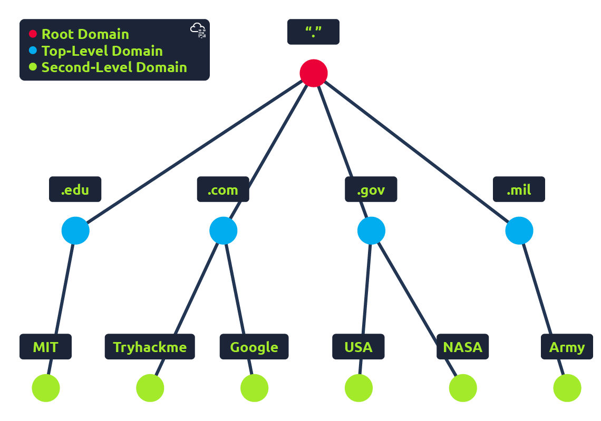

# DNS

A Domain Name System (DNS) provides a simple way for us to communicate with devices on the internet without remembering complex numbers. Much like every house has a unique address to communicate directly to it, every computer on the internet has it's own unique address to communicate with it called an IP address. An IP address looks like the following 104.26.10.229, 4 sets of digits ranging from 0 - 255 separated by a period. When you want to visit a website, it's not exactly convenient to remember this complicated set of numbers, and that's where DNS can help. So instead of remembering 104.26.10.229, you can remember [tryhackme.com](http://tryhackme.com/) instead.

&nbsp;

## Domain Hierarchy

The domain hierarchy is a tree structure that organizes domains in the Domain Name System (DNS). The hierarchy of domains is read from right to left, with each label to the left specifying a subdomain of the domain to the right. For example, in the domain name "blog.example.com", the third-level domain is "blog".  
Domains are configured in a hierarchy to manage how data and processes are structured in an environment. Users can only see the data contained within their domain or the child domains that are lower in the hierarchy.

### Top Level Domain (TLD)

A TLD is the most right-hand part of a domain name. So, for example, the tryhackme.com TLD is **.com**. There are two types of TLD, gTLD (generic Top Level Domain) and ccTLD (country code Top Level Domain). Historically a gTLD was meant to tell the user the domain name's purposes, .org for an organisation, .edu for education, and .gov for government. And a ccTLD was used for geographical purposes, for example, .ca for sires based in Canada, .co.uk for sites based in the United Kingdom, and so on. Due to such demand, there is an influx of new gTLDs ranging from .online, .club, .website, .biz and so many more. For a full list of over 2000 TLDs [click here](https://data.iana.org/TLD/tlds-alpha-by-domain.txt).

&nbsp;

### Second Level Domain (SLD)

Taking tryhackme.com as an example, the .com part is the TLD, and tryhackme is the Second Level Domain (SLD). When registering a domain name, the SLD is limited to 63 characters + the TLD and can only use a-z0-9 and hyphens (cannot start or end with hyphens or have consecutive hyphens).

&nbsp;

### Subdomain

A subdomain sits on the left-hand side of the Second Level Domain using a period to separate it. For example, in the name admin.tryhackme.com the admin part is the subdomain. A subdomain name has the same creation restrictions as a SLD, being limite to 63 characters and can only use a-z 0-9 and hyphens (cannot start or end with hyphens or have consecutive hyphens). You can use multiple subdomains split with periods to vreate longer names, such as jupiter.servers.tryhackme.com, but the length must be kept to 253 characters or less. There is no limit to the number of subdomainsyou can create for your domain name.