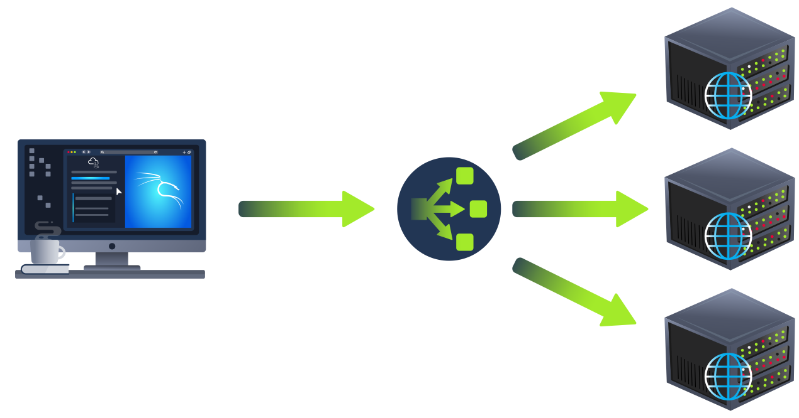

# Other Components

&nbsp;

## Load Balancers

When a website's traffic starts getting quite large or is running an application that needs to have high availability, one web server might no longer do the job. Load balancers provide two main features, ensuring high traffic websites can handle the load and providing a fail-over if a server becomes unresponsive.

When requesting a website with a load balancer, the load balancer will receive the request first and then forward it to one of the multiple servers behind it. The load balancer uses different algorithms to help it decide which server is best to deal with the request. A couple of examples of these algorithms are **round-robin**, which sends it to each server in turn, or **weighted**, which checks how many requests a server is currently dealing with and sends it to the least busy server.

Load balancers also perform periodic checks with each server to ensure they are running correctly; this is called a health check. If a server doesn't respond appropriately or doesn't respond at all, the load balancer will stop sending traffic until it responds appropriately again.

&nbsp;

## Content Delivery Networks (CDN)

A CDN can be an excellent resource for cutting down traffic to a busy website. It allows you to host static files from website, such as JavaScript, CSS, Images, Videos, and host them across thousands of servers all over the world. When a user requests one of the hosted files, the CDN works out where the nearest server is physically located and sends the request there instead of potentially the other side of the world.

&nbsp;

## Databases

Often websites will need a way of storing information for their users. Webservers can communicate with databases to store and recall data from them. Databases can range from just a simple plain text file up to complex clusters of multiple servers providing speed and resilience. Some of the most common databases to come across to are: MySQL, MSSQL, MongoDB, Postgres, and more; each has its specific features.

&nbsp;

## Web Application Firewall (WAF)

A WAF sits between the web request and the web server; it's primary purpose is to protect the webserver from hacking or denial of service attacks. It analyses the web requests for common attack techniques, whether the request is from a real browser rather than a bot. It also checks if an excessive amount of web requests are being sent by utilizing something called rate limiting, which will only allow a certain amount of requests from an IP per second. If a request is deemed a potential attack, it will be dropped and never sent to the webserver.

