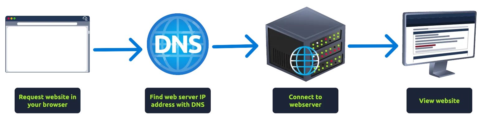

# Putting it All Together

To summarize, when requesting a website, the computer needs to know the server's IP address it needs to talk to; for this, it uses DNS. The computer then talks to the web server using a special set of commands called the HTTP protocol; the webserver then returns HTML, JavaScript, CSS, Images, etc., which the browser then uses to correctly format and display the website.

There are also a few other components that help the web run more efficiently and provide extra features.