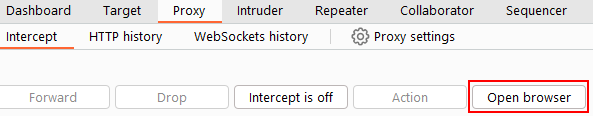

# Burp Suite Browser

In addition to modifying our regular web browser to work with the proxy, Burp Suite also includes a built-in Chromium browser that is pre-configured to use the proxy without any of the modifications we just had to do.

To start the Burp Browser, click the `Open Browser` button in the proxy tab. A Chromium window will pop up, and any requests made in this browser will go through the proxy.

**Note:** There are many settings related to the Burp Browser in the project options and user options settings. Make sure to explore and customise them as needed.

However, if you are running Burp Suite on Linux as the root user, you may encounter an error preventing the Burp Browser from starting due to the inability to create a sandbox environment.

There are two simple solutions to this:

1.  **Smart option:** Create a new user and run Burp Suite under a low-privilege account to allow the Burp Browser to run without issues.
2.  **Easy option:** Go to `Settings -> Tools -> Burp's browser` and check the `Allow Burp's browser to run without a sandbox` option. Enabling this option will allow the browser to start without a sandbox. However, please be aware that this option is disabled by default for security reasons. If you choose to enable it, exercise caution, as compromising the browser could grant an attacker access to your entire machine.