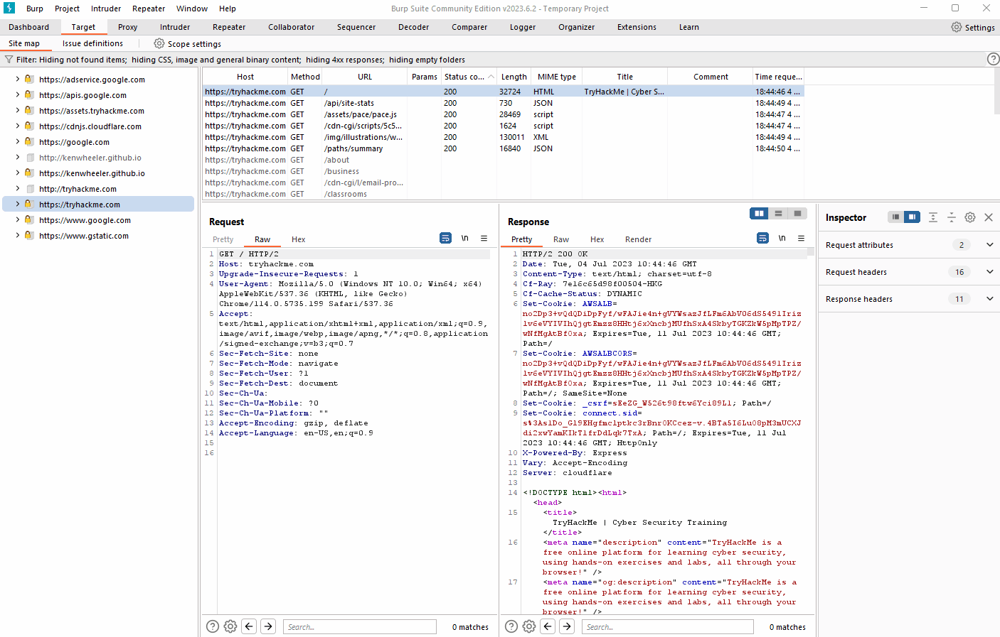
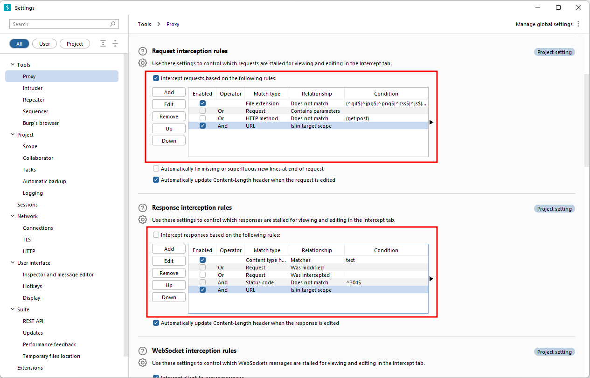

# Scoping and Targeting

Finally, we come to one of the most important aspects of using the Burp Proxy: **Scoping**.

Capturing and logging all of the traffic can quickly become overwhelming and inconvenient, especially when we only want to focus on specific web applications. This is where scoping comes in.

By setting a scope for the project, we can define what gets proxied and logged in Burp Suite. We can restrict Burp Suite to target only the specific web application(s) we want to test. The easiest way to do this is by switching to the `Target` tab, right-clicking on our target from the list on the left, and selecting `Add To Scope`. Burp will then prompt us to choose whether we want to stop logging anything that is not in scope, and in most cases, we want to select `yes`.

To check our scope, we can switch to the **Scope settings** sub-tab within the **Target** tab.

The Scope settings window allows us to control our target scope by including or excluding domains/IPs. This section is powerful and worth spending time getting familiar with.

However, even if we disabled logging for out-of-scope traffic, the proxy will still intercept everything. To prevent this, we need to go to the **Proxy settings** sub-tab and select `And URL Is in target scope` from the "Intercept Client Requests" section.

Enabling this option ensures that the proxy completely ignores any traffic that is not within the defined scope, resulting in a cleaner traffic view in Burp Suite.