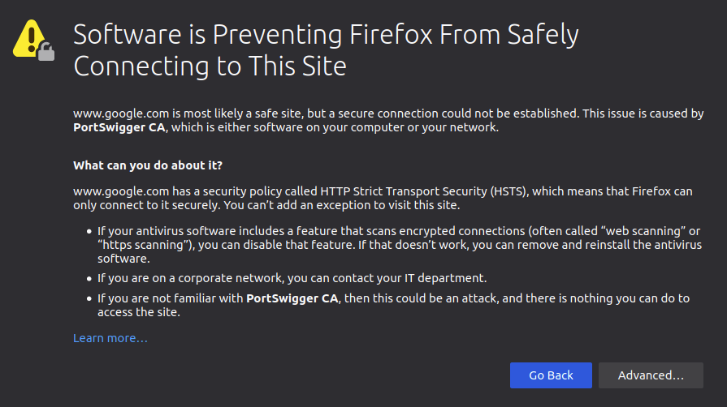
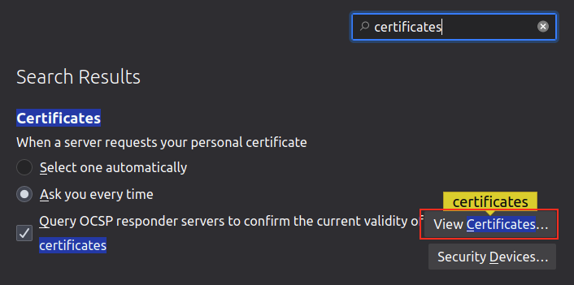
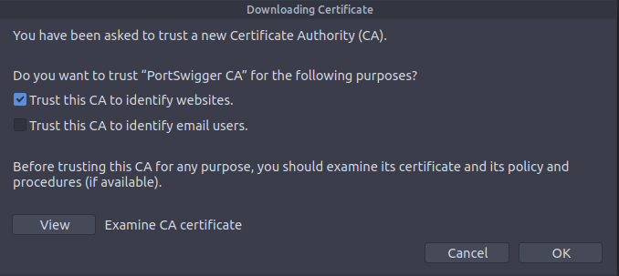
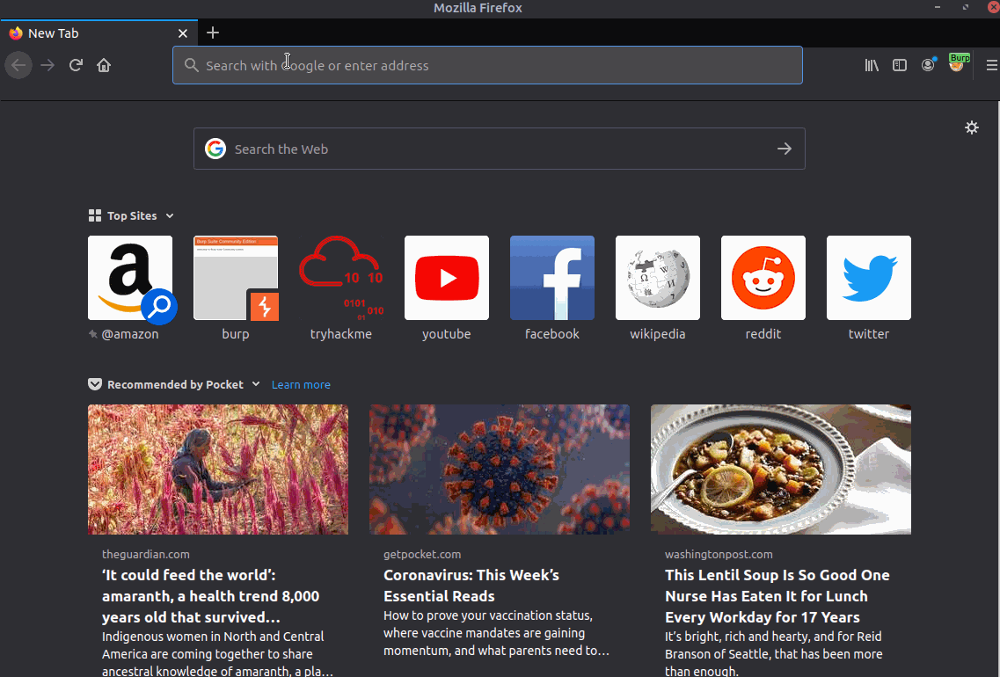

# Proxying HTTPS

When intercepting HTTP traffic, we may encounter an issue when navigating to sites with TLS enabled. For example, when accessing a site like `https://google.com/`, we may receive an error indicating that the PortSwigger Certificate Authority (CA) is not authorised to secure the connection. This happens because the browser does not trust the certificate presented by Burp Suite.

To overcome this issue, we can manually add the PortSwigger CA certificate to our browser's list of trusted certificate authorities. Here's how to do it:

1.  **Download the CA Certificate:** With the Burp Proxy activated, navigate to http://burp/cert. This will download a file called `cacert.der`. Save this file somewhere on your machine.
    
2.  **Access Firefox Certificate Settings:** Type `about:preferences` into your Firefox URL bar and press **Enter**. This will take you to the Firefox settings page. Search the page for "certificates" and click on the **View Certificates** button.
    
    
    
3.  **Import the CA Certificate:** In the Certificate Manager window, click on the **Import** button. Select the `cacert.der` file that you downloaded in the previous step.
    
4.  **Set Trust for the CA Certificate:** In the subsequent window that appears, check the box that says "Trust this CA to identify websites" and click OK.
    
    
    

By completing these steps, we have added the PortSwigger CA certificate to our list of trusted certificate authorities. Now, we should be able to visit any TLS-enabled site without encountering the certificate error.

You can watch the following video for a visual demonstration of the full certificate import process:

By following these instructions, you can ensure that your browser trusts the PortSwigger CA certificate and securely communicates with TLS-enabled websites through the Burp Suite Proxy.