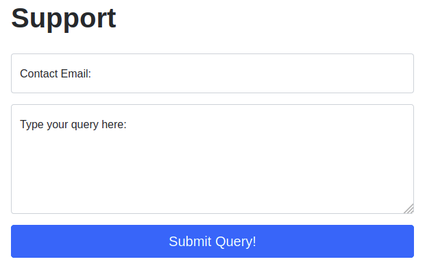
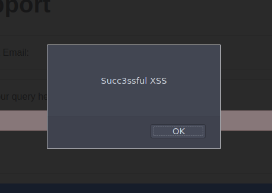

# Example Attack

Having looked at how to set up and configure our proxy, let's go through a simplified real-world example.

We will start by taking a look at the support form at `http://10.10.191.43/ticket/`:

In a real-world web app pentest, we would test this for a variety of things, one of which would be Cross-Site Scripting (or XSS). If you have not yet encountered XSS, it can be thought of as injecting a client-side script (usually in Javascript) into a webpage in such a way that it executes. There are various kinds of XSS – the type that we are using here is referred to as "Reflected" XSS, as it only affects the person making the web request.

## Walkthrough

Try typing: ``, into the "Contact Email" field. You should find that there is a client-side filter in place which prevents you from adding any special characters that aren't allowed in email addresses:

Fortunately for us, client-side filters are absurdly easy to bypass. There are a variety of ways we could disable the script or just prevent it from loading in the first place.

Let's focus on simply bypassing the filter for now.

First, make sure that your Burp Proxy is active and that intercept is on.

Now, enter some legitimate data into the support form. For example: "pentester@example.thm" as an email address, and "Test Attack" as a query.

Submit the form — the request should be intercepted by the proxy.

With the request captured in the proxy, we can now change the email field to be our very simple payload from above: ``. After pasting in the payload, we need to select it, then URL encode it with the `Ctrl + U` shortcut to make it safe to send. This process is shown in the GIF below:

Finally, press the "Forward" button to send the request.

You should find an alert box from the site indicating a successful XSS attack!

